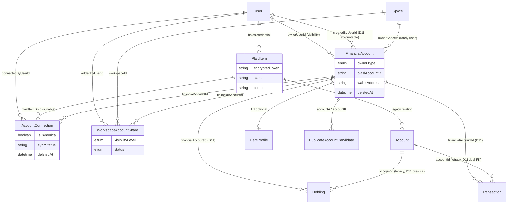
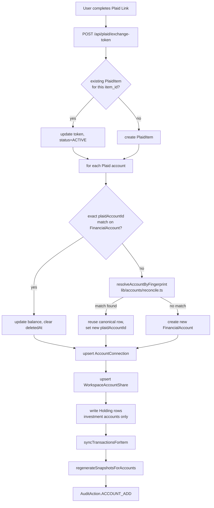
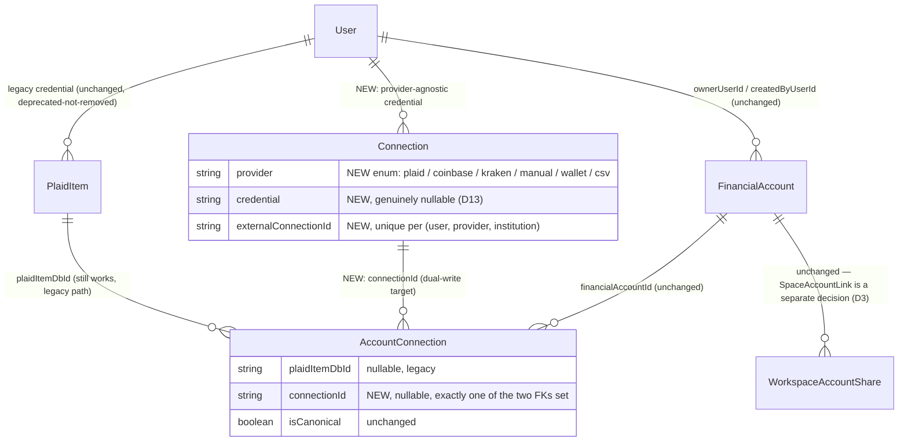
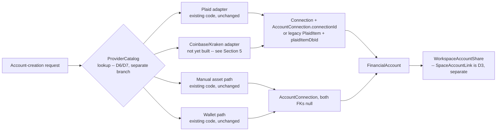

# D2 Connection Architecture Review

**Status: investigation complete. Read-only — no schema, migration, API, route, or application code was modified to produce this document.**

Branch: `feature/phase-2-architecture`. Baseline: `v2.3.0`. Predecessor work: D11 (schema modernization), D1 (duplicate-account audit trail), and the archive/restore SpaceSnapshot staleness bugfix — all merged. This document picks up D2 per the governing Phase 2 docs and the project's approved direction.

All file:line references below were verified directly against the current `prisma/schema.prisma` and the listed route/lib files on this branch — not against the freeze doc's own citations, which predate D11/D1 and are stale by 60-150 lines in places.

---

## 0. Numbering correction (read this first)

The investigation brief's §6 asks about dependencies on "D3 SpaceAccountLink, D4 ProviderCatalog, D5 AI Context Builder, D6 Space Templates, D7 Ownership & Sharing, D8 PublishedAccountView." Those labels do not match `docs/PHASE_2_DECISION_MATRIX.md`, which is this project's canonical D1–D14 numbering. The real mapping:

| Brief's label | Brief's topic | Canonical ID(s) | Canonical topic |
|---|---|---|---|
| D2 | (this investigation) | **D2** | `AccountConnection` evolve-vs-replace — matches |
| D3 | SpaceAccountLink | **D3** | `WorkspaceAccountShare`→`SpaceAccountLink` — matches |
| D4 | ProviderCatalog | **D6 / D7** | ProviderCatalog field set / ownership+admin UI |
| D5 | AI Context Builder | **D4** | AI Context Builder enforcement mechanism |
| D6 | Space Templates | **D9** | `SpaceTemplate` & marketplace foundation |
| D7 | Ownership & Sharing | *(no single ID)* | Cross-cutting: D3 (SpaceAccountLink) + D11 (`createdByUserId`, done) |
| D8 | PublishedAccountView | *(no ID assigned)* | Mentioned once, in passing, under D8's actual topic (archive/delete lifecycle consistency) — never given its own decision number |

Per the standing project rule ("do not re-litigate approved decisions"), Section 6 below answers the six topics the brief actually asked about, but tags each with its real canonical ID so this report doesn't silently launder the mismatch into the record.

---

## 1. Current Connection Model

### 1.1 PlaidItem — `prisma/schema.prisma:440-459`

Purpose: the OAuth credential layer. One row per `(user, institution)` login — a single Plaid `access_token` covers every account at that institution. Belongs to `User`, never to a `Space`: a credential is something a person holds, not something a Space owns.

Fields: `id, userId, externalItemId` (unique — Plaid's `item_id`), `institutionId, institutionName, encryptedToken` (AES-256-GCM, see `lib/plaid/encryption.ts`), `status` (`PlaidItemStatus`: enum at `schema.prisma:54-59` — `ACTIVE/ERROR/REVOKED`, etc.), `cursor` (transactions-sync cursor), `errorCode, lastSyncedAt, createdAt, updatedAt`. Relations: `accounts Account[]` (legacy), `connections AccountConnection[]` (current).

Runtime usage — exact call sites:
- Created/upserted: `app/api/plaid/exchange-token/route.ts:93-104` (keyed on `externalItemId`, the only upsert target — re-linking the same institution updates the token in place rather than creating a second row).
- Read for refresh: `lib/plaid/refresh.ts:85-90` (`refreshPlaidItem`), `:226-229` (`refreshAllActiveItemsForUser`, filters `status: ACTIVE`).
- Read for sync: `lib/plaid/syncTransactions.ts` (decrypts token, resumes from `cursor`); driven by `app/api/plaid/sync/route.ts:35-42` (manual) and `jobs/sync-banks.ts:31-34` (scheduled, see §3).
- Revoked: `lib/plaid/disconnect.ts:22-47` — `disconnectPlaidItemIfOrphaned()`, called from `app/api/accounts/[id]/route.ts:190-192` (DELETE) when an account's last `AccountConnection` is removed. Calls Plaid's `itemRemove` then sets `status: REVOKED`. Never deleted.
- No PATCH/manual-edit route exists for `PlaidItem` — it is only ever touched by the Plaid integration paths above.

### 1.2 AccountConnection — `prisma/schema.prisma:637-660`

Purpose: links one user's connection to a `FinancialAccount` via a specific source. Deliberately models a many-to-one: a joint checking account can have two `AccountConnection` rows (one per spouse's Plaid login) pointing at the same `FinancialAccount`, with `isCanonical` marking which one is the authoritative balance writer.

Fields: `id, financialAccountId → FinancialAccount, connectedByUserId → User, plaidItemDbId` (nullable FK to `PlaidItem` — null for manual/wallet connections), `syncStatus` (string, default `"pending"`), `isCanonical` (default `true`), `lastSyncedAt, deletedAt` (soft-delete on account removal), `createdAt, updatedAt`.

Runtime usage:
- Created on every account-creation path: Plaid import (`app/api/plaid/exchange-token/route.ts:222-247`, upserts to avoid duplicates on relink), manual asset (`app/api/accounts/manual/route.ts:120-127`, `plaidItemDbId` omitted), wallet (`app/api/accounts/wallet/route.ts:163-170`, `plaidItemDbId` omitted).
- Soft-deleted in lockstep with `FinancialAccount` on every archive path: `app/api/accounts/[id]/route.ts:157-160`, `app/api/accounts/manual/[id]/route.ts:144-148`.
- Restored in lockstep on every restore path: `app/api/accounts/[id]/restore/route.ts:151-155`, `app/api/accounts/manual/[id]/restore/route.ts:91-94`, `app/api/accounts/wallet/route.ts:108-111`.
- Hard-deleted only in `app/api/accounts/manual/[id]/permanent/route.ts:71` (manual assets only — no equivalent permanent-delete route exists for Plaid or wallet accounts).
- Counted (not joined for display) by `lib/plaid/disconnect.ts:24-29` to decide whether a `PlaidItem` is orphaned.
- Never read by `lib/data/accounts.ts` or any dashboard widget — the canonical balance is read directly off `FinancialAccount`, not derived from the connection. `isCanonical` and multi-connection support exist in the schema but nothing currently exercises the "two spouses, one joint account" case end-to-end; there is no UI to add a second connection to an existing `FinancialAccount`.

### 1.3 FinancialAccount — `prisma/schema.prisma:518-598`

Purpose: the canonical, deduplicated representation of one real-world account. Per its own schema comment: "One row per real-world account — never duplicated."

Fields (grouped): ownership — `ownerType` (`AccountOwnerType`: `USER`/`SPACE`, enum at `:182-185`), `ownerUserId`, `ownerSpaceId` (nullable pair, exactly one populated per the `ownerType`), `createdByUserId` (D11, nullable — the human-accountable connector, independent of visibility ownership; see comment at `:526-535`). Canonical values — `name, type` (`AccountType` enum at `:19-26`: `checking/savings/investment/crypto/debt/other`), `institution, institutionId, mask, balance, availableBalance, creditLimit, currency, lastUpdated`. Plaid identity — `plaidAccountId` (unique). Display metadata, frozen at import — `plaidName, officialName` (never rewritten by sync), `displayName` (user-editable override). Wallet fields — `walletAddress, walletChain, nativeBalance`. Debt fields — `debtSubtype, interestRate, minimumPayment` (legacy flat columns; superseded in effective-value resolution by the 1:1 `DebtProfile` relation when present, per `lib/data/accounts.ts:53-54`). `syncStatus` (string: `"synced"/"manual"/"pending"`), `deletedAt` (soft delete). Relations: `connections, workspaceShares, duplicateCandidatesA/B, goalContributions, debtProfile, transactions, holdings`.

Runtime usage: this is the single most-referenced model in the account subsystem — every route inspected in §2 reads or writes it. Visibility into a Space is never direct; it always goes through an `ACTIVE` `WorkspaceAccountShare` row (`lib/data/accounts.ts:33-39`, `app/api/spaces/[id]/accounts/route.ts:38-45`).

### 1.4 Provider abstraction — what actually exists today

The investigation brief asked about "Provider abstraction" as an architecture area. There isn't one yet, beyond Plaid-specific code:

- `lib/simplefin.ts` — **empty stub** (`export {}`, 1 line). Not a second provider integration; just a placeholder filename.
- `lib/ai-advice.ts`, `jobs/run-ai-advice.ts`, `jobs/take-snapshot.ts` — **empty stubs**, same pattern. (This resolves an apparent contradiction with `PHASE_2_ARCHITECTURE_FREEZE.md` §18.3, which states these files "do not exist at all" — they exist as zero-logic placeholders, which is consistent in substance with the freeze doc's claim that no AI-advice generation code exists.)
- `jobs/sync-crypto.ts` — also an empty stub (scheduler comment at `jobs/scheduler.ts:18` labels it "(stub)" explicitly; it is not wired into `startScheduler()`).
- The only real, non-Plaid account-creation path is the wallet route (`app/api/accounts/wallet/route.ts`), which is balance-tracking only (`balance: 0` at creation, populated by whatever eventually implements `sync-crypto`) — there is no live external API call to any crypto data source anywhere in the codebase today.

Every "provider-specific" branch point that exists today is a literal `if Plaid` / `if wallet` / `if manual` split inline in each route (e.g. `app/api/accounts/[id]/route.ts` doesn't even need to branch — it's generic — but `app/api/accounts/manual/[id]/route.ts` and `wallet/route.ts` are separate route files entirely, one per source). There is no shared interface, dispatcher, or adapter pattern of any kind.

---

## 2. Account Lifecycle

### A. Plaid account

| Step | Route / function | Tables touched | Snapshot regen | Audit record |
|---|---|---|---|---|
| **Link** | `POST /api/plaid/exchange-token` (`app/api/plaid/exchange-token/route.ts`) | Upserts `PlaidItem` (:93-104); resolves `FinancialAccount` by exact `plaidAccountId` match, else fingerprint match via `resolveAccountByFingerprint` (`lib/accounts/reconcile.ts`), else creates new (:131-219); upserts `AccountConnection` (:230-247); upserts `WorkspaceAccountShare` (:250-261); writes `Holding` rows for investment accounts (:295-320) | `regenerateSnapshotsForAccounts(importedIds)` (:352, best-effort/non-fatal) | `AuditAction.ACCOUNT_ADD` (:358-371) |
| **Refresh** | `POST /api/plaid/refresh` → `refreshPlaidItem()` / `refreshAllActiveItemsForUser()` (`lib/plaid/refresh.ts`) | Updates `FinancialAccount` balances by exact `plaidAccountId` match only — **never** creates or restores (`refresh.ts:99-102`, explicit comment); recreates `Holding` rows; calls `syncTransactionsForItem()` | `regenerateSnapshotsForAccounts(updatedAccountIds)` (`refresh.ts:193`) | `AuditAction.PLAID_REFRESH` (`app/api/plaid/refresh/route.ts:67-82`) |
| **Reconnect** (same institution, possibly reissued `plaidAccountId`) | Same `exchange-token` route — there is no separate "reconnect" endpoint | Same as Link; the fingerprint fallback in `resolveAccountByFingerprint` is specifically what handles Plaid reissuing a new `account_id` for an existing real account (3 observed real-world `plaidAccountId` changes for one Robinhood account, per `lib/accounts/reconcile.ts:30-34` comment) — `deletedAt` cleared on the matched row (:142-147, :184) | Same as Link | Same as Link |
| **Archive** | `DELETE /api/accounts/[id]` (`app/api/accounts/[id]/route.ts`) | `FinancialAccount.deletedAt = now` (:151-154); `AccountConnection.deletedAt = now`, all rows (:157-160); `WorkspaceAccountShare.status = REVOKED` (:163-166); if the connection's `PlaidItem` is now orphaned, `disconnectPlaidItemIfOrphaned()` calls Plaid `itemRemove` and sets `PlaidItem.status = REVOKED` (:183-192) | `regenerateSpaceSnapshot(spaceId)` per pre-revocation space, captured *before* the revoke so the lookup still finds them (:168-181) | free-text `"ACCOUNT_REMOVE"` (:194-203) — **not** an `AuditAction` constant; see §3 |
| **Restore** | `POST /api/accounts/[id]/restore` | If an active row already shares this account's provider identity or fingerprint, folds history into it via `mergeArchivedDuplicateIntoCanonical` instead of restoring a second visible row (:89-142); otherwise `FinancialAccount.deletedAt → null`, `AccountConnection.deletedAt → null`, `WorkspaceAccountShare.status → ACTIVE` in parallel (:144-161). Does **not** re-establish a revoked `PlaidItem` at Plaid — if the credential itself was revoked, the user must relink via Link, which the dedup logic in exchange-token then converges back onto the same row | `regenerateSnapshotsForAccounts([id])` (:169, non-merge branch only) | `AuditAction.ACCOUNT_RESTORE` (:174-182, or :132-139 on the merge branch, tagged with `reconciledIntoAccountId`) |
| **Delete** | *(no permanent-delete route exists for Plaid accounts)* | N/A | N/A | N/A |

### B. Manual account

| Step | Route | Tables touched | Snapshot regen | Audit record |
|---|---|---|---|---|
| **Create** | `POST /api/accounts/manual` | `FinancialAccount` (`type: other`, `syncStatus: manual`) (:104-117); `AccountConnection` (no `PlaidItem`, no wallet) (:120-127); `WorkspaceAccountShare` into personal Space + any additional Spaces passed in (:130-149) | none (new account, nothing to regenerate from) | free-text `"MANUAL_ASSET_ADD"` (:152-167) |
| **Archive** | `DELETE /api/accounts/manual/[id]` | `WorkspaceAccountShare.status → REVOKED` all rows (:135-142); `AccountConnection.deletedAt = now` (:145-148); `FinancialAccount.deletedAt = now` (:151-154) — note the order is share→connection→account, the *reverse* of the generic DELETE route's account→connection→share order; functionally equivalent but inconsistent | **none** — this route never calls `regenerateSpaceSnapshot`/`regenerateSnapshotsForAccounts` at all (gap not covered by the snapshot bugfix, which only touched the generic and wallet routes plus the two restore routes — see §3) | free-text `"MANUAL_ASSET_DELETE"` |
| **Restore** | `POST /api/accounts/manual/[id]/restore` | Same dedup-then-restore pattern as the generic restore route (:58-104) | `regenerateSnapshotsForAccounts([id])` (:112, non-merge branch) | free-text `"MANUAL_ASSET_RESTORE"` |
| **Permanent delete** | `DELETE /api/accounts/manual/[id]/permanent` | Hard-deletes in FK-safe order: `WorkspaceAccountShare` → `AccountConnection` → `FinancialAccount` (:70-72). Requires `deletedAt` already set. The **only** hard-delete path in the entire account subsystem | n/a | free-text `"MANUAL_ASSET_PERMANENT_DELETE"`, written *before* the delete so the name is still available |

### C. Wallet account

| Step | Route | Tables touched | Snapshot regen | Audit record |
|---|---|---|---|---|
| **Create** | `POST /api/accounts/wallet` | Three-way branch on `walletAddress` lookup: (1) active match → re-share only, plus opportunistically merges any stray archived duplicate of the same address (:56-91); (2) archived match, no active → reactivates that row (:103-123); (3) no match at all → creates new `FinancialAccount`/`AccountConnection`/`WorkspaceAccountShare` (:145-182) | Only branch (2) regenerates, via `regenerateSnapshotsForAccounts([archivedFa.id])` (:127-131) — branch (1) and (3) don't move any Space's dollar total (merge doesn't change balance; new wallets start at $0), so this is intentional, not a gap | branch (2): `AuditAction.ACCOUNT_RESTORE`; branch (3): free-text `"WALLET_ADD"`; branch (1): **no audit record written at all** — silent re-share, no log entry |
| **Reconnect / reactivate** | Same route, branch (2) above — there is no separate reconnect endpoint, same pattern as Plaid | as above | as above | as above |
| **Archive** | `DELETE /api/accounts/[id]` — wallets use the **generic** account route, not a wallet-specific one (no `type`/`syncStatus` gate the way the manual routes have) | Same as Plaid's Archive row above | Same as Plaid's Archive row above | `"ACCOUNT_REMOVE"` |
| **Restore** | `POST /api/accounts/[id]/restore` — generic route again | Same as Plaid's Restore row above | Same as Plaid's Restore row above | `AuditAction.ACCOUNT_RESTORE` |

Wallets have no dedicated archive/restore/permanent-delete routes — they share the generic `[id]` routes with Plaid accounts, while manual assets have their own complete parallel set. This is an asymmetry, not a bug (wallets and Plaid accounts both key off `plaidAccountId`/`walletAddress`-style provider identity and need the dedup logic the generic routes implement; manual assets have no provider identity at all, hence their own simpler routes) — but it means "the wallet lifecycle" and "the Plaid lifecycle" are actually the *same four route files*, differentiated only by which fields get populated at creation.

---

## 3. Connection Problems

**Should `PlaidItem` survive unchanged?** No, but not because anything is broken — because it duplicates a concept the freeze doc's proposed `Connection` model (one row per `(user, provider, institution)` credential, provider-agnostic) is specifically designed to generalize. `PlaidItem` today only knows how to be a Plaid credential: its `encryptedToken`, `cursor`, and `errorCode` fields are all Plaid-API-shaped, and `disconnectPlaidItemIfOrphaned()` (`lib/plaid/disconnect.ts`) calls `plaidClient.itemRemove` directly with no abstraction layer. A second real provider (Coinbase OAuth, Kraken API keys) cannot reuse this model without either overloading its Plaid-shaped fields or branching internally — there's no shape-per-provider story at all today, confirmed by `lib/simplefin.ts` being an empty stub rather than a second working integration.

**Should `AccountConnection` evolve or be replaced?** Evolve — it is already doing real, correct work that a replacement would have to rebuild. It already generalizes the "credential ↔ account" link correctly: one row per `(account, source)`, `isCanonical` for the authoritative balance writer, support for multiple simultaneous connections to one account. The freeze doc's `Connection` model generalizes a *different* axis (the credential/institution-login itself, replacing `PlaidItem`), and per `PHASE_2_DECISION_MATRIX.md` D2 these are complementary, not duplicative — `AccountConnection` would gain a nullable `connectionId` FK pointing at the new `Connection` table, dual-written alongside the existing `plaidItemDbId` FK until `PlaidItem` retires. Replacing `AccountConnection` outright (folding `financialAccountId`/`isCanonical` into `Connection` directly) would conflate two genuinely different cardinalities — one credential per institution login vs. potentially many account-links per credential — and lose the working multi-connection invariant for no benefit. This investigation's own reading of `AccountConnection`'s usage (§1.2) confirms the freeze doc's characterization is accurate: the model is well-designed for what it does; it just isn't load-bearing yet (nothing reads `isCanonical` to decide anything, no UI adds a second connection to an account).

**Does `FinancialAccount` currently know too much or too little?** Both, in different places. Too much: it carries four different display-name fields (`name`, `plaidName`, `officialName`, `displayName`) with a documented but easy-to-miss resolution order (`displayName ?? officialName ?? plaidName ?? name`, `lib/data/accounts.ts:70`), plus legacy flat debt columns (`debtSubtype`, `interestRate`, `minimumPayment`) that are now superseded by `DebtProfile` but never removed (additive-before-subtractive is the right call per project rules, but the two parallel debt representations are a real source of "which one is current" confusion for anyone reading the model fresh). Too little: it has no notion of "which provider created this" beyond the presence/absence of `plaidAccountId`/`walletAddress` — there is no `providerType` or `source` enum, so every piece of code that needs to know "is this a Plaid account" does so by checking whether `plaidAccountId` is non-null (e.g. `lib/accounts/reconcile.ts:63` `providerIdentityOf`), which will not extend cleanly to a third or fourth provider without adding yet another nullable identity column.

**Duplicated responsibilities.**
- The fingerprint-matching/auto-merge pattern now exists at two levels with separately-maintained implementations: account-level in `lib/accounts/reconcile.ts` (institution + mask + type + name), and transaction-level inline in `lib/plaid/syncTransactions.ts` (financialAccountId + date + amount + merchant + pending) — same shape, same "Plaid identifiers aren't as stable as documented" root cause, two codebases.
- `mapAccountType()` (Plaid type/subtype → `AccountType`) is defined identically in `app/api/plaid/exchange-token/route.ts:44-60` and `lib/plaid/refresh.ts:44-60`, deliberately not shared per the latter's own comment ("kept as a private copy here"). Small, but it's the kind of duplication that silently drifts the next time someone adds a Plaid subtype.

**Legacy structures.** The legacy `Account` model (`schema.prisma:468-506`) is still the FK target for `Holding.accountId`/`Transaction.accountId` (both optional, dual-FK pattern from D11) and is explicitly marked "do not add new features here" in its own schema comment (`:462-466`) — confirmed not removed, correctly, per the project rule against removing legacy tables prematurely.

**Dead/aspirational code.** `lib/simplefin.ts`, `lib/ai-advice.ts`, `jobs/run-ai-advice.ts`, `jobs/take-snapshot.ts`, `jobs/sync-crypto.ts` are all empty `export {}` stubs. `jobs/scheduler.ts:7-13` documents that `startScheduler()` itself is never invoked anywhere (no `instrumentation.ts` hook) — this matches Decision Matrix D5 exactly and is confirmed still true on this branch. None of this blocks D2, but any D2 proposal that assumes a working scheduled-sync entrypoint, crypto balance sync, or AI advice pipeline already exists would be building on a gap that's tracked separately (D5) and explicitly out of this branch's scope.

**Overlapping ownership/visibility concepts.** Two independent mechanisms currently express "who can see this account": `FinancialAccount.ownerType/ownerUserId/ownerSpaceId` (visibility ownership, set once at creation) and `WorkspaceAccountShare` (per-Space sharing grants, can be added/revoked independently of the owner fields). They don't contradict each other today — `ownerSpaceId` is barely used in any route read in this investigation (every creation route sets `ownerType: USER`; nothing in §2 ever sets `ownerType: SPACE`) — but the schema supports a SPACE-owned account that *also* has its own `WorkspaceAccountShare` rows, and nothing in the current code base defines how those two relate if they ever diverge (e.g., can a SPACE-owned account be un-shared from its own owning Space?). This is exactly the ambiguity `SpaceAccountLink` (D3) is meant to resolve by consolidating both into one polymorphic link.

**Confusing "who" fields.** Across this subsystem there are now four distinct "who" identifiers, each answering a related but different question: `FinancialAccount.ownerUserId` (visibility owner), `FinancialAccount.createdByUserId` (D11, human-accountable connector), `AccountConnection.connectedByUserId` (who established this specific connection), `WorkspaceAccountShare.addedByUserId` (who shared it into this Space). For a USER-owned, self-shared personal account these are all the same person and the distinction is invisible — which is likely why it hasn't caused a visible bug yet — but for a SPACE-owned or multi-connection account they can legitimately diverge, and no single doc currently states all four side-by-side with examples of when they differ. Worth a short reference table in whatever document eventually owns the ownership model, independent of D2.

**Audit trail inconsistency.** `lib/audit-actions.ts` defines an `AuditAction` const object specifically "to ensure consistency across API routes... instead of free-text strings" (its own header comment). In practice, only the Plaid paths (`ACCOUNT_ADD`, `PLAID_SYNC`, `PLAID_REFRESH`, `ACCOUNT_RESTORE`) and the generic restore route consistently use it. Every other write path in this subsystem uses a raw string that has no corresponding `AuditAction` entry at all: `"ACCOUNT_REMOVE"` (`app/api/accounts/[id]/route.ts:199`), `"MANUAL_ASSET_ADD"`/`"MANUAL_ASSET_UPDATE"`/`"MANUAL_ASSET_DELETE"`/`"MANUAL_ASSET_RESTORE"`/`"MANUAL_ASSET_PERMANENT_DELETE"` (all of `app/api/accounts/manual/**`), `"WALLET_ADD"` (`app/api/accounts/wallet/route.ts:188`), `"ACCOUNT_SHARE"`/`"ACCOUNT_SHARE_REVOKE"` (`app/api/spaces/[id]/accounts/share/route.ts`). None of these eight strings exist in `AuditAction` or its `AUDIT_ACTION_GROUPS` admin-filter list (`lib/audit-actions.ts:51-68, 144-146` — the "Accounts" group only lists `ACCOUNT_SHARED`/`ACCOUNT_REVOKED`, which themselves don't match the actual strings written: `ACCOUNT_SHARE` vs. `ACCOUNT_SHARED`). Anyone filtering the admin audit log by the documented "Accounts" group today would see zero rows for every account create/archive/restore/delete event actually being logged. This is a pre-existing gap independent of D2, but D2's new connection events should not repeat it — any new audit actions D2 introduces should be added to the const and the admin group up front.

---

## 4. Target D2 Architecture

No schema is written here, per instruction — this is the conceptual shape, validated against what §1-§3 found actually running today, with the Decision Matrix's D2/D13 recommendations as the resolved baseline (re-litigating those would violate the project's standing rule absent a concrete blocker, and this investigation surfaced none).

**Shape:** `Provider` (conceptual — see `ProviderCatalog`, D6/D7, not yet built) → `Connection` → `FinancialAccount` → `Space` (via `SpaceAccountLink`, D3, not yet built). Reading top to bottom: a provider definition describes what kind of thing can be connected; a `Connection` is one instance of a credential/login for a given provider; a `FinancialAccount` is the canonical real-world account, possibly reached via more than one `Connection`; a Space-level link controls visibility.

**What stays unchanged:**
- `FinancialAccount` as the canonical account row. Its dual-purpose name-resolution and debt-field redundancy (§3) are real but cosmetic — neither blocks D2, and "do not modify unrelated UI while doing schema work" argues against touching display-name resolution logic as part of this branch.
- `AccountConnection`'s shape and role (per D2's own recommendation, option A) — it keeps modeling "account ↔ one connection, `isCanonical` flag" exactly as it does today.
- `WorkspaceAccountShare`'s name and behavior, unchanged, per the explicit project rule against renaming it directly — `SpaceAccountLink` is a separate future table (D3), not a rename.
- The legacy `Account` model and the `Holding`/`Transaction` dual-FK pattern — D2 does not touch the D11 migration's remaining legacy surface.
- The fingerprint-reconciliation engine (`lib/accounts/reconcile.ts`) — its `ProviderIdentity` union type (`{kind: "plaid", ...} | {kind: "wallet", ...}`) is already structured to add a third member (`{kind: "connection", connectionId}` or similar) without a rewrite once `Connection` exists.

**What changes (additive):**
- A new `Connection` model is introduced alongside `PlaidItem`, not in place of it. `PlaidItem` is **not** touched, renamed, or deprecated in this step — only new rows for new institution logins would go through whatever creates `Connection` rows, while existing `PlaidItem` rows and their `AccountConnection.plaidItemDbId` pointers keep working exactly as they do today. This is the "additive before subtractive" rule applied literally: D2 should not require a backfill migration of every existing `PlaidItem` into `Connection` as a precondition.
- `AccountConnection` gains a nullable `connectionId` FK pointing at `Connection`, dual-write alongside the existing nullable `plaidItemDbId`. Exactly one of the two is populated per row going forward (mirroring the same dual-FK transition pattern D11 already established for `Holding`/`Transaction`, so this is a familiar shape for whoever implements it, not a new pattern).
- `disconnectPlaidItemIfOrphaned()` (`lib/plaid/disconnect.ts`) is the named seam its own comment already calls for: a future `disconnectConnectionIfOrphaned()` dispatches by provider type instead of calling `plaidClient.itemRemove` directly. This is the one piece of real refactor inside an otherwise-additive change, and it's scoped to a single file with one call site (`app/api/accounts/[id]/route.ts:190-192`).

**What gets renamed:** nothing, in this step. `WorkspaceAccountShare` stays as-is (explicit project rule); `PlaidItem` stays as-is (evolves alongside `Connection`, not renamed into it).

**What gets deprecated (not removed):** `PlaidItem` becomes the "Plaid-shaped legacy credential table" the same way `Account` is already the "legacy FinancialAccount." It is marked deprecated in its schema comment once `Connection` exists and a Plaid-specific adapter writes to both, but it is not dropped — existing tokens, `cursor` state, and `errorCode` history stay queryable. Retirement is a future branch's decision, gated on every `AccountConnection.plaidItemDbId` having a corresponding `connectionId`, not on D2 itself.

**Migration strategy:**
1. Add `Connection` (+ whatever shape-specific detail table(s) a real second provider needs — kept minimal, not the full four-table sketch from the freeze doc, since no second provider is implemented yet; see §5) and the nullable `AccountConnection.connectionId` FK. Pure additive migration, no backfill required to ship it.
2. New connection-creation code paths (a real second provider, when one is built) write `Connection` + `AccountConnection.connectionId` only — they never touch `PlaidItem`.
3. Existing Plaid paths (`exchange-token`, `refresh`, `disconnect`) are *not* required to change in this step. A later, separate step could have `exchange-token` start dual-writing a `Connection` row alongside `PlaidItem` for every new Plaid link, which would let `PlaidItem` retirement happen incrementally without a flag-day cutover — but that dual-write is itself a decision this report flags as open (§8), not something to schedule into D2 by default.
4. `disconnectPlaidItemIfOrphaned` is extended to a provider-dispatching version once there's a second provider to dispatch to — premature before that.

This keeps D2 scoped to exactly what the Decision Matrix already resolved (D2 + D13: add `Connection`, evolve `AccountConnection` additively, nullable credential) without quietly absorbing D3 (SpaceAccountLink), D6/D7 (ProviderCatalog), or the four-detail-table sketch — all of which are separate decisions/branches per the approved sequencing.

---

## 5. Provider Readiness

| Provider | Fit under proposed `Connection` model | Notes |
|---|---|---|
| **Plaid** | Already fits — it's the model `AccountConnection` was built against. No change needed to ship D2; `PlaidItem` keeps working unmodified alongside the new table. | Lowest-risk provider precisely because it's already implemented; the only new work is the eventual dual-write step (open decision, §8), not a Day 1 requirement. |
| **Coinbase / Kraken (OAuth or API-key exchanges)** | Good fit conceptually — both are "credential covers multiple accounts at one institution," the exact shape `Connection` generalizes. Real cost: both need their own sync logic (balance polling, no `/transactions/sync`-equivalent cursor model guaranteed) and their own error-code vocabulary, neither of which exists today (`lib/simplefin.ts` being an empty stub means there is zero prior art to extend, not a head start). | Effort is dominated by writing a real adapter (API client, auth flow, balance/holdings mapping), not by anything `Connection` itself constrains. Plan for this to be comparable in size to the original Plaid integration, not a thin wrapper. |
| **Manual assets** | Already fits without `Connection` at all — manual assets have no credential, and `AccountConnection` already supports a connection row with `plaidItemDbId: null` and (after D2) `connectionId: null`. No schema change required for this provider type specifically. | This is the proposed-architecture's "genuinely nullable credential" decision (D13) validated directly: a manual asset is the concrete case where forcing a non-null placeholder credential would be actively wrong. |
| **Self-custodied wallets** | Fits the same "no credential" shape as manual assets — `walletAddress` already lives on `FinancialAccount`, not on any connection/credential table, and that's correct: a public wallet address isn't a secret to encrypt. The gap is sync, not modeling: `jobs/sync-crypto.ts` is an empty stub, so balances never update automatically today regardless of what `Connection` looks like. | D2 doesn't need to solve crypto balance sync — that's an independent, already-tracked gap. Don't let "wallets need a real sync job" become scope creep into this schema change. |
| **CSV imports** | Conceptually the cleanest fit for a `credential: null` `Connection` row (or no `Connection` row at all, depending on whether "a CSV upload" should be modeled as a connection or as a one-time `AccountConnection` with no `Connection` parent) — but this is a genuinely open modeling question this investigation did not find an existing answer to anywhere in the docs corpus. The freeze doc's four-detail-table sketch includes an `ImportConnectionDetail`, implying CSV is meant to get a `Connection` row; nothing in the current codebase exercises this path to validate the assumption. | Flagged as an open decision (§8) rather than resolved here — building the wrong shape for "what is a CSV import, connection-wise" is cheap to get wrong now and annoying to unwind once accounts exist under whichever answer is picked first. |

---

## 6. Dependency Analysis

(Canonical IDs per §0's correction table; topics as the brief named them.)

**D3 — SpaceAccountLink.** Real, bidirectional dependency, already flagged by the Decision Matrix itself (not a new finding from this investigation): `SpaceAccountLink` is meant to consolidate `WorkspaceAccountShare` *and* `FinancialAccount.ownerSpaceId/ownerUserId` into one polymorphic link (§3's "overlapping ownership/visibility concepts" finding is exactly the gap `SpaceAccountLink` closes). D2's `AccountConnection.connectionId` addition doesn't touch either of those fields, so D2 itself has no hard technical dependency on D3 landing first or vice versa — but the Decision Matrix's own recommended re-sequencing (swap branches 3 and 4, i.e. do `SpaceAccountLink` *before* `provider-adapter-layer`) is worth restating here because this investigation's findings reinforce it: §3 found that `FinancialAccount`'s `ownerSpaceId` path is essentially unused by every route read in this investigation, while `WorkspaceAccountShare` carries all real sharing logic today. Building `Connection`/`AccountConnection.connectionId` against the *current* ownership model, then having `SpaceAccountLink` change that model out from under it shortly after, is exactly the kind of rework the matrix's swap-recommendation was trying to avoid. This report concurs with that recommendation.

**ProviderCatalog (canonical D6/D7).** One-directional dependency: `ProviderCatalog` is the institution-picker that sits *in front of* whatever adapter layer D2 builds — it needs to know, for each catalog entry, which of the (eventual) provider shapes to route to. D2 as scoped in §4 doesn't require `ProviderCatalog` to exist first (Plaid keeps working via its existing hardcoded `institution_id`/`institution_name` flow, no catalog lookup involved), but the reverse is true: `ProviderCatalog`'s field set (D6) and its `providerType`-to-adapter-shape resolution only make sense once there's more than one adapter shape to resolve to. Sequencing these two in either order is technically fine; building `ProviderCatalog` meaningfully before a second real provider's adapter exists risks designing its field set against a hypothetical adapter shape that turns out wrong once a real second provider (Coinbase/Kraken, per §5) is actually implemented.

**AI Context Builder (canonical D4).** No dependency in either direction, confirmed by this investigation: `lib/ai/context-builder.ts` does not exist, `lib/ai-advice.ts` and `jobs/run-ai-advice.ts` are empty stubs, and nothing in §1-§4's proposed `Connection`/`AccountConnection` changes touches account *data shape* in a way the (future) context builder would need to special-case — it reads `FinancialAccount` fields, none of which D2 changes. The one soft consideration: per the project's allow-list-only AI-accessible tagging rule, whatever ships under `Connection`/D2 should avoid putting anything secret-shaped on `FinancialAccount` itself (D2 doesn't — credentials stay on `Connection`/`PlaidItem`, never on `FinancialAccount`), so D2 as scoped doesn't create new AI-context risk.

**Space Templates (canonical D9).** No dependency in either direction. `SpaceTemplate` is about how a *Space* is seeded (category presets, replacing `lib/space-presets.ts`'s hardcoded mapping) — it operates one layer above accounts entirely. Nothing in D2 touches Space creation or templating.

**Ownership & Sharing (cross-cutting: D3 + D11, already done).** D11 already shipped `FinancialAccount.createdByUserId`, which directly addressed the "who is accountable independent of who can see it" half of this topic. The remaining half — consolidating the *visibility* mechanisms (§3's `ownerSpaceId` vs. `WorkspaceAccountShare` overlap) — is D3, covered above. D2 does not need to wait on either: `AccountConnection.connectedByUserId` (the third "who" field identified in §3) is unaffected by D2's proposed `connectionId` addition.

**PublishedAccountView (unnumbered).** No dependency on D2. Per the freeze doc's own design (§9.3, redact-at-read against live `FinancialAccount` data via `lib/account-privacy.ts`'s existing pattern, no persisted copy), `PublishedAccountView` reads whatever `FinancialAccount` already exposes at query time — it has no relationship to how that account got connected (`Connection` vs. legacy `PlaidItem`) at all. Sequencing it before or after D2 is purely a matter of unrelated team bandwidth, not a technical ordering constraint.

**Net sequencing recommendation:** D2/D13 (this branch) can proceed independently of D6/D7, D4, and D9. It should not proceed *before* D3 lands, per the Decision Matrix's own branch-3/4 swap recommendation, restated and reinforced by this investigation's finding that `ownerSpaceId` is currently dead weight everywhere except the schema. If D3 cannot land first for scheduling reasons, D2's `AccountConnection.connectionId` addition is still safe to ship — it just means whoever eventually builds `SpaceAccountLink` inherits one more FK to account for when consolidating ownership, not a blocking conflict.

---

## 7. Diagrams

### 7.1 Current-state — entity relationships

### 7.2 Current-state — Plaid Link request flow

### 7.3 Proposed-state — entity relationships (D2/D13 scope only)

### 7.4 Proposed-state — adapter dispatch (conceptual, no new schema implied beyond §7.3)

---

## 8. Open Decisions Requiring Approval

1. **Dual-write timing for existing Plaid links.** Should `app/api/plaid/exchange-token/route.ts` start writing a `Connection` row (alongside the untouched `PlaidItem` row) for every *new* Plaid link as soon as `Connection` exists, or should that wait for a separate, later step? §4 scoped D2 to not require this; confirm that's acceptable before implementation, since it changes how soon `PlaidItem` retirement becomes possible.
2. **CSV import modeling.** Does a CSV import get its own `Connection` row (`credential: null`, matching the freeze doc's `ImportConnectionDetail` sketch), or is it modeled with no `Connection` parent at all — just an `AccountConnection` with both FKs null, the same shape manual assets already use? §5 flags this as unresolved; no existing code exercises either answer.
3. **Branch sequencing: D3 before D2/D13.** This report concurs with the Decision Matrix's recommended branch-3/4 swap (§6) — confirm before opening `feature/provider-adapter-layer` that `feature/space-account-link-migration` is sequenced first, or explicitly accept the rework risk of building D2 against the soon-to-change ownership model.
4. **`disconnectPlaidItemIfOrphaned` generalization timing.** §4 proposes deferring the provider-dispatching version of this function until a second real provider exists, rather than speculatively generalizing it now. Confirm that's acceptable, or flag if D2's design doc should sketch the dispatcher shape up front even before a second provider lands.
5. **Audit action debt (§3, "Audit trail inconsistency").** Independent of D2's own scope, but D2 will add new connection-lifecycle events. Should those be added to `AuditAction`/`AUDIT_ACTION_GROUPS` from day one (recommended), and should fixing the eight pre-existing free-text strings be scoped as its own small follow-up PR (parallel to D5's scheduler fix, similarly low-risk and independent)?
6. **Second-provider selection for validating the adapter shape.** §5 evaluated Coinbase/Kraken/CSV in the abstract; no second provider has been chosen for actual implementation. Recommend deciding which one (if any) is built first, since "the adapter shape is right" can only be confirmed against a real second implementation, not a hypothetical one.

No code, schema, or migration changes have been made. Per the working style for this project, the next step is a short implementation checklist for whichever piece of D2 is approved to proceed (most narrowly: the additive `Connection` model + `AccountConnection.connectionId` FK from §4, gated on Open Decision 3 above), submitted for approval before any implementation begins.
