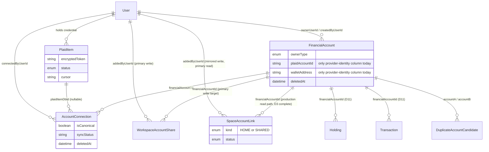
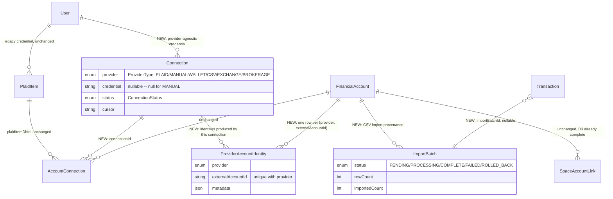

# D2 — Provider & Connection Architecture Investigation

**Status: investigation complete. Read-only — no schema, migration, API, route, or application code was modified to produce this document.**

Branch: `feature/phase-2-architecture`. Baseline: `v2.3.0`. This document answers the expanded D2 investigation brief (Provider types, ownership/visibility, wallet roadmap, CSV imports, brokerages/exchanges, phased migration). It supersedes §4–§8 (target architecture, provider readiness, dependency analysis, diagrams, open decisions) of `docs/architecture/D2_CONNECTION_ARCHITECTURE_REVIEW.md`; that document's §1–§3 (current-model file:line inventory and per-provider lifecycle tables) remain accurate reference material and are re-verified, not repeated wholesale, below.

## 0. What changed since the prior D2 draft

Two things moved on this branch since `docs/architecture/D2_CONNECTION_ARCHITECTURE_REVIEW.md` was written, both re-confirmed directly against current files for this report:

1. **D3 is now functionally complete**, matching this brief's stated context. `lib/data/accounts.ts:36-103` (`getAccounts`, the dashboard's main account query) and the Archived Assets settings page now query `SpaceAccountLink` instead of `WorkspaceAccountShare` — confirmed by reading the file and by `docs/initiatives/d3/D3_STEP4E_IMPLEMENTATION_REPORT.md`. Every account-mutation route (`app/api/plaid/exchange-token`, `app/api/accounts/manual/route.ts`, `app/api/accounts/wallet/route.ts`, `app/api/accounts/[id]/route.ts`, `app/api/accounts/manual/[id]/route.ts`, `.../[id]/restore`, `.../[id]/permanent`) still writes `WorkspaceAccountShare` as the primary record and then mirrors the same change onto `SpaceAccountLink` via `lib/accounts/space-account-link.ts`'s best-effort, non-fatal dual-write helpers. That matches the brief's framing exactly: **`SpaceAccountLink` is the production read model; `WorkspaceAccountShare` is a legacy write mirror only** (it is still the *primary* write target — "mirror" here describes its read-path role, not that writes stopped). No D3 retirement work is in scope here, per instruction.
2. `lib/audit-actions.ts` picked up `ACCOUNT_REMOVE` and `WALLET_SYNC` constants since the prior report. The call sites did not move with it — `app/api/accounts/[id]/route.ts:216` still writes the raw string `"ACCOUNT_REMOVE"` rather than `AuditAction.ACCOUNT_REMOVE`, and `MANUAL_ASSET_ADD`/`MANUAL_ASSET_UPDATE`/`MANUAL_ASSET_DELETE`/`MANUAL_ASSET_PERMANENT_DELETE`/`WALLET_ADD` are still free-text with no constant at all. The audit-trail gap the prior report flagged is narrower, not closed.

Everything else in the prior report's §1–§3 (PlaidItem, AccountConnection, FinancialAccount field inventories; the Plaid/manual/wallet lifecycle tables; the "duplicated responsibilities," "overlapping ownership," and "confusing who fields" findings) was re-spot-checked against `lib/accounts/reconcile.ts`, `lib/audit-actions.ts`, `app/api/plaid/exchange-token/route.ts`, `app/api/accounts/wallet/route.ts`, `app/api/accounts/manual/route.ts`, `app/api/accounts/[id]/route.ts`, `app/api/accounts/manual/[id]/route.ts`, `app/api/accounts/manual/[id]/permanent/route.ts`, and `lib/plaid/disconnect.ts` while preparing this report and is unchanged. `lib/crypto-apis.ts` and `jobs/sync-crypto.ts` are still empty `export {}` stubs — crypto balance sync does not exist today, confirmed again.

---

## 1. Current schema & code — condensed, re-verified inventory

| Model / file | Role today | Key gap relevant to D2 |
|---|---|---|
| `PlaidItem` (`schema.prisma:458-477`) | Plaid-specific credential: `encryptedToken`, `cursor`, `errorCode`, `status` (`PlaidItemStatus`). Belongs to `User`. | Shape is Plaid-only; nothing else can use it. `lib/plaid/disconnect.ts`'s own comment names the seam: a future "provider-agnostic dispatcher... has one obvious call site to swap in." |
| `AccountConnection` (`schema.prisma:657-680`) | Generic "one connection to one `FinancialAccount`" row. `plaidItemDbId` nullable (null for manual/wallet). `isCanonical` flag, multi-connection-capable. | Already the right shape for what it does. Has no slot for a non-Plaid credential — adding a second provider today means overloading `plaidItemDbId` or branching. Never actually exercised for "two connections, one account." |
| `FinancialAccount` (`schema.prisma:536-618`) | Canonical, deduplicated account row. `ownerType/ownerUserId/ownerSpaceId`, `createdByUserId` (D11), `plaidAccountId` (unique), `walletAddress/walletChain/nativeBalance`. | No `providerType`/`source` field — every "is this Plaid?" check is `plaidAccountId != null`. A third/fourth provider needs another ad hoc nullable identity column without one. |
| `Transaction` / `Holding` (`schema.prisma:951-1017`) | Dual-FK (`accountId` legacy / `financialAccountId` canonical, D11). `Transaction.plaidTransactionId` is the only dedupe key, Plaid-only, nullable-unique. No `deletedAt` on `Transaction` at all. | No batch/import provenance field, no provider-agnostic external-id, no soft-delete — all three needed for CSV import + rollback (§8). |
| `app/api/accounts/manual/**` | Full create/update/delete/restore/permanent-delete set. `AccountConnection` always created with both `plaidItemDbId` and wallet fields absent. | Confirms manual assets already work fine with a "connection row, no credential" shape — direct precedent for §6. |
| `app/api/accounts/wallet/route.ts` | Single-address create + three-way create/reshare/reactivate dedup branch keyed on `walletAddress` (no DB unique constraint on it). | Single address only; no xpub, no multi-chain client, no sync. Confirms the brief's "wallet UI deferred, architecture should support more later" framing — there is real code today, just narrow. |
| `app/api/plaid/exchange-token/route.ts`, `lib/plaid/refresh.ts`, `lib/accounts/reconcile.ts` | Exact-match → fingerprint-fallback dedup, fully working, the one provider integration that's real end-to-end. | `reconcile.ts`'s `ProviderIdentity` union (`{kind:"plaid"}` \| `{kind:"wallet"}`) is the one place in the codebase already structured to add a third member without a rewrite — good precedent for `ProviderAccountIdentity` (§2). |
| Legacy `Account` (`schema.prisma:486-524`) | Still the dual-FK target for old `Holding`/`Transaction` rows; explicitly "do not add new features here." | Untouched by D2, correctly — not this branch's surface. |
| CSV / brokerage / exchange code | **None exists.** Confirmed by repo-wide search (`app/`, `lib/`, `jobs/`) — `lib/simplefin.ts` is a 1-line stub, no Coinbase/Kraken/CSV/brokerage file of any kind. | Everything in §3, §8, §9 below is greenfield design, not a refactor of existing code. |

---

## 2. Target model — what D2 should add

| Candidate | Recommendation | Why |
|---|---|---|
| **`Provider` (as a queryable DB table / full `ProviderCatalog`)** | **Defer to D6/D7.** Use a code-level `ProviderType` enum + small static registry for D2. | `ProviderCatalog`'s job — a searchable institution picker — sits in front of whatever dispatch D2 builds. Designing its field set before a second real adapter exists risks guessing wrong (already flagged in the prior report). D2 needs a dispatch key, not a catalog. |
| **`Connection`** | **Add.** New table, additive, generalizes the credential/login layer `PlaidItem` is locked into being Plaid-shaped. | Fields: `id, userId, provider (ProviderType), externalConnectionId, credential (nullable), status (ConnectionStatus), cursor (nullable), errorCode (nullable), lastSyncedAt, createdAt, updatedAt`. Mirrors `PlaidItem`'s shape, generalized. |
| **`AccountConnection` evolution** | **Evolve, don't replace.** Add nullable `connectionId` FK alongside existing nullable `plaidItemDbId`. | Same dual-FK transition pattern D11 already used for `Holding`/`Transaction` — familiar, low-risk, no backfill required to ship. Replacing `AccountConnection` outright would rebuild working logic (`isCanonical`, multi-connection) for no benefit — confirmed unchanged from the prior report's conclusion. |
| **`ProviderAccountIdentity`** | **Add.** New table: `financialAccountId, provider (ProviderType), externalAccountId, metadata (Json?), createdAt`, unique on `(provider, externalAccountId)`. | Directly answers the "FinancialAccount has no provider/source field" gap (§1). Generalizes what `plaidAccountId`/`walletAddress` do today and what `reconcile.ts`'s `ProviderIdentity` union already models in code without a backing table. Coinbase/Kraken/Schwab/CSV each get a row here instead of a fifth nullable column on `FinancialAccount`. |
| **`ImportBatch`** | **Add**, scoped to CSV. `id, financialAccountId, uploadedByUserId, filename, status (PENDING/PROCESSING/COMPLETE/FAILED/ROLLED_BACK), rowCount, importedCount, skippedCount, errorSummary (Json?), createdAt`. | Needed for the brief's explicit "rollback/replay" ask (§8) — nothing today gives an import a unit of rollback. |
| **`SyncRun`** | **Flag, don't build yet.** | Useful once a live-polling adapter (exchange/brokerage) exists, to record per-attempt success/failure independent of `Connection.lastSyncedAt`. No second live-sync provider exists today (§1), so this would be designed against a hypothetical shape. Defer to whichever branch ships the first real exchange/brokerage adapter. |
| **`ProviderType` enum** | **Add.** `PLAID, MANUAL, WALLET, CSV, EXCHANGE, BROKERAGE` (+ room to append more later — Postgres enum additions are non-breaking, no migration risk to existing rows). | Backing field for `Connection.provider` and `ProviderAccountIdentity.provider`. `FUTURE_ADAPTER` from the brief is not a real value to add now — it's the property that appending a new enum member later is cheap, which this design already gives you. |
| **`ConnectionStatus` enum** | **Add.** `ACTIVE, NEEDS_REAUTH, ERROR, REVOKED`. | Direct generalization of `PlaidItemStatus` (`schema.prisma:54-59`), which already has exactly this shape. |

---

## 3. Provider types — design per type

| Provider | Credential | Sync model | `Connection` row? | Net-new work |
|---|---|---|---|---|
| **PLAID** | OAuth access token (Plaid-issued) | `/transactions/sync` cursor, push via Link | Existing `PlaidItem` continues to serve this; **not** migrated to `Connection` in this step (see §5) | None — fully working today. |
| **MANUAL** | None | None — user-entered, never auto-updates | **No** — see §6 | None beyond what exists. |
| **WALLET** (single address, today) | None (public address) | None today (`sync-crypto.ts` stub) | **No** for single-address — see §6/§7 | Balance-sync adapter (separate, already-tracked gap, not D2's job). |
| **WALLET** (xpub/watch-only, future) | xpub or output descriptor (never a private key) | Periodic balance/derivation refresh, one credential → many derived addresses | **Yes** | New adapter; `Connection.credential` holds the xpub, encrypted at rest at the same tier as a Plaid token. |
| **CSV** | None (a file, not a login) | One-shot batch, user-triggered re-upload for refresh | **Open — recommend no `Connection` row**, just `ImportBatch` + existing `AccountConnection` (`connectionId: null`) | `ImportBatch`, dedupe/rollback plumbing (§8). |
| **EXCHANGE** (Coinbase, Kraken) | OAuth or API key pair | Balance polling, no cursor model guaranteed | **Yes** | Full new adapter — API client, auth flow, balance/holdings mapping. Comparable in size to the original Plaid integration, not a thin wrapper. |
| **BROKERAGE** (Schwab, Robinhood) | OAuth (brokerage-specific) | Balance + holdings polling | **Yes** | Same scope as EXCHANGE; kept as a separate enum value per the brief's request even though the adapter shape is similar, since institution-specific quirks (statement cycles, options/margin positions) differ from spot-exchange holdings. |
| **FUTURE_ADAPTER** | Unknown | Unknown | N/A | Not a value to design now — the point of `ProviderType` being an appendable enum and `Connection`/`ProviderAccountIdentity` being provider-agnostic tables is that a real future provider adds one enum member and one adapter, not a schema change. |

---

## 4. Ownership & visibility, restated against the now-complete D3 model

```
User ──owns──> Connection ──produces──> FinancialAccount ──exposed via──> SpaceAccountLink ──> Space
                                              ▲
                                  (AccountConnection: many Connections
                                   can point at one FinancialAccount,
                                   isCanonical marks the balance source)
```

- **User owns a Connection.** Same place credentials live today (`PlaidItem.userId`) — a credential is something a person holds, never something a Space owns. `Connection.userId` continues that rule.
- **Connection produces FinancialAccounts**, through `AccountConnection` exactly as `PlaidItem` does today via `AccountConnection.plaidItemDbId` — `AccountConnection.connectionId` is the new, parallel path. One `Connection` can produce many `FinancialAccount`s (one Plaid item per institution, many accounts there; one future xpub, many derived addresses).
- **`SpaceAccountLink` exposes `FinancialAccount`s to Spaces.** Confirmed unchanged and now fully load-bearing on the read side (`lib/data/accounts.ts`). `kind = HOME` is the canonical owning Space; `kind = SHARED` is an additional visibility grant. Per `lib/accounts/space-account-link.ts`'s `computeLinkKind()` (re-read for this report): **HOME is whichever Space an account's first link is written at — not necessarily the creator's personal Space.** A Connection-driven account creation flow (a new EXCHANGE/BROKERAGE/WALLET adapter) should target "whatever Space the user is active in when they connect," identical to how Plaid/manual/wallet creation already resolves `spaceId` via `getSpaceContext()` today — no new ownership rule is needed for D2, the existing one already generalizes.
- **HOME Space remains canonical owner.** D2 does not touch this; it only adds *how* a `FinancialAccount` is reached (via `Connection`), not *who* it's visible to (still `SpaceAccountLink`/D3, already done).

---

## 5. PlaidItem → future model

Three options, weighed:

1. **Replace `PlaidItem` with `Connection` now** (migrate every existing row). Rejected — requires a backfill + cutover of every existing credential before D2 can ship anything, violates additive-before-subtractive, and risks Plaid sync breakage for zero near-term benefit (no second provider exists yet to justify the cutover).
2. **Evolve `PlaidItem` in place** (add `connectionId`-style fields directly onto it). Rejected — `PlaidItem` is correctly Plaid-shaped; bolting generic fields onto it just recreates `Connection` with extra baggage, and still doesn't help a non-Plaid provider, which needs its own table regardless.
3. **Keep `PlaidItem` unchanged; `Connection` serves new provider types only, starting empty.** **Recommended.** `PlaidItem` keeps working exactly as today — no migration, no risk to existing Plaid links. `Connection` ships with zero rows until the first new adapter (Coinbase/Kraken/xpub wallet) writes to it. Whether *existing* Plaid links should later get a parallel `Connection` row (a dual-write, so `PlaidItem` could eventually retire) is a real, separate decision — kept open in §11/Open Decisions, not assumed here, exactly as the prior report flagged it (Open Decision 1).

`disconnectPlaidItemIfOrphaned()` (`lib/plaid/disconnect.ts`) stays untouched in this step — its own comment already names the generalization point for whenever a second provider needs disconnect/orphan logic. Building that dispatcher now, before a second provider exists to dispatch to, would be speculative.

---

## 6. Manual assets — Connection modeling

Three options from the brief, weighed:

1. **No `Connection` at all** (current shape, generalized — `AccountConnection.connectionId` stays null, same as `plaidItemDbId` does today for manual rows).
2. **A `MANUAL` `Connection`** — one row per manual asset.
3. **A synthetic `Connection` per user** — one row representing "this user's manual entries" collectively.

**Recommended: option 1, no `Connection` row.** `Connection`'s entire reason to exist is generalizing something that authenticates, can go stale, needs reauth, or has a sync cursor. A manual asset has none of that — there is no credential, no status transition ever fires, no sync ever runs. Forcing a row (real or synthetic) onto manual assets adds bookkeeping that participates in none of `Connection`'s actual behavior, and a future "your connections" settings page built against real `Connection` rows would show a fake "Manual" entry that doesn't match what a user means by "connection." This is the same lesson as the prior report's `FinancialAccount` "too much" finding: don't model a UI grouping need as a schema row. If a future "Connections" page needs to group manual assets visually, group `AccountConnection` rows with `connectionId: null` at query time — no schema change required.

Wallets get the *same* answer for today's single-address case (§7) but a *different* answer once xpub/watch-only ships, because an xpub is a real credential with real one-to-many structure — see next section.

---

## 7. Wallets — design

> **Status update (D2 Roadmap):** WALLET identities are deferred — `ProviderAccountIdentity` is not backfilled, dual-written, or read-cut-over for WALLET. The 1C-C investigation found `walletAddress` doesn't map onto provider identity as cleanly as `plaidAccountId` once ownership/watch-only/claim semantics are considered. WALLET work resumes only once those semantics are resolved as their own explicit decision. The design below remains valid rationale for when that happens. See `docs/initiatives/d2/D2_ROADMAP.md`.

- **BTC address tracking (today).** Already modeled: `FinancialAccount.walletAddress/walletChain/nativeBalance`, confirmed live in `app/api/accounts/wallet/route.ts` (`SUPPORTED_CHAINS` includes `BTC`). The gap is sync, not schema — `jobs/sync-crypto.ts` and `lib/crypto-apis.ts` are both still empty stubs, confirmed again for this report. D2 should not build that sync job (separately tracked, scheduler-dependent gap), but should give it a stable place to read from: recommend introducing `ProviderAccountIdentity(provider=WALLET, externalAccountId=address)` now, even though nothing populates it from real sync yet, specifically so the eventual sync job iterates one consistent table instead of querying `FinancialAccount.walletAddress` directly and re-deriving "every wallet I need to refresh" ad hoc.
- **xpub/watch-only support (later).** Needs a real `Connection` row: `provider=WALLET`, `credential` = the xpub/descriptor string (**never** a private key), `status` from `ConnectionStatus`. One `Connection` → many `AccountConnection` → many `FinancialAccount` (each a derived address) — the exact one-credential-to-many-accounts shape `Connection` exists to generalize, same as one Plaid item covering many bank accounts.
- **Multi-chain support (later).** `walletChain` already exists per-account and is additive-friendly as is; recommend leaving it on `FinancialAccount` rather than relocating it to `Connection`/`ProviderAccountIdentity` (no benefit, violates additive-before-subtractive for no gain). The real multi-chain gap is adapter code (one balance client per chain), not schema — out of D2's scope.
- **No private keys, ever.** Constraint on what `Connection.credential` is allowed to hold for `provider=WALLET` — a public address, xpub, or descriptor only. This cannot be enforced at the Postgres level (a string column can't validate "this isn't a private key"); recommend a code-review checklist item and a loud schema comment, not a DB constraint that would create false confidence.
- **Balance refresh.** Blocked entirely on `lib/crypto-apis.ts`/`jobs/sync-crypto.ts` having real implementations — confirmed still both empty. Not D2's job to build; D2's schema should simply give that future job `Connection.lastSyncedAt`/`status` and `ProviderAccountIdentity` to write to, which it already does once §2's additions land.
- **Transaction import.** No code path imports on-chain transactions today — `Transaction` has no chain-specific fields. Flag as a fully open, unscoped decision: likely modeled later as either a chain-API pull (`Transaction.financialAccountId` set directly, no schema change needed beyond what's already proposed) or a CSV-like batch import reusing `ImportBatch` (§8). Not resolved here.

---

## 8. CSV imports — design

> **Status update (D2 Roadmap):** CSV/import history is now explicitly sequenced as **D2 Step 4 — Import & History Foundation**, not a loose "later." The design below is retained as the rationale for that step; no `ImportBatch` implementation has started — it requires its own approved implementation checklist first, per standing working style. See `docs/initiatives/d2/D2_ROADMAP.md`.

- **Uploaded file batches.** New `ImportBatch` model (see §2 for fields). One row per upload.
- **Account matching.** Recommend: **the user always picks an existing `FinancialAccount` before uploading** ("import this CSV into my Chase checking"); CSV does not create a brand-new account from file contents. CSV exports rarely carry reliable institution/mask metadata to fingerprint-match against (unlike Plaid's structured `institution_id`/`mask`/`official_name`), so reusing `reconcile.ts`'s fingerprint approach for CSV-driven account *creation* would be guessing. Account creation from a CSV, if ever wanted, is an explicit future decision, not assumed here.
- **Transaction dedupe.** Today's only dedupe key, `Transaction.plaidTransactionId`, is Plaid-specific and nullable-unique. Recommend adding `Transaction.importBatchId` (nullable FK to `ImportBatch`) and a generic `Transaction.externalTransactionId` (nullable), with dedupe falling back to the same fingerprint style `reconcile.ts` already uses for accounts (`date + amount + merchant`, scoped to one `financialAccountId`) when no external id is present in the file. This is explicitly the same fingerprint logic already duplicated once between `lib/accounts/reconcile.ts` (accounts) and `lib/plaid/syncTransactions.ts` (Plaid transactions) — the prior report's "duplicated responsibilities" finding. Adding CSV as a third independent implementation would make that worse; recommend consolidating into one shared transaction-fingerprint helper *before* or *as part of* building CSV dedupe, not after.
- **Rollback/replay.** `ImportBatch.status = ROLLED_BACK` plus `Transaction.importBatchId` makes "undo this import" a single scoped query. But rollback should soft-delete, not hard-delete, consistent with this codebase's one existing hard-delete path being narrowly scoped and explicit (`manual/[id]/permanent`) — and **`Transaction` has no `deletedAt` column today at all**, confirmed in the schema read for this report. Recommend adding `Transaction.deletedAt` as part of this same additive step; it's a real, currently-missing piece CSV rollback depends on, not an incidental nice-to-have.
- **`ImportBatch` tracking.** Covered above; `status`/`rowCount`/`importedCount`/`skippedCount`/`errorSummary` give a replay UI enough to show "47 of 50 rows imported, 3 skipped as duplicates" without re-parsing the original file.

---

## 9. Brokerages / exchanges — design

- **Holdings.** No schema change needed — `Holding.financialAccountId` (D11) already generalizes this; a brokerage/exchange adapter populates it the same way `app/api/plaid/exchange-token/route.ts`'s investment-holdings block does today.
- **Transactions.** Same — `Transaction.financialAccountId` is already generic.
- **Balances.** Same — `FinancialAccount.balance`/`availableBalance` are already generic.
- **Asset symbols.** `Holding.symbol` is free-text already; it carries stock/ETF tickers today and would carry crypto symbols (`BTC`, `ETH`) identically — no gap.
- **Provider account identity.** This is `ProviderAccountIdentity`'s purpose (§2): each of Coinbase/Kraken/Schwab has its own external-account-id format; one row per `(provider, externalAccountId)` generalizes it instead of a fifth nullable column appended to `FinancialAccount`.

---

## 10. Migration strategy — five phases

> **Superseded for sequencing (D2 Roadmap):** the five-phase plan below is superseded as the step *sequencing* reference by `docs/initiatives/d2/D2_ROADMAP.md`, which tracks the real, finer-grained step lettering this work actually used (1A/1B/1C-A/1C-B/1C-C, 2A, 3A–3G) plus the newly approved Steps 4–7 (Import & History Foundation, Adapter Interface, First real new provider, Stabilization). The phase descriptions below remain accurate design rationale for *why* each phase exists — Phase 1≈Steps 1A/1B, Phase 2≈Step 1C, Phase 3≈Step 2, Phase 4≈Step 3, Phase 5≈future cleanup planning in Step 7 — just consult the roadmap doc for current status.

Deliberately mirrors this branch's own proven D3 playbook (additive table → backfill → dual-write/adapter → read cutover → cleanup) rather than inventing a new migration shape.

| Phase | What happens | Touches existing behavior? |
|---|---|---|
| **1 — Additive schema only** | Add `Connection`, `ProviderAccountIdentity`, `ImportBatch`, `ProviderType`, `ConnectionStatus`; add `AccountConnection.connectionId` (nullable), `Transaction.importBatchId`/`externalTransactionId`/`deletedAt` (all nullable/defaulted). | No. Nothing reads or writes the new tables/columns yet — same shape as `SpaceAccountLink`'s own introduction. |
| **2 — Backfill existing Plaid/manual/wallet records** | One-time script (same pattern as `scripts/backfill-space-account-link.ts`) populates `ProviderAccountIdentity` for every `FinancialAccount` with a non-null `plaidAccountId` or `walletAddress`. | Read-only against existing data; writes only to the brand-new table. `PlaidItem` → `Connection` backfill is explicitly **not** included here (kept as Open Decision, §11) so this phase stays small and reversible. |
| **3 — Dual-write / adapter wrapper** | The first new provider adapter (one of Coinbase/Kraken/xpub-wallet — still unselected, Open Decision) writes `Connection` + `AccountConnection.connectionId` + `ProviderAccountIdentity`. Existing Plaid/manual/wallet paths are **not modified** in this phase. | Only the new adapter's code paths are new; everything existing is untouched. This is genuinely its own branch/decision, not bundled into D2's schema work. |
| **4 — Read cutover** | Code that branches on `plaidAccountId != null` / `walletAddress != null` (`reconcile.ts`'s `providerIdentityOf`, similar checks elsewhere) migrates to read `ProviderAccountIdentity`. | Gated on Phase 3 having real, non-Plaid data flowing — not attempted speculatively. |
| **5 — Cleanup** | `PlaidItem` marked deprecated-in-comment (not dropped — same treatment legacy `Account` already gets). Free-text audit strings (`MANUAL_ASSET_*`, `WALLET_ADD`, the still-unwired `ACCOUNT_REMOVE`) reconciled into `AuditAction`. | Comment/labeling + a small, independent audit-trail fix — no data-shape change. |

---

## 11. Risk assessment

**High-risk tables** (any change must preserve exact current behavior): `AccountConnection` — every account-lifecycle route reads/writes it; `FinancialAccount` — the single most-referenced model in the codebase. Both are touched only additively in this design (`connectionId` nullable, no field removed or renamed).

**Low-risk additive pieces:** `Connection`, `ProviderAccountIdentity`, `ImportBatch`, `ProviderType`, `ConnectionStatus`, `Transaction.importBatchId`/`externalTransactionId`/`deletedAt` — all brand-new, zero existing reads against any of them.

**What must not be touched yet:**
- `PlaidItem` — working, no rename, no drop, no field change (§5).
- `WorkspaceAccountShare` — explicit standing project rule against renaming it directly, and per D3 it remains the live write target; D2 does not touch it at all.
- Legacy `Account` — D11's surface, not D2's.
- `Transaction`/`Holding`'s existing dual-FK pattern — D11's pattern; adding `importBatchId`/`externalTransactionId`/`deletedAt` to `Transaction` is additive alongside it, not a change to the `accountId`/`financialAccountId` pair itself.

**Rollback plan:** Phases 1–3 are additive-only — rollback is "stop writing to the new tables, optionally drop the unused columns/tables," the same low-risk shape as every D3 step's rollback section in this repo. Phase 4 (read cutover) is the first point where a real revert would mean reverting specific call sites back to the old nullable-column checks — exactly the same kind of single-file, low-risk revert D3's Step 4 cutovers already demonstrated repeatedly on this branch. Phase 5 is comment/labeling only and trivially reversible.

---

## A. Current-state diagram



## B. Future-state diagram



## C. Proposed schema additions

Sketch only — **not applied to `prisma/schema.prisma`**. For approval before any implementation step.

```prisma
enum ProviderType {
  PLAID
  MANUAL
  WALLET
  CSV
  EXCHANGE
  BROKERAGE
}

enum ConnectionStatus {
  ACTIVE
  NEEDS_REAUTH
  ERROR
  REVOKED
}

model Connection {
  id                  String            @id @default(cuid())
  userId              String
  user                User              @relation(fields: [userId], references: [id], onDelete: Cascade)
  provider            ProviderType
  externalConnectionId String?          // provider's login/credential id, where one exists
  credential          String?           // encrypted; null for MANUAL; xpub/descriptor for WALLET watch-only — never a private key
  status              ConnectionStatus  @default(ACTIVE)
  cursor              String?
  errorCode           String?
  lastSyncedAt        DateTime?
  createdAt           DateTime          @default(now())
  updatedAt           DateTime          @updatedAt

  accountConnections      AccountConnection[]
  providerAccountIdentities ProviderAccountIdentity[]

  @@index([userId])
  @@index([provider])
}

model ProviderAccountIdentity {
  id                 String           @id @default(cuid())
  financialAccountId String
  financialAccount   FinancialAccount @relation(fields: [financialAccountId], references: [id], onDelete: Cascade)
  connectionId       String?
  connection         Connection?      @relation(fields: [connectionId], references: [id], onDelete: SetNull)
  provider           ProviderType
  externalAccountId  String
  metadata           Json?
  createdAt          DateTime         @default(now())

  @@unique([provider, externalAccountId])
  @@index([financialAccountId])
}

model ImportBatch {
  id                 String           @id @default(cuid())
  financialAccountId String
  financialAccount   FinancialAccount @relation(fields: [financialAccountId], references: [id], onDelete: Cascade)
  uploadedByUserId   String
  uploadedByUser     User             @relation(fields: [uploadedByUserId], references: [id], onDelete: Cascade)
  filename           String
  status             String           @default("PENDING") // PENDING/PROCESSING/COMPLETE/FAILED/ROLLED_BACK
  rowCount           Int              @default(0)
  importedCount      Int              @default(0)
  skippedCount       Int              @default(0)
  errorSummary       Json?
  createdAt          DateTime         @default(now())
  updatedAt          DateTime         @updatedAt

  transactions       Transaction[]

  @@index([financialAccountId])
  @@index([uploadedByUserId])
}

// Additive changes to existing models:
model AccountConnection {
  // ...existing fields unchanged...
  connectionId String?
  connection   Connection? @relation(fields: [connectionId], references: [id], onDelete: SetNull)
}

model Transaction {
  // ...existing fields unchanged...
  importBatchId        String?
  importBatch           ImportBatch? @relation(fields: [importBatchId], references: [id], onDelete: SetNull)
  externalTransactionId String?
  deletedAt             DateTime?    // NEW — Transaction has no soft-delete today; required for CSV rollback
}
```

## D. Proposed migration phases

> **Superseded for sequencing (D2 Roadmap):** see the note at §10 — `docs/initiatives/d2/D2_ROADMAP.md` is now the canonical step tracker (Steps 1A–7); this summary's design rationale stands.

See §10 for the full table; summary:

1. Additive schema only (`Connection`, `ProviderAccountIdentity`, `ImportBatch`, two enums, four nullable columns) — zero behavior change.
2. Backfill `ProviderAccountIdentity` from existing `plaidAccountId`/`walletAddress` — read-only against existing data.
3. First new adapter (provider TBD, Open Decision) writes the new tables; existing Plaid/manual/wallet paths untouched.
4. Read cutover for provider-identity checks, gated on Phase 3 producing real data.
5. Cleanup: `PlaidItem` deprecated-in-comment, audit-action strings reconciled.

## E. Open decisions requiring approval

1. **Should existing Plaid links eventually get a `Connection` row too** (dual-write, enabling future `PlaidItem` retirement), or does `Connection` serve only new provider types indefinitely? Recommend deciding later, after a second provider is live — not a Day-1 requirement (carried over from the prior report, still unresolved).
2. **Which provider is built first** to validate the `Connection`/`ProviderAccountIdentity` shape against something real — Coinbase, Kraken, or xpub/watch-only wallet support? §3/§7 evaluated all three in the abstract; none has been selected (carried over, still unresolved).
3. **CSV transaction dedupe consolidation.** Building CSV dedupe as a third independent fingerprint implementation (alongside `reconcile.ts` and `syncTransactions.ts`) would compound an existing duplication. Should the three be consolidated into one shared helper before/alongside CSV import, or is duplicating once more acceptable short-term?
4. **`Transaction.deletedAt`.** Currently absent entirely. CSV rollback (§8) depends on it. Confirm this is in-scope for D2's additive step rather than a separate small PR.
5. **CSV account-matching model.** Recommended: user always selects an existing `FinancialAccount` before upload; CSV never creates a new account from file contents. Confirm, since this forecloses a "create account from CSV" feature unless revisited later.
6. **Audit-action debt.** `ACCOUNT_REMOVE` now exists as a constant but its only call site still passes the raw string; `MANUAL_ASSET_*`/`WALLET_ADD` have no constants at all. Should D2's own new connection-lifecycle events ship wired to `AuditAction` from day one (recommended) while the pre-existing gap is fixed as its own small, independent follow-up?
7. **Branch sequencing.** This report assumes D3 is fully landed (confirmed true on this branch) and proceeds independently of D6/D7 (`ProviderCatalog`) and D4 (AI Context Builder), consistent with the prior report's dependency analysis. Confirm no re-sequencing is needed before opening an implementation branch.

## F. Recommended smallest implementation slice

Narrower than full Phase 1: **`Connection` + `ConnectionStatus` enum only**, with `AccountConnection.connectionId` (nullable) added in the same step. No `ProviderType` enum yet (can default to a single-value placeholder or be added in the same migration — open call for the implementation checklist), no `ProviderAccountIdentity`, no `ImportBatch`, no `Transaction` changes. This is the minimum additive change that lets a future "pick the first new provider" decision (Open Decision 2) start writing real `Connection` rows without first deciding the entire CSV/import or wallet-xpub design in detail. `ProviderAccountIdentity` and `ImportBatch` are real, recommended additions (§2) but are each independently shippable later, gated on their own consuming feature (a second provider; CSV import) actually being built — bundling them into the first migration risks shipping schema nobody reads or writes for a while, the same caution the prior report raised about building `ProviderCatalog` ahead of a second adapter.

No code, schema, or migration changes have been made. Per the working style for this project, the next step is a short implementation checklist for whichever piece is approved to proceed — most narrowly, §F above — submitted for approval before any implementation begins.
