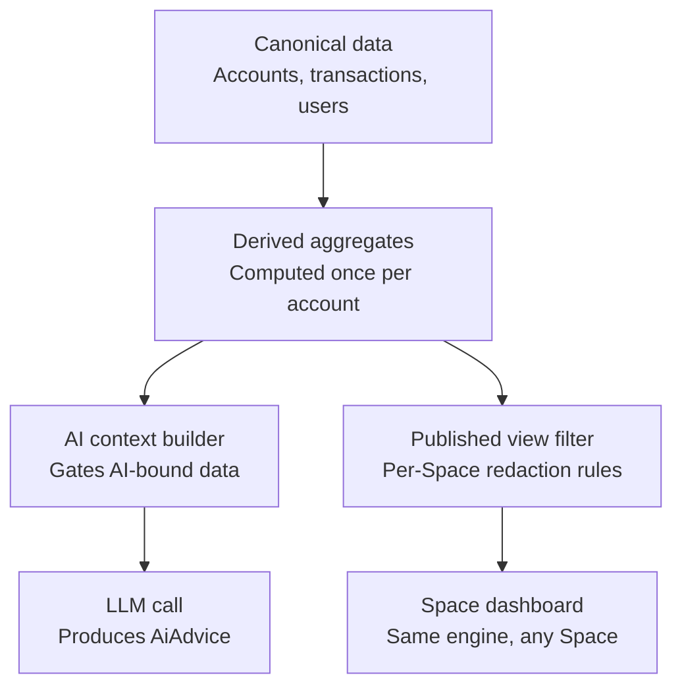
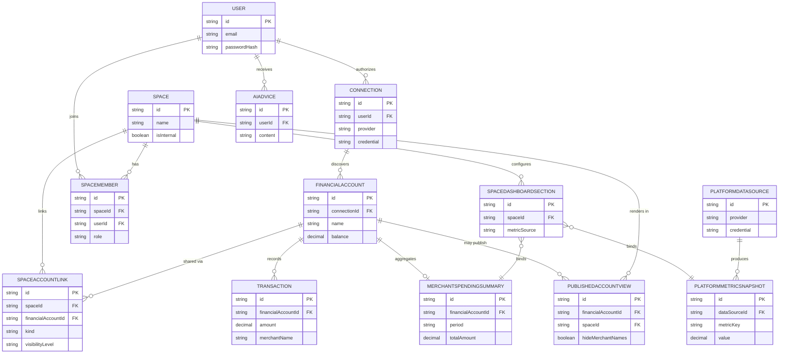

# Fourth Meridian — Database Architecture Review

**Current State vs. Future State — Spaces Platform Evolution**

Status: review only. No migrations, schema changes, or code changes were made while producing this document, per request.

---

## 0. How to read this

Two requested deliverables, in order:

1. **Current State Matrix** — every Prisma model today: purpose, domain, verdict, encryption/hashing notes.
2. **Future State Matrix** — per proposal from the brief: recommended tables/relationships, what to merge or rename, migration risk, priority — with explicit critique, since several proposals overlap with things that already exist in the codebase.

The single biggest finding sits at the top of Section 2 because it should shape how everything else is sequenced.

---

## 1. Current State Matrix

Domains: **Identity/Auth**, **Spaces** (Prisma model renamed `Workspace` → `Space` via `@@map` as part of Phase 1 — physical DB tables/columns unchanged), **Connections/Accounts**, **Goals**, **Dashboard config**, **Transactions/Holdings**, **Reporting/AI**, **Platform/Ops**.

| Model | Domain | Purpose | Verdict | Encryption | Hashing |
|---|---|---|---|---|---|
| `User` | Identity | Root identity; auth, profile, role | **Generalize** — needs to absorb optional "creator" extension fields and DOB publish-preferences | `totpSecret`, `dateOfBirthEncrypted` — AES-256-GCM, shared `ENCRYPTION_KEY` | `passwordHash` bcrypt(12). `passwordResetToken` stored **plaintext** — gap, should be SHA-256 hashed like most reset-token implementations |
| `UserSession` | Identity | Live session rows backing JWT revocation | Keep as-is | None | `sessionToken` stored plaintext (it's a random UUID used as a lookup key, not a secret derived from anything reusable — acceptable, but worth a comment in schema explaining why it's not hashed unlike codes/passwords) |
| `RecoveryCode` | Identity | 2FA backup codes | Keep as-is | None | `codeHash` bcrypt(10) — correct, codes are low-entropy-per-guess so 10 is a reasonable cost/UX tradeoff |
| `AuditLog` | Identity/Platform | Append-only security/event log | Keep as-is | None (by design — must stay queryable/diffable) | n/a |
| `PlatformSetting` | Platform | Key-value config (e.g. `require_totp_all_users`) | Keep as-is | None | n/a |
| `AiAgent` | Reporting/AI | Declarative agent/persona config | Keep as-is for now; revisit once `AiAdvice` pipeline is actually built | None | n/a |
| `Space` | Spaces | The "Space" entity — Prisma model renamed from `Workspace` via `@@map` (Phase 1, zero-DDL: physical table/column names unchanged) | **Evolve** — needs an internal-ops flag/category and a creator/public flag, see §2 | None | n/a |
| `SpaceMember` | Spaces | Membership + role (`OWNER/ADMIN/MEMBER/VIEWER`) | Keep as-is | None | n/a |
| `SpaceInvite` | Spaces | Pending invites | Keep as-is | None | Invite token: confirm it's a random opaque token, not guessable — not fully verified this session, worth a quick audit |
| `SpaceDashboardSection` | Dashboard config | Per-Space widget/section layout | Keep as-is | None | n/a |
| `SpaceSnapshot` | Reporting | Daily pre-aggregated balances/net worth per Space | Keep as-is — good precedent (see §2.F) | None | n/a |
| `PlaidItem` | Connections | One Plaid `item_id` + encrypted access token, owned by `User` | **Generalize** → candidate to become `Connection` (see §2.B) | `encryptedToken` — AES-256-GCM | n/a |
| `Account` (legacy) | Connections/Accounts | Pre-`FinancialAccount` account model, partially superseded | **Should evolve / retire** — `Holding` still FKs only to this, not yet migrated to `FinancialAccount` (confirmed via `app/api/plaid/exchange-token/route.ts` TODO comment) | n/a | n/a |
| `FinancialAccount` | Connections/Accounts | Canonical account record (already the "exists once" source of truth) | **Generalize carefully** — already does most of what's asked; don't duplicate it with a new mapping table (see §2.C) | n/a (balances/numbers currently plaintext) | n/a |
| `AccountConnection` | Connections/Accounts | Links a `FinancialAccount` to its origin (Plaid item, manual, etc.) | **Generalize** alongside `PlaidItem` → `Connection` | n/a | n/a |
| `DuplicateAccountCandidate` | Connections/Accounts | Output of the fingerprint-reconciliation engine (`lib/accounts/reconcile.ts`) flagging likely-duplicate accounts | Keep as-is — working, evidence-backed safety net | n/a | n/a |
| `DebtProfile` | Connections/Accounts | 1:1 extension of `FinancialAccount` for loan-specific fields | Keep as-is — good precedent pattern for future 1:1 extensions (e.g. `PlaidConnectionDetail`, `CreatorProfile`) | n/a | n/a |
| `WorkspaceAccountShare` | Spaces/Accounts | Join table: which Spaces can see which `FinancialAccount`, at what `VisibilityLevel`, revocable | **Evolve, don't duplicate** — this *is* most of the proposed `SpaceAssignment`/`AccountInSpace` (see §2.C) | n/a | n/a |
| `Holding` | Transactions/Holdings | Investment positions | **Should evolve** — still FK'd to legacy `Account`, needs migration to `FinancialAccount` before any new account/connection work lands on top of it | n/a (values plaintext) | n/a |
| `Transaction` | Transactions/Holdings | Bank/card transactions | Keep as-is structurally; see §2.F on why blanket field-level encryption is **not** recommended for `amount`/`date`/`category` | n/a (plaintext; indexed on `[financialAccountId, date]`) | n/a |
| `SpaceGoal` / `GoalCheckIn` / `GoalContribution` | Goals | Savings/debt-payoff goal tracking | Keep as-is | n/a | n/a |
| `CreditScore` | Reporting | Periodic credit score snapshots | Keep as-is | n/a | n/a |
| `AiAdvice` | Reporting/AI | Generated advice records | **Greenfield** — write path (`lib/ai-advice.ts`, `jobs/run-ai-advice.ts`) is fully unimplemented; design the "AI never queries DB directly" rule in from day one (see §2.F) | n/a | n/a |

### Encryption & hashing — current vs. recommended

| Field | Current | Recommended |
|---|---|---|
| `User.passwordHash` | bcrypt(12) | Keep |
| `RecoveryCode.codeHash` | bcrypt(10) | Keep |
| `PlaidItem.encryptedToken` | AES-256-GCM, shared key | Keep; carries over to `Connection.credential` |
| `User.totpSecret` | AES-256-GCM, shared key | Keep |
| `User.dateOfBirthEncrypted` | AES-256-GCM, shared key | Keep — see §2.E, do not drop |
| `User.passwordResetToken` | **Plaintext** | Hash it (SHA-256 of the token is sufficient; it's a single-use, short-TTL credential, not a long-lived secret needing reversible encryption) |
| Transactions / balances / holdings | Plaintext | Leave plaintext at the application layer; rely on Supabase/Postgres at-rest disk encryption; see §2.F for the narrow exception (free-text merchant/description fields) |

One existing risk worth restating: every AES-256-GCM field above shares **one** `ENCRYPTION_KEY`. `.env.example`'s comment only mentions Plaid tokens, but rotating that key today silently invalidates TOTP secrets and DOB too. Not part of the Spaces work, but should be fixed (either per-purpose key derivation via HKDF from one root key, or documenting the blast radius accurately) before this key is ever rotated in production.

---

## 2. Future State — proposal-by-proposal critique

### The one thing to fix before anything else

The brief proposes several *new* tables — `Connection`, `SpaceAssignment`/`AccountInSpace` — that overlap heavily with mechanisms already built and running: `WorkspaceAccountShare` plus `FinancialAccount.ownerType/ownerUserId/ownerSpaceId` already implement most of "an account can live in multiple Spaces without duplication." The codebase already has a live example of what happens when a replacement model is introduced without fully retiring the old one: `Account` (legacy) was supposed to be superseded by `FinancialAccount`, but `Holding` still FKs only to the legacy model — that migration has been open since at least June 11 and isn't closed.

Recommendation: **finish the `Account` → `FinancialAccount` migration (migrate `Holding`'s FK) before opening two more multi-step dual-model migrations** (`PlaidItem` → `Connection`, `WorkspaceAccountShare` → a consolidated assignment table). Running three or four "legacy, kept temporarily" pairs at once is how this kind of project ends up permanently dual-tracked.

### A. Identity decoupling (Users don't own financial data directly)

**Verdict: agree — and it's already substantially built.** `FinancialAccount.ownerType` (`USER`/`SPACE`) plus nullable `ownerUserId`/`ownerSpaceId` already separates "who authenticated" from "who the data legally/operationally belongs to."

**Gap found:** when `ownerType = SPACE`, `ownerUserId` is null — there's no required, non-deletable human accountable party at the DB level for business-owned accounts (support/audit/billing lineage). Recommend adding `createdByUserId` (required, `onDelete: SetNull`) to `FinancialAccount` and the future `Connection`, independent of the visibility-owner fields.

Priority: low. Migration risk: low (additive nullable column, backfillable from `ownerUserId` where present).

### B. `PlaidItem` → generalized `Connection`

**Verdict: agree directionally, but the current reconnect/duplicate-prevention behavior is weaker than what's being asked for, and that needs fixing as part of this, not after.**

Evidence: `PlaidItem` upserts on Plaid's `item_id`, which is normally a **new** value on a fresh Link flow for the same institution (unless Plaid's "Update Mode" is explicitly used, passing the existing `access_token`). `app/api/plaid/exchange-token/route.ts`'s "duplicate institution check" only logs a message — it doesn't reuse or merge the existing row. So today, relinking a bank from scratch likely **does** create a second `PlaidItem` row. The account-level fingerprint reconciliation (`lib/accounts/reconcile.ts`) cleans up the resulting duplicate `FinancialAccount` rows after the fact, but the duplicate *credential* row itself is never deduplicated.

Also confirmed: there is no staging step. Every account Plaid reports is immediately turned into `FinancialAccount` + `AccountConnection` + `WorkspaceAccountShare` in the same request — there's no "discovered, awaiting your decision" state, which contradicts the "user should be prompted to import newly discovered accounts" goal.

Recommended shape:

```
model Connection {
  id                    String
  userId                String
  provider              ConnectionProvider   // PLAID | MX | FINICITY | COINBASE | WALLET | CSV | MANUAL
  providerInstitutionId String?              // stable per institution+user
  credential            String?              // encrypted OAuth token/API key; null for CSV/manual/wallet (public address)
  status                ConnectionStatus
  lastSyncedAt          DateTime?
  createdAt / updatedAt

  @@unique([userId, provider, providerInstitutionId])
}

model PlaidConnectionDetail {     // 1:1 extension, same pattern as DebtProfile
  connectionId String @unique
  cursor        String?
  institutionName String?
}

model DiscoveredAccount {        // the missing staging step
  id            String
  connectionId  String
  providerAccountId String
  name / mask / type / snapshotBalance
  discoveredAt  DateTime
  status        DiscoveredAccountStatus  // PENDING | IMPORTED | DISMISSED
}
```

The real uniqueness constraint (`[userId, provider, providerInstitutionId]`) only prevents duplicates if Link is invoked in **Update Mode** when an active `Connection` for that institution already exists, instead of always running a fresh Link flow — that's a behavior change in `exchange-token/route.ts`, not just a schema addition; call it out as a dependency, not a side effect.

`DiscoveredAccount` rows get created on every refresh by diffing provider-reported accounts against existing `FinancialAccount`s and existing `DiscoveredAccount`s; only an explicit user action (triggered by a Notification, see §2.J) converts a `PENDING` row into a real `FinancialAccount`.

Priority: high, but sequence **after** §2.C (Space/account mapping) — staging needs to know which Space a newly imported account defaults into. Migration risk: medium-high — touches the most business-critical pipeline in the app (exchange, refresh, disconnect, reconcile). Recommend incremental cutover: add `Connection` alongside `PlaidItem`, dual-write for a release, migrate call sites, then drop `PlaidItem` — not a big-bang rename.

### C. `FinancialAccount` ↔ Space mapping

**Verdict: this is the one place to push back hardest. Don't add `SpaceAssignment`/`AccountInSpace` alongside `WorkspaceAccountShare` — consolidate into it.** As built, "which Space(s) can see this account" already has two competing answers (`FinancialAccount.ownerSpaceId` for the "home" Space, `WorkspaceAccountShare` for everything else). Adding a third table answering the same question is fragmentation, not simplification — exactly the kind of duplication flagged in the section above.

Recommended consolidation — one polymorphic link table with a `kind` distinguishing "home" from "shared":

```
model SpaceAccountLink {
  id                 String
  spaceId            String
  financialAccountId String
  kind               SpaceAccountLinkKind   // HOME | SHARED — exactly one HOME per account
  visibilityLevel    VisibilityLevel
  status             ShareStatus
  addedByUserId      String
  revokedAt / revokedByUserId

  @@unique([spaceId, financialAccountId])
}
```

`FinancialAccount.ownerSpaceId`/`ownerUserId` get retired in favor of "the `HOME` row in `SpaceAccountLink`" (keep a nullable `ownerUserId` fallback only for the brief pre-Space-assignment window, e.g. mid-onboarding). The tradeoff: enforcing "exactly one HOME link per account" is a real invariant to guard (partial unique index or application-level check), and this is now the most-queried table in the system, so index design matters.

Priority: **high** — this is foundational; sequence before §2.B's staging flow and before §2.D. Migration risk: medium, but compatible with an incremental rollout (introduce table → backfill HOME rows from existing owner fields → dual-write → cut reads over → drop legacy owner columns and `WorkspaceAccountShare`).

### D. `PublishedAccountView`

**Verdict: agree with the concept, and the right implementation pattern already exists in the codebase.** `lib/account-privacy.ts` already does exactly this for `WorkspaceAccountShare`'s `BALANCE_ONLY` tier: redact at read time, never persist a redacted copy. `PublishedAccountView` should be the same pattern applied to a different (public/anonymous) trust boundary with a richer knob set — a config/permission row, never a data table.

```
model PublishedAccountView {
  id                 String
  financialAccountId String
  spaceId            String     // the public Space this is published into
  createdByUserId    String
  showBalance / showTransactions / hideMerchantNames / hideCategories
  hidePendingTransactions / roundValues / delayHours / summaryOnly
  status             PublishedViewStatus   // ACTIVE | REVOKED
  revokedAt / revokedByUserId
}
```

No snapshot/cache table backing it — projections are computed at request time from live data, the same way `normalizeSharedAccounts()` works today. This is also consistent with how `SpaceSnapshot` already behaves (only ever stores pre-aggregated numbers, never raw transaction rows) — good existing precedent to keep, not deviate from.

Three things worth flagging beyond the schema:

1. **Revocation under caching.** "Immediately lose access" is trivial for the live app (check `status` at render time, same as today). If public Space pages are ever CDN-cached or statically rendered for shareability/SEO — a likely future request given the "public creator Space" framing — true instant revocation needs either no caching of these responses or an active purge wired into the revoke action. That's an infrastructure decision, not a schema one — flag it now so it doesn't get assumed away later.
2. **`delayHours`** should be a query filter (`transaction.date <= now() - delayHours`), not a batch job copying "ready" rows into a second table.
3. **Naming collision risk.** `VisibilityLevel` (private-network sharing) and `PublishedAccountView` (public/anonymous) will look confusingly similar to future engineers solving "who can see this account." Document the boundary explicitly: one governs visibility to people you already trust as Space co-members, the other governs visibility to the open internet and needs stronger default-deny behavior and its own audit trail (reuse `AuditLog`/`lib/audit-actions.ts`, don't invent a parallel log).

Priority: medium — depends on §2.C and a public-Space/Creator concept (§2.H) existing first. Migration risk: low (new, additive, no existing data to migrate).

### E. DOB encryption

**Verdict: push back — keep it encrypted.** The feature need described ("creator may choose to expose age / birth year / birthday, or keep it private") is a *publishing* decision, not a *storage* decision, and conflating the two is the actual mistake to avoid here. AES-256-GCM on `dateOfBirthEncrypted` already uses the same key/function as everything else — removing it saves negligible engineering effort while giving up defense-in-depth on a field that's still re-identifying (combined with name/email) and carries real downside if ever exposed (identity-fraud surface, age-related compliance exposure).

Solve the actual ask the same way as `PublishedAccountView` — add explicit, narrow publish-preference fields (on `User` or a small new row) and compute the derived public value server-side from the decrypted DOB at render time, never persisted as a second plaintext column:

```
publishAge: Boolean
publishBirthYear: Boolean
publishBirthday: Boolean
```

Priority: low (no urgency, trivial alongside other profile work). Migration risk: low.

### F. Full financial-data encryption + the AI context-builder pattern

This proposal has two separable claims — they get different verdicts.

**"AI should never directly query the database; it receives permission-aware context from a backend service" — agree, strongly, and this is nearly free to guarantee right now.** `AiAdvice`'s write path (`lib/ai-advice.ts`, `jobs/run-ai-advice.ts`) is currently an unimplemented stub — there is no existing AI code to retrofit. Recommend building the constraint in structurally from the start: a single `lib/ai/context-builder.ts` module is the *only* code allowed to both decrypt sensitive fields and call an LLM client; everything else only ever receives its already-assembled, already-permission-filtered output. Worth enforcing with a lint rule (block any other file from importing both `lib/plaid/encryption` and an LLM SDK), not just a convention.

**"Transactions, balances, holdings should likely be encrypted at rest" — disagree as a blanket policy.** Reasons grounded in what's actually built:

- `SpaceSnapshot` exists specifically because aggregating raw rows on every request is expensive — `lib/snapshots/regenerate.ts` sums balances in SQL/JS. AES-GCM ciphertext (random IV by design, so identical plaintexts never produce identical ciphertext) can't be summed, sorted, or range-filtered in SQL. Encrypting `amount`/`balance` columns means decrypting every row in application code before any aggregate — at exactly the place (dashboards, snapshots, AI context) that currently runs cheap aggregate queries.
- `Transaction` is indexed on `[financialAccountId, date]` for date-range queries — those indexes stop working the moment `date` is ciphertext.
- The threat model differs by field. A Plaid OAuth token or TOTP seed, if stolen, grants live access to an outside system or defeats a second factor — that justifies reversible application-level encryption. `amount: -42.17, merchant: Trader Joe's` is sensitive personal data, but its primary defense should be access control (who's authorized to query it) and infrastructure-level encryption (disk/volume encryption — Supabase provides this by default; worth confirming and documenting explicitly, since nothing in the repo currently states it), not row-level encryption that defeats your own query patterns.

Recommended layered model instead of blanket encryption:

| Tier | What | Mechanism |
|---|---|---|
| 1 | True secrets/credentials — provider tokens, TOTP seed, password reset token, DOB | App-level AES-256-GCM (existing pattern) |
| 2 | Everything else by default — amounts, dates, categories, balances | Infrastructure-level (disk/volume) encryption + access control; stays plaintext to the app so indexing/aggregation keep working |
| 3 | Only if a specific compliance driver appears (none is named in the brief) | Narrowly scope to the most re-identifying, least aggregation-critical fields — e.g. `merchant`/`description` free text only, never `amount`/`date`/`category` |

The "permission check → authorized decrypt → context builder" pipeline is the right shape for Tier 1 data. For Tier 2 data, the equivalent pipeline is "permission check → already-scoped SQL query → context builder" — same end guarantee (AI never free-queries the DB), without paying the encryption-breaks-indexing cost everywhere.

Priority: high for locking in the "AI never queries the DB directly" rule now, before `AiAdvice` generation is built (Milestone 5 per `ROADMAP.md` — hasn't started). Not recommended as stated for blanket transaction/balance encryption; revisit only if a named compliance requirement shows up.

### G. Internal Operations Spaces + normalized metrics

**Verdict: agree with the core idea — normalized metrics tables, not live provider queries from the page — with one structural guardrail.** Every permission check in the app today (`requireSpaceRole`, `getSpaceContext`) assumes "member of a Space" means "customer with access to their own financial Space." Internal Ops Spaces (Stripe/AWS/Cloudflare dashboards) need to be gated by `SYSTEM_ADMIN` (or a new internal-staff role) at *creation* time, not just by ordinary invite-based membership — otherwise an internal dashboard becomes reachable through the same Space-switcher code path a regular customer uses. Today there's no role check preventing any user from creating a Space of any category, and no internal/ops `SpaceCategory` value exists yet.

Recommended shape:
- Reuse `Space`/`SpaceMember`/`SpaceDashboardSection` for presentation — structurally an internal Space is just a Space, and that symmetry is worth keeping.
- Add an `isInternal` flag (or a dedicated `SpaceCategory` value) gated to `SYSTEM_ADMIN`-only creation.
- New `IntegrationMetricSnapshot`: `provider` (`STRIPE`/`PLAID`/`AWS`/`CLOUDFLARE`/`OPENAI`/`ANTHROPIC`/`INTERNAL`), `metricKey`, `value`, `recordedAt`. Populated by scheduled ingestion jobs holding their own provider credentials (themselves naturally modeled as `Connection` rows with `provider=INTERNAL` — nice symmetry with §2.B). Dashboard sections read only from this table, never call external APIs inline during render.
- This depends on a real job runner. `jobs/scheduler.ts` exists but is never actually invoked from any entrypoint today — that wiring gap blocks both this and the already-listed `take-snapshot`/`run-ai-advice` jobs, and should be fixed as a prerequisite rather than worked around per-feature.

Priority: low/later — no near-term product pressure (no billing/Stripe integration exists yet). Migration risk: low (purely additive, no interaction with customer data).

### H. Creator system as a `User` extension

**Verdict: agree fully — and it matches an existing pattern.** `CreditScore`, `AuditLog`, `RecoveryCode`, and `UserSession` all already hang directly off `User.id` rather than introducing a parallel identity. Recommend the same discipline here:

- Don't create a table yet for "verification" — it's a single fact today (`creatorVerifiedAt DateTime?` on `User` is enough).
- Defer `Follow`/`SpaceRating`/`FrameworkInstall` until public Spaces actually exist to follow/rate/install — they're plain join/fact tables (`followerUserId`/`followingUserId`; `userId`/`spaceId`/`rating`; `userId`/`frameworkId`/`installedAt`) with zero migration risk whenever they're built, so there's no benefit to building them speculatively now, and real cost to maintaining schema against a feature that doesn't exist.
- When creator-specific fields (bio, social links, payout info) accumulate enough to need their own row, a 1:1 optional `CreatorProfile` extension is the right move — same shape as `DebtProfile`'s relationship to `FinancialAccount`.

Priority: low/later. Migration risk: low whenever it happens (additive).

### I. Space Collections vs. nested Spaces

**Verdict: agree — no nesting.** Recursive permission resolution (does access to a parent imply access to every child? what about a member added to a child but not the parent?) is a real complexity and security trap. The brief's own example — "My Businesses" containing three LLCs that presumably have different membership — shows Collections are an organizational label, not a permission boundary, which is the right instinct.

```
model SpaceCollection {
  id, userId, name, createdAt/updatedAt   // personal, per-user — not shared in v1
}
model SpaceCollectionItem {
  collectionId, spaceId, addedAt
  @@unique([collectionId, spaceId])
}
```

Many-to-many (a Space can sit in more than one Collection), and Collections carry **no ACL of their own** — visibility is always re-derived from the viewer's actual `SpaceMember` row, never granted by Collection membership. That keeps "can this user see this Space" single-sourced even as the organizational layer grows.

One scope question worth confirming before building: this is per-user by default. A Family wanting a *shared* "Our Businesses" Collection visible to both spouses is a materially different (shared, ACL'd) object — worth waiting for explicit demand rather than guessing at it now.

Priority: low/later. Migration risk: low (additive, no dependency on other proposals).

### J. Notifications

Recommend one polymorphic table rather than one per type:

```
model Notification {
  id, userId, type: NotificationType,   // SPACE_INVITE | FRAMEWORK_UPDATE | FOLLOW | MENTION | SUBSCRIPTION_EVENT | SECURITY_ALERT | AI_COMPLETED
  payload: Json,                        // type-specific (inviteId, spaceId, etc.)
  readAt, createdAt
}
```

Add `NotificationPreference` (`userId`, `type`, `channel`, `enabled`) once more than one delivery channel exists (in-app today; email/push later) — don't conflate "bell-icon record" with "email send log," they have different retention and PII handling needs.

One specific overlap to avoid: `SECURITY_ALERT` already has a home — `AuditLog`. A security-alert notification should carry a pointer (`auditLogId`) rather than duplicating what happened, keeping `AuditLog` as the single source of truth for "what happened" and `Notification` purely for "does this user need a ping about it."

Priority: medium — useful as soon as Space invites get a real-time ping instead of requiring a manual check of the invites page. Migration risk: low.

### K. Messaging scoped to Spaces

**Verdict: agree with Space-scoped over global DMs** — fits the "Space is the primary organizational unit" thesis directly and avoids a second social graph alongside Spaces.

```
model Conversation { id, spaceId, title?, createdAt/updatedAt }
model ConversationParticipant { conversationId, userId, lastReadAt?, @@unique([conversationId, userId]) }
model Message { id, conversationId, senderId, parentMessageId?, body, createdAt, editedAt?, deletedAt? }
model MessageAttachment { id, messageId, url, mimeType, sizeBytes }
```

One specific pushback on the brief's own diagram (`Conversation → Message → Replies → Attachments`): model replies as `Message.parentMessageId` (self-reference), not a separate `Reply` table. A reply is structurally identical to a message; a separate table means duplicating every Message feature (edits, attachments, mentions) twice. `ConversationParticipant` earns its own table rather than inheriting from `SpaceMember` because not every Space member needs to be in every conversation (e.g. a 1:1 thread between two members of a five-person Family Space).

Priority: low/later relative to the core Spaces/Connection/Account work — it's a substantial standalone feature (read receipts, attachment storage, real-time delivery) better sequenced once the financial core stabilizes. Migration risk: low (fully additive).

---

## 3. Future State Matrix (summary)

| Change | Type | Merges/Replaces | Priority | Migration risk |
|---|---|---|---|---|
| Finish `Account` → `FinancialAccount` (migrate `Holding`'s FK) | Cleanup | Legacy `Account` | **Do first** | Medium — touches live investment data |
| `SpaceAccountLink` | New, consolidating | `WorkspaceAccountShare` + `FinancialAccount.ownerType/ownerUserId/ownerSpaceId` | High | Medium |
| `Connection`, `PlaidConnectionDetail`, `DiscoveredAccount` | New, generalizing | `PlaidItem`, `AccountConnection` | High (after `SpaceAccountLink`) | Medium-high |
| `User.passwordResetToken` → hashed | Fix | n/a | High (cheap, closes a real gap) | Low |
| `User.createdByUserId` on `FinancialAccount`/`Connection` | New field | n/a | Low | Low |
| `PublishedAccountView` | New | n/a | Medium (after Space mapping + Creator) | Low |
| DOB publish-preference fields | New fields | n/a | Low | Low |
| AI context-builder module + lint rule | New, process | n/a | High | Low (no existing AI code to migrate) |
| `IntegrationMetricSnapshot` + internal-Space gating | New | n/a | Low/later | Low |
| `CreatorProfile` (deferred), `creatorVerifiedAt` | New | n/a | Low/later | Low |
| `SpaceCollection`, `SpaceCollectionItem` | New | n/a | Low/later | Low |
| `Notification`, `NotificationPreference` | New | n/a | Medium | Low |
| `Conversation`, `ConversationParticipant`, `Message`, `MessageAttachment` | New | n/a | Low/later | Low |

**Not recommended:** dropping DOB encryption; blanket encryption of `Transaction`/`FinancialAccount` numeric/date fields; a `Reply` table separate from `Message`; further schema-level renames beyond the completed Phase 1 `Workspace` → `Space` pass (`Space`/`SpaceMember`/`SpaceSnapshot` are now the live Prisma model names, via `@@map` — no DDL) — if `PlaidItem` → `Connection` happens, it should land as a new model with a staged cutover, not a rename.

---

## 4. Suggested sequencing

1. Close out the `Account` → `FinancialAccount`/`Holding` migration debt.
2. Hash `passwordResetToken`.
3. `SpaceAccountLink` (consolidate ownership + sharing).
4. `Connection` / `PlaidConnectionDetail` / `DiscoveredAccount` (generalize Plaid, fix reconnect dedup, add import staging).
5. AI context-builder module + lint rule, ahead of any `AiAdvice` generation work.
6. `Notification` (unlocks a real-time ping for the `DiscoveredAccount` import prompt from step 4, and for Space invites).
7. `PublishedAccountView` + DOB publish preferences (once a public/Creator Space concept exists).
8. Everything else (`SpaceCollection`, Creator extension tables, internal-ops metrics, messaging) — additive, low risk, no urgency; build when the corresponding product feature is actually being shipped.

---

## 5. Open questions for product

- Should `Connection.credential` be nullable for non-secret providers (wallet address, CSV), or should every provider get a uniform (possibly-empty) encrypted blob? Affects how generic the model can be.
- Is a shared, ACL'd `SpaceCollection` (e.g. for a Family) a near-term need, or is personal/per-user scope enough for v1?
- Is there an actual compliance driver (not mentioned in the brief) that would justify Tier-3 field-level encryption on `merchant`/`description`? If not, recommend deferring that work indefinitely rather than designing for it speculatively.

---

## 6. Addendum — 2026-06-22: `MerchantSpendingSummary` scoping, internal Ops metrics, architecture inventory

Status: documentation update only. No migrations, schema changes, or code changes were made while producing this addendum.

### 6.1 `MerchantSpendingSummary` — decision

**Compute one row per `(financialAccountId, merchant/category, period)` — never one row per `(financialAccountId, Space)`.** A Space-scoped copy would duplicate derived financial data per Space, which is the exact pattern `SpaceAccountLink` (§2.C) exists to prevent one layer down. It also means every correction has to propagate to N stored copies, and every access change has to cascade into deleting or regenerating a Space's copy — reintroducing the "snapshot that needs active invalidation" risk §2.D deliberately avoided for `PublishedAccountView`.

Read paths, by Space trust level:

- **Trusted private/shared Spaces** (Family, Business, anything not publishing) — read the canonical account-level summary directly, subject to the normal `SpaceAccountLink.visibilityLevel` check. No redaction needed.
- **Space-level rollups** (e.g. "combined spending across both spouses' accounts") — aggregate the canonical account-level summaries across whichever accounts are currently linked to that Space, computed at read time. This is a new aggregation on top of canonical data, not a new storage pattern — same shape as how `SpaceSnapshot` already rolls up net worth across a Space's linked accounts.
- **Public Spaces** — apply the existing `PublishedAccountView` config at render time, the same way `lib/account-privacy.ts` already redacts `WorkspaceAccountShare`'s `BALANCE_ONLY` tier:
  - `hideMerchantNames` → roll the summary up to category-only totals
  - show categories only when merchant names are hidden
  - `delayHours` → exclude rows newer than the delay window
  - `hidePendingTransactions` → filter pending rows out of the aggregate
  - `roundValues` → round the totals before returning them
  - `summaryOnly` → return the aggregate without the underlying transaction list

No new redaction logic needs inventing — `PublishedAccountView` already carries `hideMerchantNames`/`hideCategories`/`hidePendingTransactions`/`roundValues`/`delayHours`/`summaryOnly`; merchant-spending rollups consumed by a published Space should respect those same flags rather than getting their own parallel config.

**Revocation stays live** because nothing is cached behind the access check: every read re-evaluates `SpaceAccountLink` (private/shared visibility) or `PublishedAccountView.status` (public visibility) before rendering, identical to how revocation already works for shared accounts today. There is no per-Space snapshot to invalidate because none is created.

### 6.2 Fourth Meridian Ops tables — Platform Metrics bounded context

Widen the §2.G `IntegrationMetricSnapshot` proposal into three tables, justified by the larger surface (five named internal Spaces, dozens of distinct metrics, each needing its own unit/format):

- **`PlatformDataSource`** — credentialed connection to an internal provider (Stripe, AWS, OpenAI, Anthropic, etc.), same shape as `Connection` with `provider=INTERNAL` — §2.G already anticipated this symmetry.
- **`PlatformMetricDefinition`** — catalog row per metric: key, label, unit, format, owning domain. Lets a widget render "MRR" as currency and "MFA adoption" as a percentage without hardcoding either.
- **`PlatformMetricSnapshot`** — the scalar time-series values, populated by scheduled ingestion jobs holding their own `PlatformDataSource` credentials. Dashboard sections read only from this table, never call external APIs inline during render (per §2.G).

Per-Space consumption is not uniform:

- **Fourth Meridian HQ, Growth & Revenue, Platform Operations** — mostly consume `PlatformMetricSnapshot` directly; these are genuinely scalar metrics (ARR, churn, queue depth, AWS spend) that fit the snapshot shape cleanly.
- **Security Operations** — consumes both `PlatformMetricSnapshot` (the scalar parts: MFA adoption %, time-to-resolve) **and** `AuditLog`/event feeds directly (failed logins, suspicious sessions, impossible travel, break-glass events, admin actions). These are individual incidents an operator drills into, not numbers to chart — forcing them into `PlatformMetricSnapshot` would flatten "47 failed logins" into a count and lose the ability to ask which logins, from where, for whom. `AuditLog` already exists and is explicitly designed to "stay queryable/diffable" — reuse it rather than duplicating event data into the metrics layer.
- **Customer Success** — consumes `PlatformMetricSnapshot` for rollup numbers (ticket volume, response time, satisfaction score) plus, later, a real support-tool integration for ticket detail. Support tickets and feature requests are not financial or metrics data and are flagged as a future backend enhancement, not a new internal table to build now.

Presentation and provisioning:

- Internal Spaces **reuse `SpaceDashboardSection`** rather than inventing a separate widget-binding system — structurally an internal Space is just a Space (§2.G). The binding model needs two widget archetypes, not one: a metric-chart widget bound to `PlatformMetricSnapshot`, and an event-feed widget bound to a scoped `AuditLog` query. Forcing Security Ops events through the metric-chart binding just to keep one mechanism is not recommended.
- **Internal Space creation must be gated to `SYSTEM_ADMIN`** — no role check currently prevents any user from creating a Space of any category (§2.G gap, restated here because it's load-bearing for this addendum).
- These are five fixed, named, enumerable Spaces, not a template customers spin up more of — **seed and provision them as five `Space` rows with `isInternal=true`** via an admin process, not a self-serve `SpaceInvite` flow. An open invite link has no business existing on a Space that shows ARR or break-glass events.

### 6.3 Architecture inventory — dual-axis tagging

Every table in the future-state schema is tagged on two independent axes — domain and security tier — per Appendix C below.

Domain: 🟦 Identity · 🟧 External Connections · 🟩 Financial · 🟨 Spaces · 🟪 Platform / Internal Operations · 🟥 Marketplace / Creator Economy

Security tier: 🔓 Plaintext · 🔐 Application-encrypted · #️⃣ Hashed · 👁️ Publicly exposable · 🤖 AI-readable only through Context Builder

Two tables carry two tier tags rather than one: `User` (🔐 for `totpSecret`/`dateOfBirthEncrypted`, #️⃣ for `passwordHash`) and, prospectively, no others — `Transaction` stays 🔓 only, consistent with §2.F's verdict against blanket encryption of `amount`/`date`/`category`/`merchant`/`description` absent a named compliance driver. `Framework` and `CreatorPayout` are new placeholders implied by Fourth Meridian HQ's "framework sales"/"creator payouts" metrics but not specified anywhere in this document before now — they need their own design pass before being built (`CreatorPayout` stays deferred per §7.3).

A third axis — lifecycle behavior — is added in §7.1 and folded into the revised Appendix C in §7.5, which supersedes the table below.

### 6.4 Appendices

#### Appendix A — Data lifecycle flow

Canonical data is computed into derived aggregates once per account, then gated by one of two filters before reaching a consumer. Internal and trusted Spaces read the derived layer directly, bypassing the published-view filter — that gate only sits in front of Spaces exposing a public or reduced-visibility view.



#### Appendix B — Core relationship ERD

Structural backbone only — not every table, just the relationships load-bearing enough to clarify how the pieces in §6.1/§6.2 fit together.



#### Appendix C — Schema inventory by domain and security tier

| Domain | Table | Security tier | Status | Role |
|---|---|---|---|---|
| 🟦 Identity | `User` | 🔐 + #️⃣ | current | Root identity, profile, auth secrets |
| 🟦 Identity | `UserSession` | 🔓 | current | Active session + device tracking |
| 🟦 Identity | `RecoveryCode` | #️⃣ | current | One-time MFA backup codes |
| 🟦 Identity | `AuditLog` | 🔓 | current | Security/action trail, read by every domain |
| 🟩 Financial | `FinancialAccount` | 🔓 | current | Canonical account record |
| 🟩 Financial | `Account` | 🔓 | retiring | Legacy investment table, retiring into `FinancialAccount`/`Holding` |
| 🟩 Financial | `AccountConnection` | 🔓 | current | Links an account to its origin connection |
| 🟩 Financial | `DuplicateAccountCandidate` | 🔓 | current | Dedupe detection across reconnections |
| 🟩 Financial | `DebtProfile` | 🔓 | current | 1:1 loan/debt terms extension |
| 🟩 Financial | `Holding` | 🔓 | current | Brokerage position line items |
| 🟩 Financial | `Transaction` | 🔓 | current | Ledger of posted/pending activity |
| 🟩 Financial | `SpaceGoal` | 🔓 | current | Savings/payoff goal definition |
| 🟩 Financial | `GoalCheckIn` | 🔓 | current | Progress check-in on a goal |
| 🟩 Financial | `GoalContribution` | 🔓 | current | Contribution applied toward a goal |
| 🟩 Financial | `CreditScore` | 🔓 | current | Score history over time |
| 🟩 Financial | `SpaceSnapshot` | 🔓 | current | Net worth rollup per Space, point-in-time |
| 🟩 Financial | `AiAdvice` | 🤖 | current | Stored output of an AI context-builder call |
| 🟩 Financial | `MerchantSpendingSummary` | 🤖 | proposed | Per-account merchant/category aggregate — one row per account, never per Space (§6.1) |
| 🟩 Financial | `Connection` | 🔐 | proposed | OAuth/API credential per provider, generalizes `PlaidItem` |
| 🟩 Financial | `PlaidConnectionDetail` | 🔓 | proposed | Plaid-specific cursor + institution data |
| 🟩 Financial | `DiscoveredAccount` | 🔓 | proposed | Accounts seen at a provider, not yet imported |
| 🟩 Financial | `PlaidItem` | 🔐 | retiring | Superseded by `Connection` |
| 🟨 Spaces | `Space` | 🔓 | current | The Space itself |
| 🟨 Spaces | `SpaceMember` | 🔓 | current | Membership + role |
| 🟨 Spaces | `SpaceInvite` | 🔓 | current | Pending invite token |
| 🟨 Spaces | `SpaceDashboardSection` | 🔓 | current | Widget layout + data bindings |
| 🟨 Spaces | `SpaceAccountLink` | 🔓 | proposed | Account↔Space visibility, one row per pair, replaces `WorkspaceAccountShare` |
| 🟨 Spaces | `WorkspaceAccountShare` | 🔓 | retiring | Superseded by `SpaceAccountLink` |
| 🟨 Spaces | `PublishedAccountView` | 👁️ | proposed | Redacted public projection of an account |
| 🟨 Spaces | `SpaceCollection` | 🔓 | proposed | Personal folder grouping of Spaces |
| 🟨 Spaces | `SpaceCollectionItem` | 🔓 | proposed | Membership inside a collection |
| 🟨 Spaces | `Notification` | 🔓 | proposed | Cross-domain alert feed |
| 🟨 Spaces | `NotificationPreference` | 🔓 | proposed | Per-user, per-channel notification settings |
| 🟨 Spaces | `Conversation` | 🔓 | proposed | Space-scoped message thread |
| 🟨 Spaces | `ConversationParticipant` | 🔓 | proposed | Thread membership |
| 🟨 Spaces | `Message` | 🔓 | proposed | A chat message; replies via `parentMessageId` |
| 🟨 Spaces | `MessageAttachment` | 🔓 | proposed | File metadata on a message |
| 🟪 Platform | `PlatformSetting` | 🔓 | current | Global key/value config |
| 🟪 Platform | `AiAgent` | 🔓 | current | AI persona/config catalog |
| 🟪 Platform | `PlatformDataSource` | 🔐 | proposed | Credentials for Stripe, AWS, OpenAI, Anthropic, etc. (§6.2) |
| 🟪 Platform | `PlatformMetricDefinition` | 🔓 | proposed | Metric catalog: unit, format, owning domain (§6.2) |
| 🟪 Platform | `PlatformMetricSnapshot` | 🔓 | proposed | Scalar time-series behind HQ/Growth/Platform Ops widgets (§6.2) |
| 🟥 Marketplace | `CreatorProfile` | 🔓 | proposed (deferred) | Creator-facing 1:1 extension of `User` |
| 🟥 Marketplace | `Follow` | 🔓 | proposed (deferred) | A user follows a creator or public Space |
| 🟥 Marketplace | `SpaceRating` | 🔓 | proposed (deferred) | Rating/review of a public Space template |
| 🟥 Marketplace | `Framework` | 🔓 | proposed (new) | Publishable template behind "framework sales" — not previously specified |
| 🟥 Marketplace | `FrameworkInstall` | 🔓 | proposed (deferred) | Tracks one install of a `Framework` |
| 🟥 Marketplace | `CreatorPayout` | 🔐 | proposed (new) | Payout ledger to creators — not previously specified |

Security Ops' event-shaped items (failed logins, suspicious sessions, impossible travel, break-glass, admin actions) and Customer Success's tickets/escalations/feature requests are intentionally absent from this table — per §6.2 they read `AuditLog` or a future support-tool integration rather than becoming new tables.

### 6.5 Restated rule

- **Canonical data** is the source of truth — exists once, never duplicated per Space (`FinancialAccount`, `Transaction`, `User`).
- **Derived data** is regenerable — pre-computed for cost/performance, safe to delete and rebuild from canonical data (`MerchantSpendingSummary`, `SpaceSnapshot`, `PlatformMetricSnapshot`).
- **Published data** is a permissioned projection — computed at read time from canonical/derived data plus a config row, never persisted as a redacted copy (`PublishedAccountView`).
- **Event/Audit data** is immutable history — appended, never rewritten, the single source of truth for "what happened" (`AuditLog`).

No schema changes. No code changes. Documentation update only.

---

## 7. Addendum — 2026-06-22 (cont'd): lifecycle classification, connection-shape split, Marketplace v1 scope, three diagrams

Status: documentation + diagram update only. No migrations, schema changes, or code changes.

### 7.1 Seven-badge lifecycle classification

Every table now carries a lifecycle tag describing what happens to a row over time — independent of its domain (§6.3) and security tier (§6.3). A table can carry more than one tag.

- 📦 **archive** — status flips to inactive/revoked; the row persists (`Connection`, `Space`)
- 🩹 **soft-delete** — a `deletedAt`-style column hides the row without removing it (`FinancialAccount`, `Message`)
- ⛔ **hard-delete** — the row is genuinely removed, no recovery path (`User`, `SpaceCollection`, `Notification`)
- 🔗 **cascade-only** — never deleted directly, only as a side effect of its parent's delete (`SpaceMember`, `Holding`)
- ⏳ **retention window** — governed by a time-boxed expiry (`AuditLog`, `SpaceInvite`, `PlatformMetricSnapshot`)
- 🧠 **AI-accessible** — an approved input source for the AI Context Builder (§2.F)
- 🌐 **publicly exposable** — may appear, raw or redacted, in a public-Space view

Tags on proposed tables are recommendations to build toward, not behavior that exists today — same caveat §6.3 already applies to security tiers.

The rule worth stating plainly: **🧠 and 🌐 are allow-lists, not defaults.** A table with neither tag is the common case — it never reaches the Context Builder or a public view. This is the textual form of the hard-exclusion list on the Data Flow diagram (§7.4): `Connection.credential`, `PlaidItem.encryptedToken`, `AuditLog`, and the raw form of `PublishedAccountView` must never be read by the Context Builder, regardless of future refactors.

### 7.2 Connection detail table: one shape, one table

The single proposed `PlaidConnectionDetail` (§2.B) doesn't generalize past Plaid. Coinbase, a future brokerage integration, and CSV import each carry different per-connection metadata — cursor + institution for an aggregator, API-key label + last-trade-sync for an exchange, custodian + margin flag for a brokerage, original filename + column mapping for an import. Cramming all of it into one nullable-everything table is the same anti-pattern §2.B already rejected for a generic `Connection.metadata` blob.

`Connection` still stays the single row per `(user, provider, institution)` — that part of §2.B is unchanged — but its 1:1 detail extension is now shape-specific:

| Shape | Detail table | Adapter(s) |
|---|---|---|
| Aggregator | `AggregatorConnectionDetail` | Plaid, MX, Finicity |
| Exchange | `ExchangeConnectionDetail` | Coinbase (+ future exchanges) |
| Brokerage | `BrokerageConnectionDetail` | proposed — no live provider yet |
| Import | `ImportConnectionDetail` | CSV / manual entry |

Every adapter implements one shared `ProviderAdapter` interface (`discoverAccounts()`, `syncActivity()`, a `detailTable` pointer) so sync jobs, the reconciliation engine, and the UI only ever touch the canonical DTO it returns — never a provider-specific shape. Full fan-in is in the Provider Adapter Layer diagram (§7.4).

This also moves `Connection`, its four detail tables, `DiscoveredAccount`, and the retiring `PlaidItem` out of 🟩 Financial and into a new 🟧 **External Connections** domain — they describe *how data enters the system*, not the financial data itself, a distinction that matters once a fifth or sixth provider shape shows up.

### 7.3 Marketplace: build the v1 four, defer the other two

§6.3 flagged `Framework` and `CreatorPayout` as unspecified placeholders. Resolving that now: the Marketplace district ships as four tables — `CreatorProfile`, `Follow`, `Framework`, `FrameworkInstall` — and explicitly defers two:

- `SpaceRating` — a rating needs something to rate at scale; with no install volume yet, there's nothing to aggregate a rating against.
- `CreatorPayout` — a payout ledger needs a billing/payments integration that doesn't exist yet; building the table ahead of that integration just invites schema drift once a real provider is chosen.

Both stay on the roadmap and slot into the existing `CreatorProfile`/`Framework` shape without a redesign once their preconditions (install volume, billing integration) are met.

### 7.4 The three diagrams

Plain-text Appendix A/B (§6.4) remain the GitHub-render fallback. These three SVGs are the detailed, implementation-grade versions and are the source of truth going forward:

- **[Architecture Map](../images/architecture/architecture-map.svg)** — every table across all six domains, tagged with security tier, regenerability, and the §7.1 lifecycle badges, with the relationship "roads" between domains. Now includes the proposed `ProviderCatalog` (🟪 Platform, routed into 🟧 External Connections) and `SpaceTemplate` (🟥 Marketplace, "Installs" into 🟨 Spaces) — see §8.
- **[Data Flow Lifecycle](../images/architecture/data-flow-lifecycle.svg)** — the four provider shapes fanning into the Provider Adapter Layer, through the canonical spine (`Connection` → `DiscoveredAccount` → `FinancialAccount` → `Transaction`), out to `MerchantSpendingSummary`/`SpaceSnapshot`/the AI Context Builder/`PublishedAccountView`, with the hard-exclusion footnote from §7.1 called out explicitly. Now opens with `ProviderCatalog` fanning out to the four provider shapes by `providerType` — see §8.1.
- **[Provider Adapter Layer](../images/architecture/provider-adapter-layer.svg)** — detail view of §7.2: the shared `ProviderAdapter` contract, all four shape lanes, and how each converges on one `Connection` row. Now prefaced by the `ProviderCatalog` selection step — see §8.1.

### 7.5 Appendix C — revised (supersedes §6.4 Appendix C)

Adds the **Regen** (♻ regenerable: `Y`/`N`/`live`) and **Lifecycle** (§7.1) columns, reflects the §7.2 connection-shape split, the new 🟧 External Connections domain, `AiAdvice` reclassified Financial → Platform (it's AI-pipeline output, not user financial data), and the §7.3 Marketplace v1 scope.

| Domain | Table | Tier | Regen | Lifecycle | Status | Role |
|---|---|---|---|---|---|---|
| 🟦 Identity | `User` | 🔐#️⃣ | N | ⛔🧠 | current | Root identity, profile, auth secrets |
| 🟦 Identity | `UserSession` | 🔓 | Y | 📦🔗 | current | Active session + device tracking |
| 🟦 Identity | `RecoveryCode` | #️⃣ | N | 🔗⏳ | current | One-time MFA backup codes |
| 🟦 Identity | `AuditLog` | 🔓 | N | ⏳ | current | Security/action trail, read by every domain |
| 🟧 External | `Connection` | 🔐 | N | 📦🔗 | proposed | OAuth/API credential per `(user, provider, institution)`, generalizes `PlaidItem` |
| 🟧 External | `AggregatorConnectionDetail` | 🔓 | N | 🔗 | proposed | Plaid/MX/Finicity cursor + institution metadata (§7.2) |
| 🟧 External | `ExchangeConnectionDetail` | 🔓 | N | 🔗 | proposed | Coinbase (+ future exchanges) account id + key label (§7.2) |
| 🟧 External | `BrokerageConnectionDetail` | 🔓 | N | 🔗 | proposed | Custodian + margin flag — no live provider yet (§7.2) |
| 🟧 External | `ImportConnectionDetail` | 🔓 | N | 🔗 | proposed | CSV/manual-entry filename + column mapping (§7.2) |
| 🟧 External | `DiscoveredAccount` | 🔓 | Y | 📦🔗 | proposed | Accounts seen at a provider, not yet imported |
| 🟧 External | `PlaidItem` | 🔐 | N | 📦🔗 | retiring | Superseded by `Connection` + `AggregatorConnectionDetail` |
| 🟩 Financial | `FinancialAccount` | 🔓 | N | 🩹🧠🌐 | current | Canonical account record |
| 🟩 Financial | `Account` | 🔓 | N | 🩹🔗 | retiring | Legacy investment table, retiring into `FinancialAccount`/`Holding` |
| 🟩 Financial | `AccountConnection` | 🔓 | N | 🩹🔗 | current | Links an account to its origin connection |
| 🟩 Financial | `DuplicateAccountCandidate` | 🔓 | Y | 📦🔗 | current | Dedupe detection across reconnections |
| 🟩 Financial | `DebtProfile` | 🔓 | N | 🔗🧠 | current | 1:1 loan/debt terms extension |
| 🟩 Financial | `Holding` | 🔓 | N | 🔗🧠 | current | Brokerage position line items |
| 🟩 Financial | `Transaction` | 🔓 | N | 🔗🧠🌐 | current | Ledger of posted/pending activity |
| 🟩 Financial | `SpaceGoal` | 🔓 | N | 📦🩹🔗🧠 | current | Savings/payoff goal definition |
| 🟩 Financial | `GoalCheckIn` | 🔓 | N | 🔗🧠 | current | Progress check-in on a goal |
| 🟩 Financial | `GoalContribution` | 🔓 | N | 🔗🧠 | current | Contribution applied toward a goal |
| 🟩 Financial | `CreditScore` | 🔓 | N | 🔗🧠 | current | Score history over time |
| 🟩 Financial | `SpaceSnapshot` | 🔓 | Y | 🔗🧠🌐 | current | Net worth rollup per Space, point-in-time |
| 🟩 Financial | `MerchantSpendingSummary` | 🤖 | Y | 🧠🌐 | proposed | Per-account merchant/category aggregate — one row per account, never per Space (§6.1) |
| 🟨 Spaces | `Space` | 🔓 | N | 📦🩹🧠 | current | The Space itself |
| 🟨 Spaces | `SpaceMember` | 🔓 | N | 📦🔗 | current | Membership + role |
| 🟨 Spaces | `SpaceInvite` | 🔓 | Y | 📦⏳🔗 | current | Pending invite token |
| 🟨 Spaces | `SpaceDashboardSection` | 🔓 | N | 📦🔗 | current | Widget layout + data bindings |
| 🟨 Spaces | `SpaceAccountLink` | 🔓 | N | 📦🧠🌐 | proposed | Account↔Space visibility, one row per pair, replaces `WorkspaceAccountShare` |
| 🟨 Spaces | `WorkspaceAccountShare` | 🔓 | N | 📦🔗 | retiring | Superseded by `SpaceAccountLink` |
| 🟨 Spaces | `PublishedAccountView` | 👁️ | live | 📦🌐 | proposed | Redacted public projection of an account — never cached (§2.D) |
| 🟨 Spaces | `SpaceCollection` | 🔓 | N | ⛔ | proposed | Personal folder grouping of Spaces |
| 🟨 Spaces | `SpaceCollectionItem` | 🔓 | N | 🔗 | proposed | Membership inside a collection |
| 🟨 Spaces | `Notification` | 🔓 | N | ⛔⏳ | proposed | Cross-domain alert feed |
| 🟨 Spaces | `NotificationPreference` | 🔓 | N | ⛔ | proposed | Per-user, per-channel notification settings |
| 🟨 Spaces | `Conversation` | 🔓 | N | 📦🔗 | proposed | Space-scoped message thread |
| 🟨 Spaces | `ConversationParticipant` | 🔓 | N | 🔗 | proposed | Thread membership |
| 🟨 Spaces | `Message` | 🔓 | N | 🩹🔗 | proposed | A chat message; replies via `parentMessageId` |
| 🟨 Spaces | `MessageAttachment` | 🔓 | N | 🔗 | proposed | File metadata on a message |
| 🟥 Marketplace | `CreatorProfile` | 🔓 | N | 🔗 | proposed | Creator-facing 1:1 extension of `User` |
| 🟥 Marketplace | `Follow` | 🔓 | N | ⛔ | proposed | A user follows a creator or public Space |
| 🟥 Marketplace | `Framework` | 🔓 | N | 📦 | proposed | Publishable template behind "framework sales" — not previously specified |
| 🟥 Marketplace | `SpaceTemplate` | 🔓 | N | 📦🔗 | proposed | Installable Space configuration behind a `Framework` — dashboards, widgets, goals, AI prompts (§8.2) |
| 🟥 Marketplace | `FrameworkInstall` | 🔓 | N | 🔗⛔ | proposed | Tracks one install of a `Framework` |
| 🟪 Platform | `PlatformSetting` | 🔓 | N | ⛔ | current | Global key/value config |
| 🟪 Platform | `AiAgent` | 🔓 | N | 🔗 | current | AI persona/config catalog |
| 🟪 Platform | `ProviderCatalog` | 🔓 | N | 📦 | proposed | User-facing institution catalog (Chase, Coinbase, CSV, etc.) that routes to a provider adapter; platform-owned, not customer Space data (§8.1, §8.3) |
| 🟪 Platform | `PlatformDataSource` | 🔐 | N | 📦 | proposed | Credentials for Stripe, AWS, OpenAI, Anthropic, etc. (§6.2) |
| 🟪 Platform | `PlatformMetricDefinition` | 🔓 | N | ⛔ | proposed | Metric catalog: unit, format, owning domain (§6.2) |
| 🟪 Platform | `PlatformMetricSnapshot` | 🔓 | Y | ⏳ | proposed | Scalar time-series behind HQ/Growth/Platform Ops widgets (§6.2) |
| 🟪 Platform | `AiAdvice` | 🤖 | N | 🔗 | current | Stored output of an AI context-builder call |

51 tables. `SpaceRating` and `CreatorPayout` (§7.3) are intentionally absent — deferred, not forgotten. Security Ops' event-shaped items and Customer Success's tickets/escalations remain absent per the §6.4 footnote — they read `AuditLog` or a future support-tool integration rather than becoming new tables. `ProviderCatalog` and `SpaceTemplate` (§8) are the two additions since §7.5's original count of 49.

No schema changes. No code changes. Documentation + diagram update only.

---

## 8. Addendum — 2026-06-22 (cont'd): ProviderCatalog, SpaceTemplate, internal ops ownership

Status: documentation + diagram update only. No migrations, schema changes, or code changes. Both tables below are proposed, not built.

### 8.1 ProviderCatalog — the institution picker, not the provider picker

Today's mental model leaks the aggregator into the product: a user "connects Plaid" or "connects Coinbase." That's an implementation detail, not a decision a user should have to understand. `ProviderCatalog` inverts it — the user picks an **institution** (Chase, Amex, Schwab, Fidelity, Coinbase, Kraken, CSV Import, Manual Account) from Fourth Meridian's own UI, and the platform resolves which adapter actually services that institution behind the scenes.

Proposed fields:

| Field | Purpose |
|---|---|
| `id` | Primary key |
| `slug` | Stable identifier for routing/URLs (`chase`, `coinbase`, `csv-import`) |
| `displayName` | User-facing name ("Chase", "Coinbase") |
| `institutionType` | Bank, brokerage, exchange, credit union, etc. |
| `providerType` | Which adapter shape services it — maps to §7.2's four shapes (Aggregator/Exchange/Brokerage/Import) |
| `providerInstitutionId` | The id Plaid/MX/Finicity/etc. uses internally for this institution |
| `logoUrl` | Institution logo for the Add Account UI |
| `supportsTransactions` / `supportsInvestments` / `supportsLiabilities` / `supportsCrypto` / `supportsOauth` / `supportsRefresh` | Capability flags — drive which UI affordances are even offered |
| `reliabilityStatus` | Healthy / degraded / down — drives the badge in §8.1's UI use case below |
| `successRate` | Rolling connection-success metric |
| `knownIssue` | Free-text note surfaced to the user before they try a flaky institution |
| `enabled` | Kill switch — pull an institution from the picker without deleting history |

This single table can power several surfaces without becoming several tables: the user-facing Add Account UI (search "Chase" instead of choosing a provider), provider routing (resolve `providerType` → adapter at connect time), institution reliability badges, known-issue messaging shown before a doomed connection attempt, the actual Plaid/MX/Finicity routing decision when more than one aggregator can service the same institution, and admin visibility into which institutions are currently failing.

`ProviderCatalog` sits in front of the §7.2 connection-shape split, not inside it: the user's institution choice resolves to a `providerType`, which resolves to one of the four adapters, which writes one `Connection` row plus its shape-specific detail table exactly as §7.2 already describes. Diagram placement: a routed edge in the Architecture Map (🟪 Platform → 🟧 External Connections), a literal upstream fan-out node in the Data Flow Lifecycle diagram, and a full-width header box above the `ProviderAdapter` contract in the Provider Adapter Layer diagram (all three updated — §7.4).

### 8.2 SpaceTemplate — the installable shape behind a Framework

§7.3 scoped the Marketplace v1 four (`CreatorProfile`, `Follow`, `Framework`, `FrameworkInstall`) but left "what does installing a Framework actually *do*" unanswered. `SpaceTemplate` answers it: a `Framework` is the methodology being sold or shared (e.g. "Debt Payoff Sprint," "Rental Property Starter Kit"); a `SpaceTemplate` is the concrete, installable configuration that methodology unpacks into — default dashboard layout, starter widgets, starter goals, AI prompt presets, reminder schedules, default categories, default perspectives/views, and a documents checklist.

Proposed fields:

| Field | Purpose |
|---|---|
| `id` | Primary key |
| `frameworkId` | FK to the `Framework` this template is the installable form of |
| `name` / `description` | Template-level metadata, may differ from the parent Framework's marketing copy |
| `category` | Personal / Family / Business / Investment / Property / Estate / Tax — mirrors the Space-type list in the product vision |
| `templateJson` | Catch-all structured payload for the install-time scaffold (kept JSON rather than a dozen new tables, consistent with §2.B's stance on avoiding premature normalization) |
| `defaultPerspectiveConfig` / `defaultWidgetConfig` / `defaultGoalConfig` / `defaultAiPromptConfig` | The four install-time scaffolds called out explicitly, broken out of `templateJson` because they're the four things every future template will need, regardless of category |
| `version` | Templates evolve after install volume exists; existing installs pin to the version they installed |
| `createdByUserId` | Creator attribution, ties back to `CreatorProfile` |
| `visibility` | Public / private / unlisted |

Future UX this unlocks: clicking "Install Framework" creates a new Space pre-populated from its `SpaceTemplate` — dashboards, widgets, starter goals, and AI guidance arrive already configured, with the creator choosing public/private visibility for their template independent of the Framework's own listing. This is the literal mechanism behind `FrameworkInstall` (§7.3) — that table already records *that* an install happened; `SpaceTemplate` is *what* got installed.

Explicitly out of scope here, per the same reasoning §7.3 already applied to `SpaceRating`/`CreatorPayout`: no marketplace payout tables. `SpaceTemplate` is pure product-configuration data — it has no relationship to billing, and adding payout plumbing ahead of a real install-volume signal would be the same premature-table mistake §7.3 already declined to make twice. Diagram placement: inserted into the Marketplace district between `Framework` and `FrameworkInstall`, with an "Installs" edge into the Spaces district in the Architecture Map (§7.4).

### 8.3 ProviderCatalog is platform-owned, not a Space concern

Worth stating plainly so it doesn't get treated as customer data during implementation: `ProviderCatalog` is **operational metadata owned by Fourth Meridian**, not something any customer Space creates, edits, or sees a management UI for. It lives in the 🟪 Platform domain for exactly that reason — same bucket as `PlatformSetting`, `PlatformDataSource`, and the Platform Ops metric tables (§6.2), not alongside `Connection` or any customer-facing table.

Practically, that means catalog edits — adding a newly-supported institution, flipping `enabled` off for a broken one, updating `reliabilityStatus` — happen through internal 4M operations tooling, not through normal Space-creation flows. The likely future surfaces, none of which exist yet and all of which are annotated here as future enhancements rather than built:

- **Platform Operations** — the internal Space (per §6.2's HQ/Growth/Platform Ops pattern) that would visualize `ProviderCatalog` health: which institutions are degraded, which adapters are absorbing the most failures, success-rate trends.
- **Institution Health** / **Connection Health** — narrower internal views scoped to this one table, likely a tab inside Platform Operations rather than a standalone Space.
- **Admin Console** — the access-control layer. The Admin Console controls *who* is allowed to edit the catalog (which internal roles can flip `enabled`, edit `knownIssue` text, etc.); the internal Space (Platform Operations) *visualizes* the resulting performance and reliability data. Those are two different concerns — write-access gating versus read-side dashboarding — and shouldn't collapse into one screen.

None of this requires new tables beyond `ProviderCatalog` itself — Admin Console is a permissions/UI concern over an existing internal-role system, not a new schema.

No schema changes. No code changes. Documentation + diagram update only.
