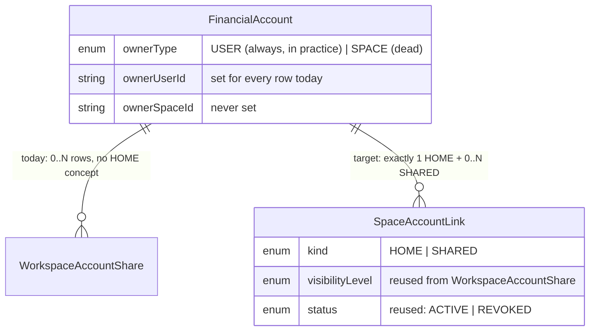

# D3 Space-Account Link Review

**Status: investigation complete. Read-only — no schema, migration, API, route, or application code was modified to produce this document.**

Source context: `docs/architecture/D2_CONNECTION_ARCHITECTURE_REVIEW.md` (D2 investigation, this branch). Governing docs: `docs/architecture/PHASE_2_ARCHITECTURE_FREEZE.md` §4, §8, §9.3, §16-17; `docs/architecture/PHASE_2_DECISION_MATRIX.md` D3 (lines 88-106). All file:line references verified directly against the current `prisma/schema.prisma` and listed route/lib files on this branch.

One naming note before the substance: the task that produced this report referred to "WorkspaceMember." The live Prisma model is `SpaceMember` (`schema.prisma:365`) — `WorkspaceMember` is only the underlying Postgres table name, preserved via `@@map("WorkspaceMember")` from the Phase 1 rename. Both names point at the same rows; this report uses `SpaceMember`, matching the schema and every route that queries it.

---

## 1. Current ownership/visibility model

Three independent mechanisms answer three different questions about an account. They are not layers of one system — confirmed by reading every call site, they don't call into each other at all.

**Mechanism 1 — Space membership (`SpaceMember`, `schema.prisma:365-385`).** Answers "can this user act in this Space, and with what role?" Fields: `spaceId` (`@map("workspaceId")`), `userId`, `role` (`SpaceMemberRole`: `OWNER/ADMIN/MEMBER/VIEWER`, `schema.prisma:110-117`), `status` (`SpaceMemberStatus`: `ACTIVE/REMOVED/LEFT`, `schema.prisma:122-128`, soft — rows are never deleted), `revokedAt/revokedById`. `derivePermissions(role)` (`lib/space.ts:59-67`) maps role to four booleans — `canInvite`/`canManage` (OWNER/ADMIN), `canWrite` (+MEMBER), `canRead` (always true for any active member), `isOwner`. This is a flat, role-only permission set with **no per-resource ACL beneath it** — a VIEWER and an OWNER who are both members of the same Space see exactly the same set of shared accounts; the role only gates membership-management actions (invite, role-change, remove), never which accounts are visible.

**Mechanism 2 — Declared account ownership (`FinancialAccount.ownerType/ownerUserId/ownerSpaceId`, `schema.prisma:518-535`).** Answers "who/what does this account conceptually belong to?" `ownerType: AccountOwnerType` (`USER | SPACE`, `schema.prisma:182-185`) gates which of `ownerUserId`/`ownerSpaceId` is populated — schema comment at `:512-513` states exactly one is set. Per the freeze doc (§4, line 81), the design intent for `SPACE`-owned accounts is "every member sees it per their role's read permission, no separate share row needed" — i.e., this mechanism was meant to be sufficient on its own for Space-owned accounts, bypassing Mechanism 3 entirely.

**Mechanism 3 — Per-Space visibility grants (`WorkspaceAccountShare`, `schema.prisma:677-698`).** Answers "which specific Spaces can currently see this specific account, and at what fidelity?" One row per `(workspaceId, financialAccountId)` pair (`@@unique`, `:694`), `visibilityLevel` (`VisibilityLevel`: `PRIVATE/BALANCE_ONLY/SUMMARY_ONLY/SHARED(legacy)/FULL`, `schema.prisma:139-145`), `status` (`ShareStatus`: `ACTIVE/REVOKED`), `addedByUserId`/`revokedByUserId`.

**These three don't compose the way the freeze doc describes.** `lib/data/accounts.ts:30-45` (`getAccounts()`, the single function every dashboard, KPI, and brief surface reads through) queries exclusively via `WorkspaceAccountShare` — there is no `OR ownerSpaceId` branch, no fallback to Mechanism 2 at all. So even if a `SPACE`-owned account existed, Mechanism 2 alone would not make it visible anywhere; it would still need a `WorkspaceAccountShare` row, the same as a `USER`-owned account. Confirmed by direct read of the function: nothing in it references `ownerSpaceId`. This means the freeze doc's stated design for Mechanism 2 is not actually implemented by the one read path that matters — see §3 for how dead this makes the field in practice, not just "lightly used."

**A fourth, narrower mechanism — credential/connection identity (`AccountConnection.connectedByUserId`, `schema.prisma:637-660`).** Answers "who established this specific connection to the account?" Distinct from both ownership mechanisms: doesn't gate visibility or membership at all, purely a provenance field on the connection row. Confirmed never read for any permission decision in any route inspected for this or the prior D2 investigation.

**`createdByUserId` (D11, `schema.prisma:526-535`)** sits beside all of this as a fifth, even narrower field: the human-accountable creator, independent of `ownerUserId`/`ownerSpaceId`. Per its own schema comment, it exists specifically because `ownerType=SPACE` accounts have `ownerUserId: null` by design, leaving no other field to answer "which person actually connected this on the Space's behalf." Like Mechanism 2, it has never been exercised for a `SPACE`-owned account in practice (see §3) — every existing row's `createdByUserId` equals its `ownerUserId`.

---

## 2. Runtime usage map

| Concern | File:line | What happens |
|---|---|---|
| Role-gated route access | `lib/session.ts:218-236` (`requireSpaceRole`), `:203-208` (`meetsMinRole`) | Looks up `SpaceMember` by `(spaceId, userId)`, rejects if not `ACTIVE` or role below the route's minimum. Used by every Space-scoped route (members, permanent-delete, etc.) |
| Space context resolution | `lib/space.ts:166-246` (`resolveSpaceContext`), `:92-144` (`getSpaceContextUncached`) | 3-tier fallback entirely over `SpaceMember`: requested Space (`:180-198`) → personal Space (`:206-220`) → any active membership (`:228-236`). Never touches `WorkspaceAccountShare` or `FinancialAccount` ownership fields — this function resolves *which Space*, not *which accounts* |
| Account list (read) | `lib/data/accounts.ts:30-45` (`getAccounts`), `:115-128` (`getHoldings`, FinancialAccount-anchor branch) | Exclusively `WorkspaceAccountShare` (`status: ACTIVE`, joined `financialAccount.deletedAt: null`). No `ownerSpaceId` branch anywhere |
| Space's own account list (read) | `app/api/spaces/[id]/accounts/route.ts` (GET, requires `VIEWER`+) | Same `WorkspaceAccountShare`→`FinancialAccount` join, passed through `normalizeSharedAccounts()` (`lib/account-privacy.ts`) |
| Account creation — Plaid | `app/api/plaid/exchange-token/route.ts:131-261` | Sets `ownerType: USER`, `ownerUserId`, `createdByUserId` (all = the linking user, `:196`) on `FinancialAccount`; creates `AccountConnection.connectedByUserId` (= same user, `:225,234`); creates `WorkspaceAccountShare` into the active Space (`:250-261`) |
| Account creation — manual | `app/api/accounts/manual/route.ts:104-149` | Same pattern: `ownerType: USER`/`createdByUserId` (`:108`), `AccountConnection.connectedByUserId` (`:123`), `WorkspaceAccountShare` into personal Space + any additional validated `spaceIds` (`:130-149`) |
| Account creation — wallet | `app/api/accounts/wallet/route.ts:145-182` | Same pattern: `createdByUserId` (`:149`), `connectedByUserId` (`:166`), single `WorkspaceAccountShare` (`:173-182`) |
| Share into a Space | `app/api/spaces/[id]/accounts/share/route.ts` POST | Ownership-checked (`fa.ownerUserId !== user.id` rejected), upserts `WorkspaceAccountShare`, raw-string audit `"ACCOUNT_SHARE"` |
| Revoke a share | Same file, DELETE | Checks `addedByUserId === userId` OR caller role OWNER/ADMIN, sets `status: REVOKED`, raw-string audit `"ACCOUNT_SHARE_REVOKE"` |
| Member role change | `app/api/spaces/[id]/members/[userId]/route.ts:35-91` (PATCH) | OWNER-only, touches `SpaceMember.role` only — never touches `WorkspaceAccountShare` or any `FinancialAccount` field |
| Member removal / self-leave | Same file, `:93-171` (DELETE) | (1) `SpaceMember.status → REMOVED/LEFT` (`:132-139`); (2) **cascades to `WorkspaceAccountShare`**: every `ACTIVE` share in that Space with `addedByUserId = targetUserId` → `REVOKED` (`:141-154`) — this is the mechanism behind the schema comment at `schema.prisma:666-667` ("typically triggered when the member who shared it is removed or leaves"). Notably: this cascade keys on **who added the share**, not on `ownerUserId`/`createdByUserId`/`connectedByUserId` — a departing member's own owned/created/connected accounts are untouched if someone else added the share into this Space |
| Space permanent delete | `app/api/spaces/[id]/permanent/route.ts:62-73` | Explicit guard: blocks delete if `FinancialAccount.count({ where: { ownerSpaceId: id } }) > 0` — defensive code written for a state nothing in the codebase currently creates (see §3). `SpaceMember`/`WorkspaceAccountShare` rows cascade-delete automatically (`onDelete: Cascade`, confirmed in the route's own header comment, `:24-30`) |
| Redact-at-read for `BALANCE_ONLY` shares | `lib/account-privacy.ts` (`genericAccountName`, `sanitizeForBalanceOnly`, `normalizeSharedAccounts`) | Operates only on `WorkspaceAccountShare.visibilityLevel`; no interaction with Mechanism 2 or `SpaceMember.role` |

---

## 3. Conflicts / dead fields

**`FinancialAccount.ownerSpaceId` and `AccountOwnerType.SPACE` are fully dead, not just lightly used.** Two independent greps confirm this, not an inference: zero application-code occurrences of `AccountOwnerType.SPACE` or `ownerType: "SPACE"` anywhere (`app/`, `lib/`), and the one non-schema, non-comment reference to `ownerSpaceId` in the entire codebase is the defensive guard in `app/api/spaces/[id]/permanent/route.ts:62-73`, written to protect against a state that no creation path produces. All three creation routes (Plaid, manual, wallet) hard-code `ownerType: AccountOwnerType.USER`. Combined with §1's finding that `getAccounts()` wouldn't honor `ownerSpaceId` even if it were set, this is a fully unreachable code path end to end: nothing writes it, and the one place that would need to read it for the freeze doc's described behavior to work doesn't. This is a stronger finding than D2's framing of it as "rarely used" — there is no live or historical row anywhere with `ownerType: SPACE`.

**`VisibilityLevel` carries three enum values nothing ever sets.** Grep confirms zero occurrences of `VisibilityLevel.PRIVATE`, `.SUMMARY_ONLY`, or `.SHARED` (the legacy value) anywhere in application code — only `FULL` (the default) and `BALANCE_ONLY` are ever assigned or checked (`lib/account-privacy.ts`'s `sanitizeForBalanceOnly`/`normalizeSharedAccounts` only branch on `BALANCE_ONLY`). Three of five enum values are aspirational.

**The membership-permission axis and the account-visibility axis never intersect.** `derivePermissions()` produces `canRead: true` unconditionally for any active member, and no route in §2 checks `SpaceMember.role` when deciding which *accounts* (as opposed to which member-management actions) a user can see. This is a real design simplicity worth preserving, not a bug — but it means there's currently no way to express "this account is visible to OWNER/ADMIN only within the Space," and `SpaceAccountLink`'s carried-over `visibilityLevel` field doesn't add that either (it's about field-level redaction, not role-gating). Worth knowing going in: this consolidation doesn't introduce role-based account visibility; it just gives the same binary membership-gated visibility one home instead of two.

**Five different "who" fields now exist across this subsystem**, confirmed and counted precisely this session: `FinancialAccount.ownerUserId` (declared visibility owner), `FinancialAccount.createdByUserId` (D11, human-accountable creator), `AccountConnection.connectedByUserId` (credential establisher), `WorkspaceAccountShare.addedByUserId` (who shared it into *this* Space), and — newly confirmed this session — `SpaceMember.revokedById` answers yet another "who" question (who removed this member) that's adjacent but unrelated. For every account in the database today, `ownerUserId === createdByUserId === connectedByUserId` (since every creation path sets all three to the same authenticated user) — the distinction is currently theoretical, not exercised, which is exactly why it's easy to design `SpaceAccountLink` without breaking anything live, but also why a design that's wrong about one of them won't surface a bug until a multi-connection or Space-owned account actually exists.

**The member-removal cascade has a scope gap worth carrying into the target model.** It revokes shares by `addedByUserId`, which is correct for "stop showing what I personally shared," but it does not touch accounts where the departing member is the `ownerUserId`/`createdByUserId`/`connectedByUserId` but someone *else* added the share. That's arguably correct behavior (account ownership shouldn't evaporate because of a Space-membership change) — but it means a departed user's Plaid credential (`PlaidItem`, still `User`-scoped) can keep silently syncing an account that other Space members continue to see, with no membership-side signal that the original connector is gone. Not a D3 blocker, but worth flagging since `SpaceAccountLink`'s `HOME` row is meant to be authoritative about "whose account is this," and this cascade gap means that authority and Space membership can drift apart with zero automated reconciliation.

---

## 4. Target model

The freeze doc already specifies this model concretely (§9.3) rather than leaving it open — this report adopts that sketch rather than proposing a different shape, consistent with the standing rule against re-litigating approved decisions absent a concrete blocker. No blocker was found in this investigation.

```prisma
model SpaceAccountLink {
  id                 String              @id @default(cuid())
  spaceId            String
  financialAccountId String
  kind               SpaceAccountLinkKind   // HOME | SHARED — exactly one HOME per account
  visibilityLevel    VisibilityLevel
  status             ShareStatus
  addedByUserId      String
  revokedAt          DateTime?
  revokedByUserId    String?

  @@unique([spaceId, financialAccountId])
}
```

**What this consolidates (per freeze doc §9.3, confirmed against this session's findings as the right scope):** Mechanism 2 (`ownerType`/`ownerUserId`/`ownerSpaceId`) and Mechanism 3 (`WorkspaceAccountShare`) collapse into one polymorphic table. A `kind: HOME` row replaces the declared-owner pair (the account's "primary" Space — for every existing account, that's the creator's Personal Space, confirmed in §3). A `kind: SHARED` row replaces each `WorkspaceAccountShare` row for every *other* Space the account is visible in. One row per `(space, account)` pair either way — the exact same cardinality `WorkspaceAccountShare` already has (`@@unique([workspaceId, financialAccountId])` vs. the new table's `@@unique([spaceId, financialAccountId])`), so this is a genuine consolidation of two mechanisms into the shape one of them already had, not a new shape.

**What stays untouched, explicitly:**
- `SpaceMember` and the role-permission axis (Mechanism 1) — `SpaceAccountLink` has no `role` concept and doesn't gate membership actions. These are orthogonal systems; D3 does not merge them.
- `AccountConnection.connectedByUserId` and `FinancialAccount.createdByUserId` — both describe *who connected/created* the account, a question `SpaceAccountLink` doesn't answer and shouldn't absorb. `SpaceAccountLink` only answers *which Space(s) can see it*.
- `WorkspaceAccountShare` itself — name, fields, and Prisma accessor (`db.workspaceAccountShare`) stay exactly as-is per the explicit project rule and the freeze doc §17 restatement. It is superseded as the write/read target during cutover, never renamed or dropped.
- `ownerType` as a field — the freeze doc says `ownerSpaceId`/`ownerUserId` "retire in favor of the HOME row," but doesn't retire `ownerType` itself, and this investigation found no reason it has to: `ownerType` could continue to answer "is this conceptually a personal or joint/business account" as a UI/classification signal, independent of which Space currently holds the `HOME` link. Flagged as an open decision in §6 rather than resolved here, since the freeze doc doesn't take a position on it either.



`PublishedAccountView` (also sketched in freeze doc §9.3) is explicitly downstream of this table ("depends on §9.3's own `SpaceAccountLink`... sequenced accordingly in §16") — out of scope for this report beyond noting the dependency for §6.

---

## 5. Migration strategy (additive, no rename, no break)

1. **Add `SpaceAccountLink` as a new, empty table.** Pure additive migration. `WorkspaceAccountShare` and the `FinancialAccount` owner columns are not touched in this step — no DDL against either.

2. **Backfill `SHARED` rows — mechanical, 1:1.** For every existing `WorkspaceAccountShare` row, insert a `SpaceAccountLink` row with `kind: SHARED`, copying `visibilityLevel`/`status`/`addedByUserId`/`revokedAt`/`revokedByUserId` verbatim. No ambiguity here.

3. **Backfill `HOME` rows — requires one resolved ambiguity (see §6, Decision 1).** Per §3, every existing `FinancialAccount` has `ownerType: USER` (never `SPACE`), so in practice the backfill only ever needs the `ownerUserId → that user's Personal Space` path: look up the owner's `SpaceMember` row where `space.type = PERSONAL` (the exact lookup `resolveSpaceContext()` already does at `lib/space.ts:206-209`, reusable as a batch query rather than per-request), and insert `kind: HOME` for that `(personalSpaceId, financialAccountId)` pair. Since every creation route already shares each new account into its creator's personal Space at creation time (confirmed in §2's creation rows), this `HOME` row's `(space, account)` pair will exactly collide with a `WorkspaceAccountShare` row already migrated as `SHARED` in step 2 — backfill order matters: resolve and insert all `HOME` rows first, then insert `SHARED` for every remaining `WorkspaceAccountShare` row whose `(space, account)` pair isn't already claimed by a `HOME` row from step 3, skipping the one that would collide. (The `ownerType: SPACE` branch of this step is currently a no-op — zero rows — but should still be written, since leaving it unhandled would silently break the day someone finally exercises that path.)

4. **Dual-write period.** Every write path in §2's table that creates/revokes/restores a `WorkspaceAccountShare` row gets a parallel `SpaceAccountLink` write, scoped to exactly the files already identified: `exchange-token/route.ts`, `accounts/manual/route.ts`, `accounts/wallet/route.ts`, `accounts/[id]/route.ts` (archive), `accounts/[id]/restore/route.ts`, `accounts/manual/[id]/restore/route.ts`, `accounts/manual/[id]/route.ts` (manual archive/restore), `spaces/[id]/accounts/share/route.ts` (share/revoke), `spaces/[id]/members/[userId]/route.ts` (member-removal cascade — needs its own parallel `SpaceAccountLink` revoke, matching the `WorkspaceAccountShare` one it already does). No reads cut over yet.

5. **Cutover.** Once dual-write is proven stable, switch `getAccounts()`/`getHoldings()` (`lib/data/accounts.ts`) and the Space accounts route (`spaces/[id]/accounts/route.ts`) to read `SpaceAccountLink` instead of `WorkspaceAccountShare`. `lib/account-privacy.ts`'s redaction functions need no change — they operate on `visibilityLevel`, which the new table carries unchanged.

6. **Retire-later, not retire-now.** `WorkspaceAccountShare` and `FinancialAccount.ownerSpaceId`/`ownerUserId` are not dropped in this branch — same treatment as `Account`/`PlaidItem` already get post-D11/D2. They become read-dead but stay in the schema until a dedicated, separately-reviewed drop migration, per "do not remove legacy tables prematurely" and "do not rename `WorkspaceAccountShare` directly."

This is the same shape D11 and the proposed D2 `Connection` work already use (dual-FK / dual-write, additive-before-subtractive) — no new migration pattern is being introduced for D3.

---

## 6. Open decisions requiring approval

1. **`HOME`-vs-`SHARED` collision rule at backfill time (§5, step 3).** Confirm the proposed rule — the personal-Space `WorkspaceAccountShare` row becomes the `HOME` link; every other Space's row becomes `SHARED` — is correct, including for the (currently zero, but possible after this lands) case of a manually-entered account whose creator later removes the personal-Space share without removing any other share. What should `HOME` mean if the original personal-Space share is gone but the account is still shared elsewhere? The freeze doc's "exactly one `HOME` per account" constraint implies this needs an explicit re-assignment rule, not just a backfill rule.

2. **Does `ownerType` retire alongside `ownerSpaceId`/`ownerUserId`, or does it survive as a standalone classification field?** §4 flags this as undecided by the freeze doc itself. Recommend keeping it (it's cheap, additive-compatible, and answers a question `kind: HOME/SHARED` doesn't — "personal vs. joint/business," not "which Space currently hosts it") but this is a product-semantics call, not a technical one.

3. **Does removing a member ever need to revoke or reassign a `HOME`-kind link?** §3's "member-removal cascade gap" finding applies most sharply to `HOME` links: if the `HOME` row's Space is a *shared* (non-personal) Space — possible in principle once `SPACE`-owned accounts are ever actually created — and the account's `createdByUserId` leaves that Space, should the `HOME` link revoke, reassign, or stay put with a dangling creator? No existing behavior to preserve here (this case has zero live rows today), so this is a forward-looking design decision, not a migration-safety one.

4. **Should the dual-write step also extend the member-removal cascade's scope**, given the gap noted in §3 (cascade only follows `addedByUserId`, never `ownerUserId`/`createdByUserId`/`connectedByUserId`)? This is logically independent of introducing `SpaceAccountLink` — the same gap exists today against `WorkspaceAccountShare` — but since D3 touches that exact cascade route anyway (`members/[userId]/route.ts`) to add the dual-write, it's a natural point to decide whether to also close the gap or explicitly leave it as-is for a separate, smaller PR.

5. **Reuse `VisibilityLevel` verbatim in `SpaceAccountLink`, including its three dead values?** The freeze doc's sketch does (§4 of this report shows the field unchanged). Recommend yes — trimming the enum is a separate, unrelated cleanup and "stays generic, no big-bang" argues against bundling it here — but flagging since it's an easy moment to also tidy this up if preferred.

---

## 7. Sequencing impact on D2

This investigation's findings reinforce, with direct evidence, the conclusion the D2 report's §6 already reached from the Decision Matrix alone: **D3 (`SpaceAccountLink`) should land before D2/D13 (`Connection`/provider-adapter-layer)**, reversing the freeze doc's original branch 3-then-4 numbering in favor of the Decision Matrix's recommended swap.

The concrete reason, now grounded in this session's reads rather than just the matrix's abstract argument: the freeze doc's own §9.1 states the (not-yet-built) `DiscoveredAccount` staging step "needs to know which Space a newly imported account defaults into" — and per §1 of this report, "which Space" is currently answered by Mechanism 2 (`ownerSpaceId`/`ownerUserId`), a mechanism this investigation just confirmed is dead end-to-end. Building any new provider-adapter staging logic against that mechanism would mean building it against a path that doesn't work today and is explicitly slated for replacement by this exact branch. Building it against `WorkspaceAccountShare` instead just relocates the same problem one branch later, since `SpaceAccountLink` retires that table's write role too. Either way, D2's staging/import design would need a second pass the moment D3 lands — confirming the matrix's "branch 3's staging work would be built against the old model and need re-pointing" risk is not hypothetical.

No technical blocker runs the other direction: `SpaceAccountLink`'s backfill (§5) operates entirely on `FinancialAccount`/`WorkspaceAccountShare` data that already exists regardless of whether `Connection`/`AccountConnection.connectionId` (D2's proposed addition) has shipped. D3 has no dependency on D2.

Net: this report concurs with D2 §6 and the Decision Matrix — sequence `feature/space-account-link-migration` before `feature/provider-adapter-layer`. `feature/published-account-view` (branch 5) stays after both, per its own explicit dependency on `SpaceAccountLink` (freeze doc §9.3, §16 point 5).

No code, schema, or migration changes have been made. Per the working style for this project, the next step is a short implementation checklist for whichever piece of D3 is approved to proceed (most narrowly: the additive `SpaceAccountLink` table + `SpaceAccountLinkKind` enum from §4, with Open Decision 1 resolved), submitted for approval before any implementation begins.
