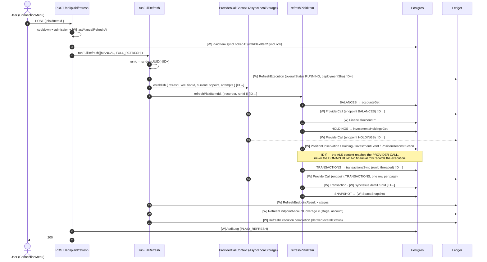

# V26-OPS-REFRESH-1 — Manual Refresh Execution Traceability

**Status:** investigation only. Read-only. No code, schema, data, route, job, or
ledger was modified.

> ## ⚠️ DRIFT-1 IS RESOLVED — read this document as a historical record of the defect
>
> **OPS-REFRESH-1A (`980657d`)** put every per-item refresh in the all-items
> manual fan-out inside the canonical `runFullRefresh` envelope: one
> MANUAL/FULL_REFRESH `RefreshExecution` per eligible item, the sync lock claimed
> **inside** the envelope so contention records a SKIPPED execution, `deferSnapshot`
> and every user-facing behaviour preserved. No schema change, no migration, no
> production execution. Slice record:
> `docs/plans/V26-OPS-REFRESH-EXECUTION-LEDGER.md`.
>
> **DRIFT-2, DRIFT-3, DRIFT-4 and DRIFT-5 remain OPEN** and are now disclosed in
> `REFRESH_EXECUTION_DOCTRINE.md` §N. §6 of this document — *"can production
> answer which refresh caused this to change?"* — still answers **no**: DRIFT-1
> was about whether an execution record exists at all, not about whether a
> financial row can name the execution that wrote it. That is DRIFT-3, and it is
> untouched.
>
> One statement below is now out of date by design: §1 Q5/Q6 and §4's
> manual-fan-out row describe the pre-fix behaviour. They are left verbatim
> because the doctrine-versus-reality table is the evidence for why the fix was
> made.
**Date:** 2026-08-01
**Branch:** v2.6
**Trigger:** a confirmed user-initiated manual refresh wrote 25 `Transaction`,
49 `PositionObservation` (including `origin: DERIVED` / `source:
"reconstruction"`), 9 `InvestmentEvent`, and 1 `SpaceSnapshot` row — with **no**
`RefreshExecution` and **no** `JobRun`.

---

## 0 · Executive finding

**The manual refresh route has two branches. Only one of them is on the ledger.**

`POST /api/plaid/refresh` (`app/api/plaid/refresh/route.ts`) forks on whether the
request body carries a `plaidItemId`:

| Branch | Body | UI entry points | Ledger |
|---|---|---|---|
| **A — single item** | `{ plaidItemId }` | `ConnectionMenu` (per-connection "Refresh connection"), `AccountRefreshButton` (Investments connections card) | `runFullRefresh({ trigger: "MANUAL", profile: "FULL_REFRESH" })` — **one `RefreshExecution` + stage rows + `ProviderCall` rows** |
| **B — all active items** | *(empty)* | **the global topbar `RefreshButton`** and the sidebar "Refresh Data" row, both via `components/plaid/useManualRefresh.ts` (`fetch("/api/plaid/refresh", { method: "POST" })` — no body) | `refreshAllActiveItemsForUser(user.id)` → `withPlaidItemSyncLock(id, () => refreshPlaidItem(id, { deferSnapshot: true }))` — **no recorder, no `runId`, no `runFullRefresh`. Zero ledger rows.** |

`refreshPlaidItem`'s recorder seam is *optional by design* (`recorder?.begin(...)`,
optional-chained at every call). Branch B passes `{ deferSnapshot: true }` and
nothing else — so every stage silently records nothing, no `RefreshExecution`
row is opened, no `runId` is minted, and the DF-2D `AsyncLocalStorage`
provider-call context is never established.

**The reported row signature is Branch B's fingerprint, and only Branch B's.**
The `1 SpaceSnapshot` is decisive: Branch B sets `deferSnapshot: true`, which
skips the per-item `regenerateSnapshotsForAccounts` fan-out and defers to a
single post-loop `regenerateCompletedSpaces()`. Branch A, cron, webhook and
reconnect all write a `RefreshExecution`. There is no other path that produces
provider-derived writes on a user's explicit action while leaving the ledger
empty.

**Classification:** this is **(2) implementation drift from doctrine** — not an
intentional exemption. `REFRESH_EXECUTION_DOCTRINE.md` §C states *"Every
canonical refresh attempt produces exactly one [`RefreshExecution`]"*, lists
`MANUAL` as a shipped profile, and records the manual refresh route as
**integrated in DF-2A (`5b7be94`)**. The doctrine's only stated exemption (§J)
covers the **reconnect inline fast slice**, which is a different code path in a
different file. The all-items fan-out is never mentioned in the doctrine at all —
it was not exempted, it was **not seen**.

---

## 1 · Answers to the twelve questions

| # | Question | Answer |
|---|---|---|
| 1 | Exact route + call graph for a user-initiated manual refresh | Two graphs — §2. Branch A is ledgered; Branch B (the topbar button) is not. |
| 2 | Which functions write the four tables | §3 matrix. `Transaction` ← `syncTransactionsForItem`; `PositionObservation` ← `capturePositionObservations` / `captureBrokerageCash` / `persistInstrument` (reconstruction) / `captureWalletPosition` / import+opening writers; `InvestmentEvent` ← `persistPlaidEvent` / import-commit / opening-position; `SpaceSnapshot` ← `regenerateSpaceSnapshot` / `backfillSpaceSnapshots` / `regenerateWealthHistory*`. |
| 3 | Which step runs reconstruction | On the manual path: `syncInvestmentsForItem` → `ingestInvestmentEvents` → `maybeRepairReconstructions` → `repairReconstructionForAccount` → `reconstructAccount`. It is **four call frames below** the refresh, inside a best-effort catch, inside another best-effort catch. |
| 4 | Which step writes DERIVED PositionObservation | `persistInstrument` in `lib/investments/reconstruction-runner.ts:155-179` — `deleteMany` (origin DERIVED + source `"reconstruction"`) then `createMany`. Reached only when a `PositionReconstruction` summary already exists (repair no-ops otherwise). |
| 5 | Does the manual route call the canonical wrapper | **Branch A: yes. Branch B: no.** |
| 6 | Is the omission required by doctrine | **No.** §J exempts only `performPlaidTokenExchange`'s inline connect slice. The all-items fan-out is unmentioned and contradicts §C. |
| 7 | Does a deferred follow-up create the execution later | **No.** Branch B schedules nothing — no `after()`, no `syncPlaidItemFromWebhook`, no job. The work is fully synchronous inside the request and leaves no ledger trace, ever. |
| 8 | Any execution/request/trace/sync/parent id linking the four writes | **No.** §5. `RefreshExecution.runId` is the only correlator that exists, and Branch B never mints one. `Transaction`, `PositionObservation`, `InvestmentEvent`, `PositionReconstruction`, `SpaceSnapshot` carry **no** execution, run, trace, job, or parent column in `prisma/schema.prisma`. |
| 9 | Can production answer "which refresh caused this position/snapshot to change?" | **No — for any path, not just Branch B.** §6. |
| 10 | Does reconnect/update mode behave differently | **Yes, materially.** §4. Reconnect = inline fast slice (deliberately unledgered, §J) **+** deferred `runFullRefresh(trigger: RECONNECT, profile: RECONNECT)` which runs `HISTORY_BACKFILL` (the one-time `reconstructAccount` bootstrap). Manual never runs `HISTORY_BACKFILL`. |
| 11 | Do CRON/WEBHOOK have stronger traceability than USER/MANUAL | **Yes.** Cron and webhook are 100% ledgered per item; manual is ledgered only on the per-connection button. Cron additionally has a `JobRun` parent (though `parentJobRunId` is still null — DF-2B.1). The *most common* manual gesture in the product is the *least* observable ingestion path on the platform. |
| 12 | Is reconstruction provenance sufficient to prevent circular reasoning | **Partially — by accident of a filter, not by contract.** §7. Reconstruction anchors on `origin: OBSERVED` only, so it cannot eat its own output today. But DERIVED rows carry **no** pointer to the execution, the anchor, or the prior generation, and every *valuation* reader consumes them with **no origin filter**. The contract is unwritten and unguarded. |

---

## 2 · End-to-end sequence diagram

Legend: **`[W]`** = database write · **`[ID+]`** = execution identity created ·
**`[ID→]`** = identity propagated · **`[ID✗]`** = identity **lost** (no
correlator exists past this point).

### 2a · Branch B — the topbar Refresh button (the reported incident)

```mermaid
sequenceDiagram
    autonumber
    actor U as User (topbar Refresh)
    participant R as POST /api/plaid/refresh
    participant AD as admitOperationalWork
    participant FA as refreshAllActiveItemsForUser
    participant RP as refreshPlaidItem
    participant BAL as refreshBalancesForItem
    participant SI as syncInvestmentsForItem
    participant PC as capturePositionObservations
    participant IE as ingestInvestmentEvents
    participant RR as repairReconstructionForAccount
    participant TX as syncTransactionsForItem
    participant SN as regenerateCompletedSpaces
    participant DB as Postgres
    participant L as RefreshExecution / JobRun

    U->>R: POST (no body)
    R->>R: limitByUser("plaid-refresh")
    R->>AD: admit REFRESH_EXECUTION
    AD-->>R: ALLOW
    Note over R,L: ID✗ — no runFullRefresh call.<br/>No RefreshExecution opened.<br/>No runId minted.<br/>No ProviderCall ALS context.
    R->>DB: [W] PlaidItem.lastManualRefreshAt (markManyManualRefreshed)
    R->>FA: refreshAllActiveItemsForUser(userId)

    loop per active PlaidItem
        FA->>DB: withPlaidItemSyncLock → [W] PlaidItem.syncLockedAt
        FA->>RP: refreshPlaidItem(id, {deferSnapshot:true})
        Note over RP: recorder = undefined · runId = undefined<br/>every recorder?.begin/succeed is a no-op

        RP->>BAL: BALANCES stage
        BAL->>DB: plaid.accountsGet (UNATTRIBUTED — no ProviderCall row)
        BAL->>DB: [W] FinancialAccount.balance / availableBalance /<br/>balanceLastUpdatedAt / lastUpdated / syncStatus

        RP->>SI: HOLDINGS stage
        SI->>DB: plaid.investmentsHoldingsGet (UNATTRIBUTED)
        SI->>DB: [W] PlaidItem.investmentsConsent (on change)
        SI->>PC: capturePositionObservations
        PC->>DB: [W] Instrument (resolver may create)
        PC->>DB: [W] PositionObservation (origin OBSERVED, source "plaid")
        PC->>DB: [W] PositionObservation (origin DERIVED, source "account-balance-residual")
        PC->>DB: [W] PriceObservation (A8-2 same-day close)
        SI->>DB: [W] Holding (syncCurrentHoldings insert/update/remove-stale)

        SI->>IE: ingestInvestmentEvents (24-month window)
        IE->>DB: plaid.investmentsTransactionsGet (UNATTRIBUTED, paginated)
        IE->>DB: [W] InvestmentEvent (append-only; supersede on restatement)
        IE->>RR: maybeRepairReconstructions(affected accounts)
        RR->>DB: read PositionObservation WHERE origin=OBSERVED (anchors)
        RR->>DB: read InvestmentEvent WHERE deletedAt=null AND supersededById=null
        RR->>DB: [W] DELETE PositionObservation WHERE origin=DERIVED AND source="reconstruction"
        RR->>DB: [W] PositionObservation (origin DERIVED, source "reconstruction")
        RR->>DB: [W] PositionReconstruction (upsert summary)
        Note over RR,DB: ID✗ — DERIVED rows record<br/>reconstructionVersion + evidenceRefs.eventIds only.<br/>No execution id. No anchor id. No prior generation.

        RP->>TX: TRANSACTIONS stage
        Note over TX: runId = randomUUID() minted INTERNALLY [ID+]<br/>— but it is never returned, never stored on any row,<br/>and no RefreshExecution exists to own it.
        TX->>DB: plaid.transactionsSync (UNATTRIBUTED, paginated)
        TX->>DB: [W] Transaction (create / update / soft-delete)
        TX->>DB: [W] PlaidItem.cursor / lastSyncedAt / syncIncompleteAt
        TX->>DB: [W] SyncIssue.detail.runId  ← the ONLY row carrying the correlator
        Note over TX,L: ID✗ — that runId matches no RefreshExecution.<br/>lib/platform/refresh/execution-query.ts cannot join it.

        RP->>DB: RECONCILIATION stage → [W] SyncIssue (BALANCE_TX_MISMATCH, if any)
        Note over RP: SNAPSHOT stage SKIPPED (deferSnapshot) — not recorded anywhere
        RP->>DB: [W] AuditLog (ConnectionSynced domain event)
        FA->>DB: [W] PlaidItem.syncLockedAt = null (release)
    end

    FA->>SN: regenerateCompletedSpaces(succeededAccountIds, failedItemIds)
    SN->>DB: [W] SpaceSnapshot (upsert on [spaceId, today])  ← the 1 observed row
    FA-->>R: RefreshSummary
    R->>DB: [W] AuditLog (PLAID_REFRESH — counts only, no ids, no runId)
    R-->>U: 200 { ok: true, ...summary }

    Note over L: RefreshExecution: 0 rows<br/>RefreshEndpointResult: 0 rows<br/>RefreshEndpointAccountCoverage: 0 rows<br/>ProviderCall: 0 rows<br/>JobRun: 0 rows
```

### 2b · Branch A — the per-connection Refresh button (for contrast)



**The identity boundary, stated exactly.** Even on the fully-ledgered Branch A,
execution identity propagates into **operational telemetry only** —
`RefreshEndpointResult`, `RefreshEndpointAccountCoverage`, `ProviderCall`, and
`SyncIssue.detail.runId`. It never reaches a **financial** row. `Transaction`,
`PositionObservation`, `InvestmentEvent`, `PositionReconstruction` and
`SpaceSnapshot` are all written by functions that neither receive nor record the
execution id. That is a doctrine-consistent design (§L: "the ledger is an
authority, not a presentation model") but it is the reason question 9 answers
*no* even where the ledger works.

---

## 3 · Writer matrix — every path capable of writing the five tables

Column key: **Exec-ID** = is a `RefreshExecution` identity in scope while the
write happens · **RefEx** = a `RefreshExecution` row is written for this work ·
**JobRun** = a `JobRun` row covers this work.

### 3.1 · `Transaction`

| # | Path | Writer | Trigger | Exec-ID | RefEx | JobRun | Doctrine expects | Actual | Drift |
|---|---|---|---|---|---|---|---|---|---|
| T1 | `POST /api/plaid/refresh` **branch A** | `syncTransactionsForItem` | manual | ✅ `runId` threaded | ✅ MANUAL/FULL_REFRESH | ✗ (correct — §I) | ledgered | ledgered | — |
| T2 | `POST /api/plaid/refresh` **branch B** | `syncTransactionsForItem` (via `refreshAllActiveItemsForUser`) | manual | ❌ self-minted `runId`, orphan | ❌ **none** | ❌ | ledgered (§C) | **invisible** | ⚠️ **DRIFT-1** |
| T3 | `POST /api/plaid/sync` | `syncTransactionsForItem` | manual | ✅ | ✅ MANUAL/TRANSACTIONS_ONLY | ✗ | ledgered | ledgered | — |
| T4 | `POST /api/plaid/resume-sync` | `syncTransactionsForItem` | user/auto-resume | ✅ | ✅ RESUME/IMPORT_RECOVERY | ✗ | ledgered | ledgered | — |
| T5 | `POST /api/plaid/investments/enable` | `refreshPlaidItem` | manual | ✅ | ✅ MANUAL/FULL_REFRESH | ✗ | ledgered | ledgered | — |
| T6 | `jobs/sync-banks.ts` | `runCronItemRefresh` | cron | ✅ | ✅ CRON/FULL_REFRESH | ✅ (`runJob`, but `parentJobRunId` null) | ledgered; parent deferred | as documented | DF-2B.1 (disclosed) |
| T7 | `POST /api/plaid/webhook` | `runDeferredHistorySync` | webhook | ✅ | ✅ WEBHOOK/RECONNECT | ✗ (correct — §I) | ledgered | ledgered | — |
| T8 | `POST /api/plaid/exchange-token` → deferred | `runDeferredHistorySync` | reconnect | ✅ | ✅ RECONNECT/RECONNECT | ✗ | ledgered | ledgered | — |
| T9 | `performPlaidTokenExchange` **inline slice** (`deferHistorySync:false`, e.g. admin expanded-history) | `syncTransactionsForItem` | reconnect/admin | ❌ | ❌ by design | ❌ | **outside the ledger (§J)** | outside | — (intended) |
| T10 | `jobs/resume-stale-imports.ts` | via `syncPlaidItemFromWebhook` | background job | ✅ | ✅ RESUME/IMPORT_RECOVERY | ✅ (`runJob`) | ledgered | ledgered | — |
| T11 | Platform-Ops `connections/[id]/resync` | `syncTransactionsForItem` | operator | ✅ | ✅ OPERATOR/TRANSACTIONS_ONLY | ✗ | ledgered | ledgered | — |
| T12 | `scripts/recover-plaid-item-transactions.ts` | `syncTransactionsForItem` | script | ❌ | ❌ | ❌ | not stated | unledgered | ⚠️ minor (script) |
| T13 | CSV import commit / manual transaction routes | import writers | user | ❌ | ❌ | ❌ | not a refresh | `ImportBatch` provenance instead | — (own channel) |

### 3.2 · `PositionObservation`

| # | Path | Writer / origin+source | Trigger | Exec-ID | RefEx | JobRun | Doctrine | Actual | Drift |
|---|---|---|---|---|---|---|---|---|---|
| P1 | refresh **branch A** | `capturePositionObservations` → OBSERVED/`plaid`; `captureBrokerageCash` → DERIVED/`account-balance-residual` | manual | ⚠️ execution open, **row records nothing** | ✅ | ✗ | HOLDINGS stage recorded | stage recorded, **row unattributed** | ⚠️ **DRIFT-3** |
| P2 | refresh **branch B** | same writers | manual | ❌ | ❌ | ❌ | ledgered | **invisible** | ⚠️ **DRIFT-1** |
| P3 | refresh **branch A or B** → `repairReconstructionForAccount` | `persistInstrument` → **DERIVED/`reconstruction`** | manual | ❌ (four frames deep, no seam) | A: ✅ / B: ❌ | ❌ | *unstated* — reconstruction is not a named stage on the manual profile | writes DERIVED rows with **no stage, no coverage, no execution** | ⚠️ **DRIFT-2** |
| P4 | `exchange-token` inline slice | `capturePositionObservations` + repair | reconnect | ❌ | ❌ by design (§J) | ❌ | outside ledger | outside | — |
| P5 | deferred pipeline `HISTORY_BACKFILL` | **`reconstructAccount`** (the one-time bootstrap that SEEDS `PositionReconstruction`) | webhook / reconnect / resume | ⚠️ inside `HISTORY_BACKFILL` stage | ✅ | ✗ | HISTORY_BACKFILL stage (§F) | stage recorded, **rows unattributed** | ⚠️ **DRIFT-3** |
| P6 | `jobs/sync-banks.ts` investment-event ingest | `persistInstrument` via repair | cron | ❌ — runs **after** `runFullRefresh` returned | ✗ for this work | ✅ | §M concedes the provider call is unattributed | writes are **also** unattributed | ⚠️ **DRIFT-4** |
| P7 | `lib/crypto/btc-sync.ts` | `captureWalletPosition` → OBSERVED/`wallet` | cron (`sync-crypto`) / wallet routes | ❌ | ❌ | ✅ (cron only) | crypto is outside the Plaid refresh ledger | unledgered | — (out of scope, disclosed) |
| P8 | CSV import commit | `investment-import-commit` → IMPORTED/`csv:<profile>` | user import | ❌ | ❌ | ❌ | `ImportBatch` is the provenance authority | `importBatchId` + `deletedAt` rollback | — (own channel, **the good model**) |
| P9 | Opening-position assertion | `opening-position.ts` → USER_ASSERTED/`user` | user | ❌ | ❌ | ❌ | user assertion | `createdByUserId` on the event | — |
| P10 | `scripts/backfill-position-observations.ts`, `scripts/backfill-crypto-positions.ts`, `scripts/run-reconstruction.ts` | direct create / `reconstructAccount` | script | ❌ | ❌ | ❌ | not stated | unledgered | ⚠️ minor (script) |

### 3.3 · `InvestmentEvent`

| # | Path | Writer | Trigger | Exec-ID | RefEx | JobRun | Doctrine | Actual | Drift |
|---|---|---|---|---|---|---|---|---|---|
| E1 | refresh **branch A** | `persistPlaidEvent` (via `syncInvestmentsForItem` → `ingestInvestmentEvents`) | manual | ⚠️ execution open (`investmentsTransactionsGet` attributes to **HOLDINGS**, per §M) | ✅ | ✗ | §M: "INVESTMENT_ACTIVITY / during HOLDINGS on the manual path" | provider call attributed; **rows not** | ⚠️ **DRIFT-3** |
| E2 | refresh **branch B** | same | manual | ❌ | ❌ | ❌ | ledgered | **invisible** | ⚠️ **DRIFT-1** |
| E3 | `exchange-token` inline slice | same | reconnect | ❌ | ❌ by design | ❌ | outside ledger (§J) | outside | — |
| E4 | `jobs/sync-banks.ts` | `ingestInvestmentEvents` **outside** the envelope | cron | ❌ | ✗ for this work | ✅ | §M: "cron's investment-event ingest runs outside the execution today" | as documented | — (disclosed) but see DRIFT-4 |
| E5 | CSV import commit | `investment-import-commit` | user import | ❌ | ❌ | ❌ | `ImportBatch` | `importBatchId` + `importedRaw` | — |
| E6 | Opening-position assertion | `opening-position.ts` | user | ❌ | ❌ | ❌ | user assertion | `createdByUserId` | — |
| E7 | Import rollback | `investment-import-rollback.ts` | user | ❌ | ❌ | ❌ | `ImportBatch` | soft-delete by batch | — |

### 3.4 · `PositionReconstruction`

| # | Path | Writer | Trigger | Exec-ID | RefEx | JobRun | Doctrine | Actual | Drift |
|---|---|---|---|---|---|---|---|---|---|
| PR1 | deferred pipeline `HISTORY_BACKFILL` | `reconstructAccount` (**the only bootstrap that seeds a summary**) | webhook / reconnect / resume | ⚠️ inside stage | ✅ | ✗ | HISTORY_BACKFILL | stage recorded, summary unattributed | ⚠️ DRIFT-3 |
| PR2 | refresh branch A or B | `repairReconstructionForAccount` (**no-op unless PR1 already ran**) | manual | ❌ | A: ✅ / B: ❌ | ❌ | unstated | unattributed | ⚠️ DRIFT-2 |
| PR3 | `jobs/sync-banks.ts` | repair, outside envelope | cron | ❌ | ✗ | ✅ | unstated | unattributed | ⚠️ DRIFT-4 |
| PR4 | import commit / rollback / opening-position | repair | user | ❌ | ❌ | ❌ | `ImportBatch` | batch-attributed inputs, unattributed output | — |
| PR5 | `scripts/run-reconstruction.ts` | `reconstructAccount` | script | ❌ | ❌ | ❌ | unstated | unattributed | ⚠️ minor |

> `PositionReconstruction` has a `runAt DateTime @default(now())` column and an
> `evidenceRefs Json?` carrying the anchor observation id + contributing event
> ids. It is the **only** one of the five tables with any run-shaped field — and
> it is a bare timestamp, not an identity, and it is overwritten on every upsert.

### 3.5 · `SpaceSnapshot`

| # | Path | Writer | Trigger | Exec-ID | RefEx | JobRun | Doctrine | Actual | Drift |
|---|---|---|---|---|---|---|---|---|---|
| S1 | refresh **branch A** | `regenerateSnapshotsForAccounts` | manual | ⚠️ SNAPSHOT stage recorded | ✅ | ✗ | SNAPSHOT stage (§F) | stage recorded, row unattributed | ⚠️ DRIFT-3 |
| S2 | refresh **branch B** | `regenerateCompletedSpaces` → `regenerateSpaceSnapshot`, **after the item loop** | manual | ❌ | ❌ | ❌ | ledgered | **invisible** — and structurally *outside* any per-item execution even if branch B were fixed | ⚠️ **DRIFT-1 + DRIFT-5** |
| S3 | deferred pipeline (CONN-3 freshness) | `regenerateSnapshotsForAccounts` | webhook/reconnect/resume | ⚠️ SNAPSHOT stage | ✅ | ✗ | SNAPSHOT | stage recorded | — |
| S4 | deferred pipeline `HISTORY_BACKFILL` | `backfillSpaceSnapshots` + `regenerateWealthHistoryForAccounts` (**writes up to MAX-window history rows**) | webhook/reconnect/resume | ⚠️ inside HISTORY_BACKFILL | ✅ | ✗ | HISTORY_BACKFILL (§F) | stage recorded; **row count/window not** (`recorder.succeed("HISTORY_BACKFILL")` is called with **no facts at all**) | ⚠️ DRIFT-3 |
| S5 | `jobs/sync-banks.ts` — cron item | `regenerateSnapshots` | cron | ⚠️ SNAPSHOT stage | ✅ | ✅ | SNAPSHOT | stage recorded | — |
| S6 | `jobs/sync-banks.ts` — wealth self-heal | `regenerateWealthHistoryForAccounts`, **after `runFullRefresh` returned** | cron | ❌ | ✗ for this work | ✅ | unstated | rewrites historical snapshots with **zero execution attribution** | ⚠️ **DRIFT-4** |
| S7 | `POST /api/plaid/resume-sync` post-envelope | `regenerateWealthHistoryForItem` (MAX window) | user | ❌ — line 169, **after** `runFullRefresh` closed | ✗ for this work | ❌ | unstated | unattributed historical rewrite | ⚠️ **DRIFT-4** |
| S8 | `exchange-token` inline slice | `regenerateSnapshotsForAccounts` | reconnect | ❌ | ❌ by design | ❌ | outside ledger (§J) | outside | — |
| S9 | `POST /api/connections/build-intelligence` | `regenerateWealthHistoryForAccounts` | user | ❌ | ❌ | ❌ | unstated | unattributed | ⚠️ minor |
| S10 | `/api/accounts/manual`, `/wallet`, `/[id]/sync`, `/[id]/restore`, `/manual/[id]/restore` | `regenerateSnapshotsForAccounts` / `regenerateWealthHistoryForAccounts` | user | ❌ | ❌ | ❌ | not a Plaid refresh | unledgered | — (out of scope) |
| S11 | `lib/accounts/disconnect.ts`, `lib/events/handlers/snapshot.ts` | `regenerateSpaceSnapshot` | user / domain event | ❌ | ❌ | ❌ | not a refresh | unledgered | — |
| S12 | `jobs/sync-crypto.ts` | `regenerateWealthHistoryForAccounts` | cron | ❌ | ❌ | ✅ | crypto outside Plaid ledger | unledgered | — (disclosed) |
| S13 | `scripts/backfill-snapshots.ts`, `regenerate-wealth-history.ts`, `dry-run-regeneration.ts` | backfill / regen | script | ❌ | ❌ | ❌ | unstated | unledgered | ⚠️ minor (script) |
| S14 | `prisma/seed.ts` | `createMany` | seed | ❌ | ❌ | ❌ | n/a | n/a | — |

---

## 4 · Doctrine versus reality, per path

| Path | Intended ledger behavior (doctrine ref) | Actual ledger behavior | Rows mutated | Execution identity recorded? | Drift? | Risk |
|---|---|---|---|---|---|---|
| **Manual — per-connection** (`{plaidItemId}`) | one `RefreshExecution` MANUAL/FULL_REFRESH; stages BALANCES·HOLDINGS·TRANSACTIONS·RECONCILIATION·SNAPSHOT (§C, §F) | exactly that, + `ProviderCall` per attempt, + per-account coverage | Transaction · PositionObservation (OBS+DERIVED) · InvestmentEvent · PositionReconstruction · SpaceSnapshot · Holding · FinancialAccount · SyncIssue | **Ledger: yes. Financial rows: no.** | Partial (DRIFT-3) | Low-Med |
| **Manual — all items** *(the default gesture)* | same as above, per item (§C "every canonical refresh attempt produces exactly one") | **nothing.** Zero `RefreshExecution`, zero `RefreshEndpointResult`, zero coverage, zero `ProviderCall`, zero `JobRun` | identical set to above, ×N items | **No — nothing, anywhere** | ⚠️ **YES — DRIFT-1** | **High** |
| **Reconnect — inline fast slice** | explicitly **outside** the ledger; "no half-ledger participation" (§J) | outside the ledger | FinancialAccount · Holding · PositionObservation · InvestmentEvent · PositionReconstruction · SpaceSnapshot (· Transaction when not deferred) | No — **by doctrine** | No | Med (doctrine-accepted; §J demands a future all-or-nothing decision) |
| **Reconnect — deferred pipeline** | one `RefreshExecution` RECONNECT/RECONNECT incl. `HISTORY_BACKFILL` (§F, §J) | exactly that | Transaction · FinancialAccount · SpaceSnapshot (today + backfill + MAX-window wealth history) · PositionObservation DERIVED · PositionReconstruction · PriceObservation | Ledger: yes. Rows: no. `HISTORY_BACKFILL` records **no facts** (no recordsWritten, no coverage) | Partial (DRIFT-3) | Med |
| **Webhook** | one `RefreshExecution` WEBHOOK/RECONNECT; skipped-locked → SKIPPED(IN_FLIGHT) (§C, §G) | exactly that | same as reconnect deferred | Ledger: yes. Rows: no | Partial (DRIFT-3) | Med |
| **Cron — per item** | one `RefreshExecution` CRON/FULL_REFRESH under a `JobRun`; `parentJobRunId` deferred to DF-2B.1 (§I) | exactly that; `parentJobRunId` **null** | Transaction · FinancialAccount · SpaceSnapshot (today) | Ledger: yes (parent link absent, disclosed) | Disclosed (DF-2B.1) | Low |
| **Cron — post-envelope work** (investment events + wealth self-heal) | §M concedes the *provider call* is unattributed; the *writes* are unmentioned | outside every execution | InvestmentEvent · PositionObservation DERIVED · PositionReconstruction · **SpaceSnapshot historical rows** | No | ⚠️ **YES — DRIFT-4** | **Med-High** (historical snapshot rewrites with zero attribution) |
| **Resume — route + job** | one `RefreshExecution` RESUME/IMPORT_RECOVERY, TRANSACTIONS only | exactly that | Transaction | Ledger: yes | — | Low |
| **Resume — post-envelope wealth regen** | unstated | outside the execution (route line 169) | **SpaceSnapshot MAX-window** | No | ⚠️ **YES — DRIFT-4** | Med |
| **Operator resync** | one `RefreshExecution` OPERATOR/TRANSACTIONS_ONLY + audit + denial ledgered | exactly that | Transaction | Ledger: yes | — | Low |
| **Deferred/background continuation** (`resume-stale-imports`) | via `syncPlaidItemFromWebhook`, RESUME/IMPORT_RECOVERY, one admission verdict threaded | exactly that, under a `JobRun` | full deferred pipeline set | Ledger: yes | — | Low |
| **Scripts** (`run-reconstruction`, `backfill-*`, `regenerate-wealth-history`, `recover-plaid-item-transactions`) | unstated | no ledger | all five tables | No | ⚠️ minor | Low-Med (operator-initiated, rare, but indistinguishable from app writes afterwards) |

### The five drifts, named

- **DRIFT-1 — the all-items manual refresh is entirely off the ledger.** The
  product's primary refresh gesture produces provider calls, financial writes and
  historical snapshot mutations with **no execution record of any kind**. This is
  the reported incident. Contradicts §C directly.
- **DRIFT-2 — reconstruction is not a stage on the manual profile.** DERIVED
  `PositionObservation` rows and `PositionReconstruction` summaries are written
  during a manual refresh from four frames below the stage recorder. §F requires a
  stage when work "would need a distinct diagnosis/action on failure" — a
  reconstruction failure is silently swallowed twice and appears nowhere.
- **DRIFT-3 — execution identity never reaches a financial row.** Even on fully
  ledgered paths, no `Transaction`, `PositionObservation`, `InvestmentEvent`,
  `PositionReconstruction` or `SpaceSnapshot` row records the execution that wrote
  it. Doctrine §L implies projections answer this; §H explicitly disclaims
  `coveredAccountIds` as an outcome authority. **Nothing in the system closes the
  gap.** Compounding it, `HISTORY_BACKFILL` — the stage that owns the largest
  historical rewrite in the product — calls `recorder.succeed("HISTORY_BACKFILL")`
  with **no facts whatsoever**.
- **DRIFT-4 — post-envelope work.** Cron's investment-event ingest + wealth
  self-heal, and resume-sync's `regenerateWealthHistoryForItem`, run **after**
  `runFullRefresh` has closed. These rewrite historical `SpaceSnapshot` rows over
  a MAX-available window. §M discloses the *provider call* gap for cron; the
  *snapshot rewrite* gap is undisclosed anywhere.
- **DRIFT-5 — branch B's snapshot regeneration is structurally item-less.**
  `regenerateCompletedSpaces` operates on the union of *all* items' accounts after
  the loop. Even a correct per-item execution envelope could not own it — it
  belongs to the fan-out, which has no execution grain at all. Any fix must
  decide what that write belongs to.

### Deliberate non-drift (verified, do not "fix")

- Owner-facing routes (`/refresh`, `/sync`, `/resume-sync`, `/investments/enable`)
  do **not** call `recordAdmissionDenial`. This is pinned as an assertion with a
  written rationale in `lib/platform/admission/producer-convergence.test.ts:216-240`
  — the caller gets the typed reason synchronously.
- Cron and `resume-stale-imports` deliberately do **not** ledger a denial per
  candidate (one dispatch finding instead).
- `parentJobRunId` null on cron executions — DF-2B.1, disclosed in §I.
- The reconnect inline fast slice's absence from the ledger — §J.

---

## 5 · Execution identity: what exists, and where it dies

**Identifiers that exist:**

| Identifier | Where it lives | Scope | Reaches financial rows? |
|---|---|---|---|
| `RefreshExecution.runId` (`@unique` UUID) | `RefreshExecution` | one per-item refresh | **No** — only `SyncIssue.detail.runId` (a JSON field) |
| `RefreshExecution.id` | `RefreshEndpointResult.refreshExecutionId` (FK), `ProviderCall.refreshExecutionId` (FK), `RefreshEndpointAccountCoverage.refreshExecutionId` (FK), `SyncIssue.resolvingExecutionId` (soft) | telemetry only | **No** |
| `JobRun.executionId` (`@unique` UUID) | `JobRun` | one batch | **No** — never passed down (DF-2B.1) |
| `ImportBatch.id` | `Transaction.importBatchId`, `PositionObservation.importBatchId`, `InvestmentEvent.importBatchId` (all FK, `onDelete: SetNull`) | one user import | **Yes** — the only working example in the codebase |
| `PositionObservation.reconstructionVersion` + `evidenceRefs.eventIds` | DERIVED rows | which algorithm + which events | partial — no run, no anchor, no generation |
| `PositionReconstruction.runAt` | summary | timestamp, overwritten on upsert | not an identity |

**Where identity is lost, precisely:**

1. `refreshAllActiveItemsForUser` — never creates one. *(DRIFT-1)*
2. `syncTransactionsForItem` mints `runId = deps.runId ?? randomUUID()`
   (`lib/plaid/syncTransactions.ts:252`). On branch B that fallback UUID lands in
   `SyncIssue.detail.runId` and matches **no** `RefreshExecution` —
   `lib/platform/refresh/execution-query.ts` cannot join it. An orphan correlator
   is worse than none: it looks joinable.
3. `capturePositionObservations`, `syncCurrentHoldings`, `ingestInvestmentEvents`,
   `persistInstrument`, `regenerateSpaceSnapshot`, `regenerateWealthHistory*` —
   **none accepts an execution id parameter.** The boundary is architectural, not
   a missed wiring.
4. The DF-2D `AsyncLocalStorage` context is read **only** by the Plaid client
   Proxy (`lib/plaid/provider-call.ts`). It is available at every write site
   listed above and consulted at none of them.
5. `regenerateCompletedSpaces` is outside every per-item grain. *(DRIFT-5)*

---

## 6 · Can production answer "which refresh caused this to change?"

**No.**

| Question | Answerable today? | Why |
|---|---|---|
| "Which refresh created this `PositionObservation`?" | **No** | The row has `createdAt` and nothing else. Best available: correlate `createdAt` against `RefreshExecution.startedAt`/`completedAt` for the owning item — which is exactly the log-archaeology §K forbids, and which returns **nothing** for branch B because no execution row exists. |
| "Which refresh changed this `SpaceSnapshot`?" | **No** | `SpaceSnapshot` is **upserted** on `[spaceId, date]`. Every regeneration overwrites in place. There is no version, no history, no writer id, and `createdAt` records the *first* write, not the last. For a row rewritten by cron's post-envelope wealth self-heal, even the timestamp points at the wrong event. |
| "Which refresh produced these 9 `InvestmentEvent` rows?" | **No** | Only `createdAt` + `source: "plaid"`. |
| "Did last night's cron or this morning's manual refresh move this number?" | **No** | Branch B leaves no record to compare against. |
| "Which provider call cost us this ingest?" | **Branch A yes / Branch B no** | `ProviderCall` requires an active execution context; branch B establishes none, so `accountsGet`, `investmentsHoldingsGet`, `investmentsTransactionsGet` and every `transactionsSync` page from the product's main refresh button are **unattributed**. |

**Doctrine §M's closing claim is now incomplete.** It enumerates the unattributed
surfaces as `itemPublicTokenExchange`, the connect fast-slice `accountsGet`,
`linkTokenCreate`, `itemRemove`, `webhookVerificationKeyGet`, and cron's
`investmentsTransactionsGet`. **The all-items manual refresh's entire provider
footprint belongs on that list and is missing from it.** That is a doctrine
correction owed regardless of whether DRIFT-1 is fixed.

The one place attribution genuinely works — `ImportBatch` — is worth naming as
the house pattern: a nullable soft FK on the financial row, `SetNull` on delete,
carried by every writer in that pipeline, with a rollback path that uses it.

---

## 7 · Reconstruction provenance and the QUANTITY circularity question

### 7.1 · Is reconstruction circular today?

**No — but only because of a single `where` clause, and nothing guards it.**

`gatherReconstructionInputs` (`lib/investments/reconstruction-runner.ts:95-101`)
reads anchors as:

```ts
where: { financialAccountId, origin: PositionOrigin.OBSERVED, deletedAt: null }
```

DERIVED rows — both `"reconstruction"` and `"account-balance-residual"` — are
excluded from the anchor set. `persistInstrument` deletes only its **own** rows
(`origin: DERIVED AND source: "reconstruction"`) before rewriting. So:

- reconstruction cannot consume its own output as evidence ✅
- reconstruction cannot consume brokerage-cash DERIVED rows as evidence ✅
- a rerun is idempotent and does not compound ✅
- `applyCheckpointConflicts` reads `origin: IMPORTED` anchors and **flags**
  conflicts rather than averaging or re-anchoring ✅ (A7-7 — a genuinely good
  contract)

**That correctness is undocumented and unenforced.** It is one filter in one
function. There is no test asserting "reconstruction never anchors on DERIVED",
no comment marking the filter as load-bearing, and the module header does not
state the invariant. A future author widening that read — e.g. to include
`IMPORTED` anchors in the main walk, or to "use the most recent observation
whatever its origin" — closes the loop silently.

### 7.2 · Is the risk real for QUANTITY-1B/1C?

**Yes, on two independent vectors.**

**Vector 1 — origin-blind readers already exist.** Every *valuation* reader
consumes `PositionObservation` with **no origin filter**:

| Reader | Filter | DERIVED rows consumed? |
|---|---|---|
| `lib/investments/valuation.ts:172` (`getInvestmentValueAsOf`) | `supersededById: null, deletedAt: null` | **Yes** |
| `lib/investments/valuation.ts:249` (window) | same | **Yes** |
| `lib/investments/current-positions.ts:110,133` | same | **Yes** |
| `lib/prices/ownership-window.ts:55` | `deletedAt: null` only | **Yes** |
| `lib/snapshots/regenerate-history.ts:253` | `quantity > 0, supersededById: null` | **Yes** |
| `lib/plaid/backgroundHistorySync.ts:243` | `supersededById: null, deletedAt: null` | **Yes** |
| `lib/investments/reconstruction-read.ts:205` | none — but resolves by **origin precedence** `OBSERVED > IMPORTED > DERIVED > USER_ASSERTED` | Yes, ranked last ✅ |
| `lib/investments/reconstruction-runner.ts:95` | `origin: OBSERVED` | **No** ✅ |

Only two of eight readers are origin-aware. If QUANTITY-1C's replay reads
observation anchors the way `valuation.ts` or `current-positions.ts` does — the
majority idiom in this codebase — it inherits DERIVED rows as evidence on day
one.

**Vector 2 — QUANTITY-1H explicitly proposes reusing the DERIVED channel.**
`V26-QUANTITY-1-HISTORICAL-OWNERSHIP-RECONSTRUCTION.md` §7 states:

> *"Note `PositionObservation` with `origin: DERIVED` is **already** a
> materialised reconstruction channel, and DERIVED rows already exist in local
> data. A new table may not be needed at all."*

If replay output materialises into `PositionObservation` DERIVED rows while
replay input reads `PositionObservation` without an origin filter, the loop is:

```
InvestmentEvents  →  replay  →  DERIVED PositionObservation
                        ↑                      │
                        └──────────────────────┘
                     (next replay reads it as an anchor)
```

The second generation would then reconcile against its own first-generation
output, `unexplainedQuantity` would converge to zero for the wrong reason, and
`completeness` would ratchet upward with no new evidence. That failure is
**silent and self-confirming** — the worst shape a data defect can take.

### 7.3 · Is the DERIVED row's provenance sufficient to detect this?

**No.** A DERIVED `"reconstruction"` row carries:

| Field | Present | Sufficient? |
|---|---|---|
| raw provider evidence | ❌ | The Plaid holdings payload is not retained on any row. |
| normalized evidence | ⚠️ `evidenceRefs: { eventIds: [...] }` | Names the `InvestmentEvent` ids — but those are mutable (`supersededById` reassignment, soft-delete) and the row is not versioned against them. |
| the anchor it walked back from | ❌ **on the row** | The anchor `observationId` is on the `PositionReconstruction` **summary**'s `evidenceRefs`, and the summary is **upserted** — overwritten on every rerun. The link is destroyed on the next repair. |
| prior reconstruction output | ❌ | `persistInstrument` **hard-deletes** the previous generation (`deleteMany`), it does not supersede it. There is no `supersededById` chain for DERIVED rows and no record that a prior generation existed. |
| the execution that created it | ❌ | No column exists. |
| algorithm version | ✅ `reconstructionVersion` | The one genuinely good field. |
| trust tier | ✅ `completeness` (write-time guarded against `COMPLETENESS_TIERS`) | Good. |
| residue | ✅ `unexplainedQuantity` (persisted, never forced to 0) | Good. |

So: a DERIVED row can tell you *which algorithm* and *which events* produced it,
and *how much it could not explain*. It cannot tell you *which run*, *from which
anchor*, *replacing what*, or *whether a later run has since invalidated it*.

**Not solved here, per the brief.** Stated as a required contract:

> ### Contract QUANTITY-1B/1C must enforce
>
> 1. **Evidence-origin allowlist, declared not implied.** Replay input MUST be
>    restricted to origins that are *evidence*: `OBSERVED`, `IMPORTED`,
>    `USER_ASSERTED`. `DERIVED` MUST be excluded, in an explicit, named, tested
>    predicate — not an inline `where` clause that reads like an optimisation.
> 2. **Derived output must be structurally unable to become input.** Either
>    materialise replay output outside `PositionObservation`, or make the
>    exclusion a schema-level guarantee. Reusing the DERIVED channel (QUANTITY-1H
>    option) is acceptable **only** with rule 1 enforced by a ratchet test.
> 3. **Generation identity on the row.** Every derived row must name the run that
>    produced it and the evidence generation it consumed, so a stale generation is
>    *detectable* rather than *invisible*. `reconstructionVersion` names the
>    algorithm; nothing names the run.
> 4. **Supersede, do not delete.** Hard-deleting the prior generation makes
>    "did this number change, and why?" permanently unanswerable — the exact
>    question this investigation was opened to ask.
> 5. **Anchor identity survives.** The anchor `observationId` must live on the
>    derived rows or in an append-only record, not solely on an upserted summary.
> 6. **A replayed quantity must never be presentable as an observed one.** The
>    origin-precedence rule in `reconstruction-read.ts` already does this
>    correctly; QUANTITY must not introduce a second, origin-blind resolver.

**Does it block QUANTITY-1C?** — see §10.

---

## 8 · Why the existing ratchets did not catch DRIFT-1

`lib/plaid/execution-convergence.test.ts` (OPS-2D-1) exists precisely to assert
that "every refresh-equivalent execution leaves `RefreshExecution` evidence." It
lists `app/api/plaid/refresh/route.ts` in `CONVERGED` and checks:

```ts
check(`${p.file}: uses runFullRefresh`, /runFullRefresh[<(]/.test(src));
```

The file **does** contain `runFullRefresh(` — on line 103, inside branch A. The
regex passes. A **lexical source scan cannot see a second branch that bypasses
it.** Branch B calls `refreshAllActiveItemsForUser`, which lives in a different
file that the census does not examine, and which the census's own list has no
entry for.

This is the same failure mode already recorded twice in this repository's
memory — *"'Compiled successfully' ≠ build passed; assert intent, not a lexical
proxy"* (OPS-2C) and the OPS-2D-1 comment in this very file conceding *"fifth
time a guard has been broader than its own doctrine."* Here the guard is
**narrower** than its doctrine: it asserts *a call exists in the file*, when the
doctrine says *every attempt produces a row*.

`lib/platform/admission/producer-convergence.test.ts` and
`admission-boundary.test.ts` list the same route as `migrated: true, note:
"owner manual refresh"` — accurate for admission (which is asked once at the top
of the route, before the fork) and misleading for execution.

No test in the repository executes or scans `refreshAllActiveItemsForUser` for
ledger participation. `git log` confirms `lib/plaid/refresh.ts` was touched by
DF-2A (`5b7be94`), DF-2B (`f270b51`) and DF-2E (`1d39937`) — all to add the
recorder seam to `refreshPlaidItem`, none to wire the fan-out that calls it.

---

## 9 · Smallest recommended fix

Ordered by ratio of truth restored to risk taken. **Not implemented — this
investigation is read-only.**

### FIX-1 (smallest, highest value) — put branch B inside the envelope

In `lib/plaid/refresh.ts:633`, change:

```ts
withPlaidItemSyncLock(item.id, () => refreshPlaidItem(item.id, { deferSnapshot: true }))
```

to run inside `runFullRefresh({ itemId, trigger: "MANUAL", profile: "FULL_REFRESH" })`
with the recorder and `runId` threaded through — the **identical** shape branch A
already uses, and the shape cron already proves works for a fan-out
(`jobs/sync-banks.ts:211`).

- **Behaviour delta:** none. All ledger writes are best-effort/non-throwing by
  construction (`refresh-execution.ts:365, 402, 424, 446`), and `runFullRefresh`
  rethrows the original error unchanged, so `refreshAllActiveItemsForUser`'s
  per-item `try/catch`, health classification, `skipped: "in-flight"` result and
  snapshot orchestration are all untouched.
- **Cost:** N executions per all-items refresh, bounded by the user's connection
  count and a 20/hour rate limit — the same grain cron already writes nightly.
- **Gains immediately:** `RefreshExecution` + stage results + per-account
  coverage + **`ProviderCall` attribution for the product's main refresh button**,
  and a `runId` that makes existing `SyncIssue.detail.runId` rows joinable.
- **Must decide (DRIFT-5):** the post-loop `regenerateCompletedSpaces` has no
  per-item grain. Truthful options: (a) each item's execution records
  `SNAPSHOT` SKIPPED(`BUDGET`) — which is what `refreshPlaidItem` **already**
  does with `deferSnapshot: true` — and the fan-out's snapshot write stays
  unattributed but is at least *declared* as skipped in every execution; or
  (b) the fan-out becomes a `JobRun` (trigger `"manual"`, the vocabulary already
  exists on the model) and each item's `parentJobRunId` points at it, which also
  gives DRIFT-5's write an owner. **(b) is the honest answer** and it costs one
  `runJob()` wrapper — but it is strictly larger than FIX-1 and should be its own
  decision.

### FIX-2 — correct the doctrine

`REFRESH_EXECUTION_DOCTRINE.md` §M's "known uninstrumented" list and the closing
"unattributed surfaces, stated precisely" paragraph must name the all-items
manual refresh until FIX-1 lands. A doctrine that says *"this document is
authority, not aspiration: every section describes code in `main`"* and is wrong
about its most-used path is worse than one that discloses the gap.

### FIX-3 — close the ratchet's blind spot

Extend `execution-convergence.test.ts` so a route that forks is checked per
branch, or add `lib/plaid/refresh.ts` to the census with an assertion that
`refreshAllActiveItemsForUser` reaches the authority. State the intent —
*"every refresh-equivalent path reaches the ledger"* — rather than *"the string
`runFullRefresh` appears in this file."*

### FIX-4 (separate slice) — reconstruction as a declared stage

Give reconstruction a stage on the profiles that run it. The vocabulary is
already reserved (§F lists `INVESTMENT_ACTIVITY`; `HISTORY_BACKFILL` already
covers the connect-time bootstrap). A manual refresh that silently rewrites 49
DERIVED position rows via two nested best-effort catches is the definition of §F's
own test: *"would need a distinct diagnosis/action on failure."*

### FIX-5 (separate slice, QUANTITY-blocking) — provenance on derived rows

Adopt the `ImportBatch` pattern: a nullable soft reference on derived financial
rows naming the run that produced them, plus supersede-instead-of-delete. This is
the durable answer to question 9 and the structural precondition for §7's
contract. **It is a schema change and belongs to QUANTITY-1H, not here.**

---

## 10 · Verdicts

**Confirmed intended behavior.**
`REFRESH_EXECUTION_DOCTRINE.md` §C: *every canonical refresh attempt produces
exactly one `RefreshExecution`.* Manual refresh is a canonical refresh — §D lists
`MANUAL` as a first-class trigger, §E lists `FULL_REFRESH` as its profile, and the
initiative history records the manual route as integrated in DF-2A. The only
stated exemption (§J) is the reconnect **inline connection-establishment fast
slice** in `performPlaidTokenExchange`, which is a different function in a
different file serving a different purpose. Cron, webhook, reconnect-deferred,
resume, and operator resync are all ledgered and were verified so.

**Confirmed actual behavior.**
`POST /api/plaid/refresh` forks on `body.plaidItemId`. The per-connection branch
is fully ledgered. **The all-items branch — the one behind the global topbar
Refresh button and the sidebar "Refresh Data" row, i.e. the product's primary
refresh gesture — calls `refreshAllActiveItemsForUser`, which invokes
`refreshPlaidItem` with no recorder and no `runId`, opens no `RefreshExecution`,
establishes no provider-call context, and writes no `JobRun`.** It nonetheless
performs the complete refresh: `accountsGet`, `investmentsHoldingsGet`,
`investmentsTransactionsGet`, paginated `transactionsSync`, position capture,
brokerage-cash derivation, investment-event ingest, bounded reconstruction repair
(which deletes and rewrites DERIVED `PositionObservation` rows and upserts
`PositionReconstruction` summaries), balance/transaction reconciliation, and a
post-loop `SpaceSnapshot` regeneration. The reported row signature — 25
`Transaction`, 49 `PositionObservation` including DERIVED/`reconstruction`, 9
`InvestmentEvent`, exactly 1 `SpaceSnapshot`, zero ledger rows — is this path's
fingerprint and no other path's.

**Is there doctrine drift?**
**Yes — five drifts, one of them severe.** DRIFT-1 (all-items manual refresh off
the ledger) directly contradicts §C and is not covered by §J. DRIFT-4 (cron and
resume-sync rewriting historical `SpaceSnapshot` rows *after* their execution
closed) is undisclosed anywhere in the doctrine. DRIFT-2, DRIFT-3 and DRIFT-5 are
architectural gaps the doctrine does not address rather than statements it
contradicts. Doctrine §M's precise enumeration of unattributed provider surfaces
is now factually incomplete.

**Is manual refresh observably attributable?**
**No.** For the all-items branch: not at all — no execution, no stages, no
coverage, no provider attribution, and a self-minted `runId` in
`SyncIssue.detail` that joins to nothing. For the per-connection branch:
*operationally* yes (stages, coverage, provider calls, duration, deployment sha),
*financially* no — no `Transaction`, `PositionObservation`, `InvestmentEvent`,
`PositionReconstruction` or `SpaceSnapshot` row records the execution that wrote
it, on any path. Production cannot answer *"which refresh caused this position or
snapshot to change?"* today, and `SpaceSnapshot`'s upsert-in-place semantics mean
even the timestamp fallback is unreliable.

**Is reconstruction provenance circular?**
**Not today, and one `where` clause away from it.** `gatherReconstructionInputs`
anchors exclusively on `origin: OBSERVED`, `persistInstrument` deletes only its
own `DERIVED`/`"reconstruction"` rows, and `applyCheckpointConflicts` flags
`IMPORTED` disagreements rather than re-anchoring on them. That is correct. It is
also undocumented, untested and unguarded, while **six of eight** other
observation readers consume DERIVED rows with no origin filter and QUANTITY-1H
explicitly proposes materialising replay output into that same channel. The
provenance a DERIVED row carries (`reconstructionVersion`, `evidenceRefs.eventIds`,
`completeness`, `unexplainedQuantity`) is enough to say *which algorithm* and
*which events*; it cannot say *which run*, *from which anchor*, or *replacing
what* — the anchor id lives only on an upserted summary and the prior generation
is hard-deleted.

**Smallest recommended fix.**
**FIX-1:** wrap `refreshAllActiveItemsForUser`'s per-item body in
`runFullRefresh({ trigger: "MANUAL", profile: "FULL_REFRESH" })` with the
recorder and `runId` threaded — the shape branch A and cron already use, zero
behavioural delta by construction. **FIX-2:** correct §M's unattributed-surface
list. **FIX-3:** make `execution-convergence.test.ts` assert the intent rather
than the token. FIX-4 (reconstruction as a stage) and FIX-5 (provenance on
derived rows) are separate slices.

**Does it block QUANTITY-1C?**
**No — QUANTITY-1C is not blocked, but it must not be written origin-blind.**

QUANTITY-1C is specified as a **pure replay core** producing interval segments,
with no schema and no persistence (`V26-QUANTITY-1` §8). A pure core that takes
normalized events plus an explicitly-typed anchor set has no way to reach a
`PositionObservation` row, so the circularity in §7 cannot manifest inside 1C
itself. The traceability gap is likewise orthogonal: 1C reads existing rows and
writes none.

Two conditions must hold, and both are 1C-sized, not blockers:

1. **1C's anchor input type must make origin explicit and refuse `DERIVED` at the
   boundary** — a typed input with an origin field and a documented allowlist,
   not an untyped `{date, quantity}[]` that a future binding fills from an
   origin-blind query. This is a design constraint on 1C's signature, satisfiable
   within the slice.
2. **The DB binding (1F) and materialisation (1H) are where the risk actually
   lands.** §7's six-point contract must be settled *before* 1H chooses the
   DERIVED channel, and 1F must not reuse `valuation.ts`'s or
   `current-positions.ts`'s origin-blind read idiom.

**One caveat that touches 1C's evidence base.** Every DERIVED
`"reconstruction"` row currently in the database — including the 49-row batch
that opened this investigation — was written by a run that left **no record of
itself**, from an anchor whose identity was overwritten on the next repair,
replacing a prior generation that was hard-deleted. When 1C's replay output is
compared against existing DERIVED rows to validate the core, a disagreement will
not be diagnosable to a cause. That argues for FIX-1 landing before any
production reconstruction or regeneration run — the same argument
`V26-QUANTITY-1` §10 already makes about QUANTITY-1A moving numbers a second
time — but it is a **sequencing** recommendation, not a gate on writing 1C.

---

## Appendix A — files read

**Doctrine:** `docs/architecture/REFRESH_EXECUTION_DOCTRINE.md` ·
`docs/plans/V26-QUANTITY-1-HISTORICAL-OWNERSHIP-RECONSTRUCTION.md`

**Ledger:** `lib/plaid/refresh-execution.ts` · `refresh-execution-types.ts` ·
`provider-call-context.ts` · `provider-call.ts` ·
`lib/platform/refresh/execution-query.ts` · `lib/sync/deferred-ingestion.ts` ·
`prisma/schema.prisma` (`RefreshExecution`, `RefreshEndpointResult`,
`ProviderCall`, `RefreshEndpointAccountCoverage`, `JobRun`, `SyncIssue`,
`Transaction`, `PositionObservation`, `InvestmentEvent`,
`PositionReconstruction`, `SpaceSnapshot`)

**Routes:** `app/api/plaid/refresh/route.ts` · `sync/route.ts` ·
`resume-sync/route.ts` · `webhook/route.ts` · `exchange-token/route.ts` ·
`investments/enable/route.ts` ·
`app/api/platform/platform-ops/connections/[id]/resync/route.ts` ·
`app/api/connections/build-intelligence/route.ts`

**Services:** `lib/plaid/refresh.ts` · `syncTransactions.ts` ·
`sync-investments.ts` · `webhook-sync.ts` · `backgroundHistorySync.ts` ·
`exchangeToken.ts` · `jobs/sync-banks.ts` · `jobs/resume-stale-imports.ts` ·
`jobs/sync-crypto.ts`

**Investments:** `reconstruction-runner.ts` · `reconstruction-read.ts` ·
`investment-event-ingest.ts` · `position-capture.ts` · `brokerage-cash.ts` ·
`valuation.ts` · `current-positions.ts` · `opening-position.ts` ·
`investment-import-commit.ts` · `investment-import-rollback.ts` ·
`quantity-event.core.ts` · `lib/prices/ownership-window.ts`

**Snapshots:** `lib/snapshots/regenerate.ts` · `regenerate-history.ts` ·
`backfill.ts`

**Ratchets:** `lib/plaid/execution-convergence.test.ts` ·
`lib/platform/admission/producer-convergence.test.ts` ·
`admission-boundary.test.ts` · `lib/plaid/sync-lock.test.ts`

**UI:** `components/plaid/useManualRefresh.ts` ·
`components/plaid/AccountRefreshButton.tsx` ·
`components/dashboard/RefreshButton.tsx` ·
`components/connections/ConnectionMenu.tsx`

## Appendix B — verification method and limits

Static source analysis plus schema inspection. **No** database was queried, **no**
refresh was executed, and **no** production or local data was read — consistent
with the read-only constraint. The branch-B attribution of the reported row
signature is therefore a **deduction from code paths**, not a runtime
observation. It rests on four independently checked facts: (1) branch B is the
only user-triggerable path that reaches `refreshPlaidItem` without
`runFullRefresh`; (2) cron, webhook, reconnect-deferred, resume and operator
resync all provably write a `RefreshExecution`; (3) the exactly-one
`SpaceSnapshot` matches `deferSnapshot: true` + `regenerateCompletedSpaces`, not
the per-item fan-out; and (4) the user confirmed the refresh was manual. The
single runtime check that would close it — `SELECT count(*) FROM
"RefreshExecution" WHERE "plaidItemId" = ... AND "startedAt" BETWEEN ...` — is
deliberately left for whoever executes the fix.
